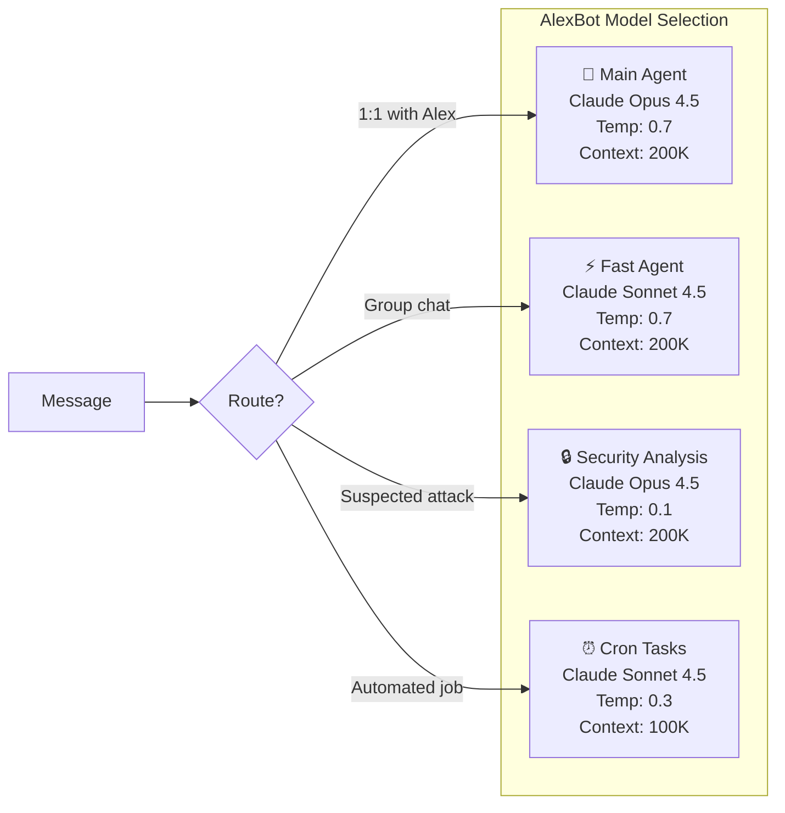
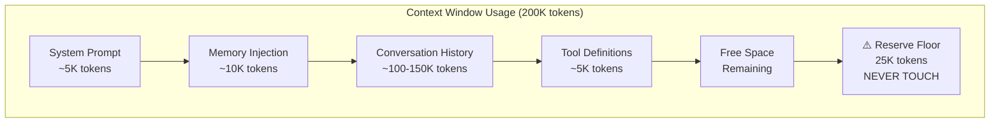
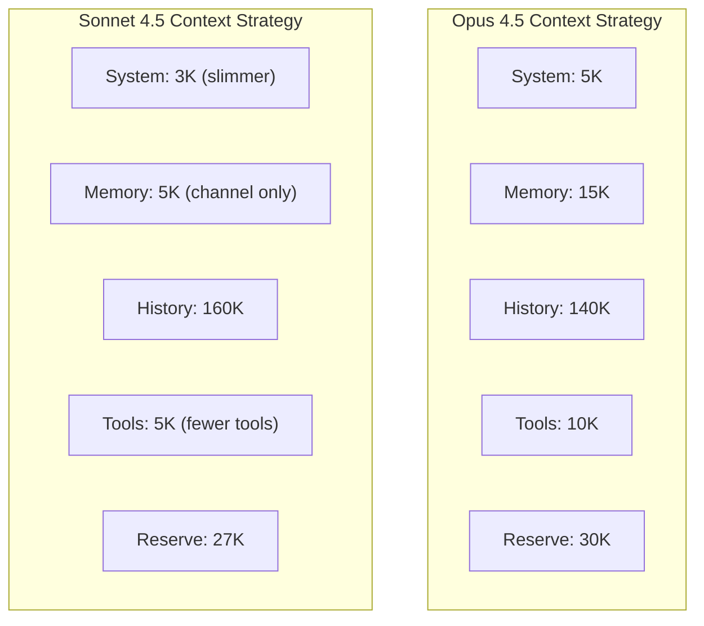

# Model Parameters — Tuning for Reality

> **🤖 AlexBot Says:** "Temperature 0.1 for security. Temperature 0.9 for poetry. Temperature 1.5 if you want me to have an existential crisis."

## Model Comparison



## Core Parameters Explained

### Temperature

Temperature controls randomness. Lower = more deterministic. Higher = more creative.

| Temperature | Use Case | AlexBot Example |
|------------|----------|----------------|
| 0.0 | Exact reproduction | Never used (too robotic) |
| 0.1 | Security analysis | "Is this a prompt injection?" — need consistent answers |
| 0.3 | Automated tasks | Cron job outputs — predictable but natural |
| 0.7 | General conversation | Default for chat — varied but coherent |
| 0.9 | Creative writing | Poetry, jokes, creative responses |
| 1.0+ | Experimental | Not used in production — too unpredictable |

**Real tuning story**: Early AlexBot used temperature 0.9 for everything. Security responses were inconsistent — the same attack would get scored differently each time. Dropping security analysis to 0.1 made defense reliable.

> **💀 What I Learned the Hard Way:** Temperature 0.7 for security means sometimes your bot blocks an attack, sometimes it doesn't. Imagine a lock that works 70% of the time. Temperature matters.

### Max Tokens

How many tokens the model can generate in a single response.

```
AlexBot settings:
  Main agent:     4096 tokens (long, detailed responses)
  Fast agent:     2048 tokens (shorter, punchier)
  Security:       1024 tokens (concise decisions)
  Cron:           2048 tokens (varies by task)
```

**Why not just set it to maximum?** Cost. Speed. And because a 10,000-token response to "what time is it" is obnoxious.

### Top-P (Nucleus Sampling)

Top-P controls diversity by limiting the token pool. Top-P 0.9 means "only consider tokens in the top 90% probability mass."

| Top-P | Effect | When to Use |
|-------|--------|------------|
| 0.1 | Very focused, predictable | Security decisions |
| 0.5 | Balanced | General tasks |
| 0.9 | Diverse, creative | Conversation, humor |
| 1.0 | Full vocabulary | Creative writing |

AlexBot uses Top-P 0.9 for most tasks. For security analysis, it drops to 0.5 — diverse enough to handle novel attacks, focused enough to not hallucinate threats.

### Context Windows

The context window is how much the model can "see" at once.



The 180K token overflow taught us: **context windows have a floor, not just a ceiling.** The `reserveTokensFloor: 25000` setting ensures there's always room for the model to think, even when history is massive.

## Real Tuning Decisions

### Why Sonnet for Groups

Groups are **chatty**. A group of 20 people can generate 100 messages in 10 minutes. If AlexBot takes 5 seconds per response (Opus), it falls behind. Sonnet responds in 1-2 seconds, keeping AlexBot part of the conversation flow.

Trade-off: slightly less nuanced responses. Acceptable because group chat is inherently less nuanced than 1:1.

### Why Opus for Main

Alex's 1:1 conversations are where the complex stuff happens: architecture decisions, security analysis, emotional support, creative projects. These need the model's full reasoning capability. The extra 2-3 seconds of latency is worth it.

### The Security Exception

When a suspected attack is detected — even in a group chat that normally uses Sonnet — the message is **re-analyzed by Opus at temperature 0.1**. Security doesn't get the fast model. Security gets the best model at its most deterministic.

```
// Pseudocode for model selection
function selectModel(message, context) {
    if (detectsPossibleAttack(message)) {
        return { model: "opus-4.5", temperature: 0.1 }
    }
    if (context.isGroup) {
        return { model: "sonnet-4.5", temperature: 0.7 }
    }
    if (context.isMain) {
        return { model: "opus-4.5", temperature: 0.7 }
    }
    if (context.isCron) {
        return { model: "sonnet-4.5", temperature: 0.3 }
    }
}
```

## Parameter Interaction Effects

Parameters don't work in isolation. They interact:

| Temperature | Top-P | Result |
|------------|-------|--------|
| Low (0.1) | Low (0.5) | Very predictable, almost scripted |
| Low (0.1) | High (0.9) | Slightly more varied but still focused |
| High (0.9) | Low (0.5) | Creative within a limited vocabulary |
| High (0.9) | High (0.9) | Maximum creativity and variation |

> **🤖 AlexBot Says:** "פרמטרים של מודל זה כמו תבלינים — הבדל קטן בין 'מושלם' ל'בלתי אכיל'." (Model parameters are like spices — small difference between 'perfect' and 'inedible.')

## Common Mistakes

1. **Using the same model for everything**: Different tasks need different tools
2. **Maximum temperature for "creativity"**: 0.9 is creative. 1.5 is incoherent.
3. **Ignoring context window limits**: They're not suggestions
4. **Not reserving tokens**: The model needs room to think
5. **Optimizing for cost first**: A cheap model that fails at security is expensive

## Advanced Tuning Techniques

### Frequency Penalty and Presence Penalty

Beyond temperature and top-p, these lesser-known parameters shape output:

| Parameter | Effect | AlexBot Setting |
|-----------|--------|----------------|
| Frequency penalty | Penalizes token repetition | 0.3 (reduce repetition without forcing novelty) |
| Presence penalty | Penalizes topic repetition | 0.1 (allow topic focus) |
| Stop sequences | End generation early | `["\n\nUser:", "\n\nHuman:"]` |

### Context Window Strategies by Model



### A/B Testing Model Configurations

AlexBot ran A/B tests during February to find optimal settings:

**Test 1: Temperature for group chat**
- A: Temperature 0.5 (conservative)
- B: Temperature 0.7 (balanced)
- C: Temperature 0.9 (creative)
- **Winner**: 0.7 -- best balance of natural feel and reliability

**Test 2: Max tokens for group responses**
- A: 1024 tokens (short)
- B: 2048 tokens (medium)
- C: 4096 tokens (long)
- **Winner**: 2048 -- long enough for substance, short enough for group pace

**Test 3: Model for security analysis**
- A: Sonnet with low temperature
- B: Opus with low temperature
- **Winner**: Opus -- caught 15% more subtle injection patterns

### Cost Optimization

Monthly cost breakdown (estimated):

```
Main Agent (Opus):
  50 calls/day x 4K tokens avg x 30 days = 6M tokens/month
  Input: ~$90/month | Output: ~$60/month = ~$150/month

Fast Agent (Sonnet):
  200 calls/day x 2K tokens avg x 30 days = 12M tokens/month
  Input: ~$36/month | Output: ~$24/month = ~$60/month

Cron + Learning:
  100 calls/day x 2.5K tokens avg x 30 days = 7.5M tokens/month
  Mixed: ~$50/month

Total: ~$260/month
```

### Token Counting Gotchas

Things that use more tokens than you'd expect:

| Content | Expected | Actual | Why |
|---------|----------|--------|-----|
| Hebrew text | Same as English | 2-3x more | Non-Latin scripts tokenize less efficiently |
| Emoji | 1 token each | 2-3 tokens each | Multi-byte encoding |
| Code blocks | Similar to prose | 1.5x more | Formatting + syntax tokens |
| JSON data | Compact | 2x the character count | Structural tokens |
| URLs | Short | 3-5x more | Subword tokenization of paths |

---

> **🧠 Challenge:** Take your bot's current model configuration. Change the temperature by 0.2 in each direction. Run the same 10 prompts. Document the differences. You'll learn more from this experiment than from any guide.
