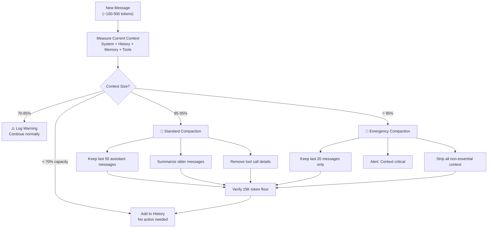
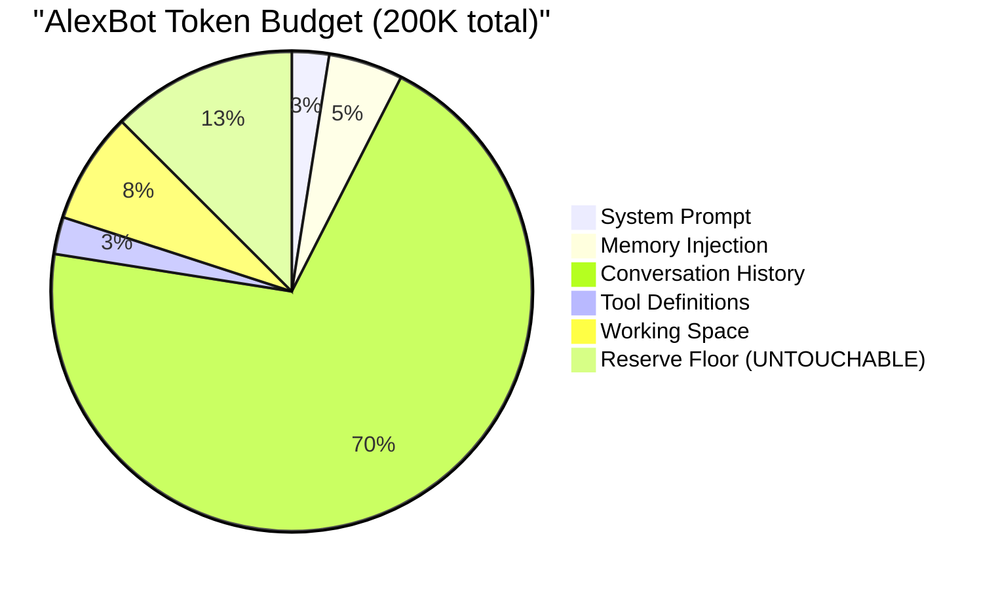
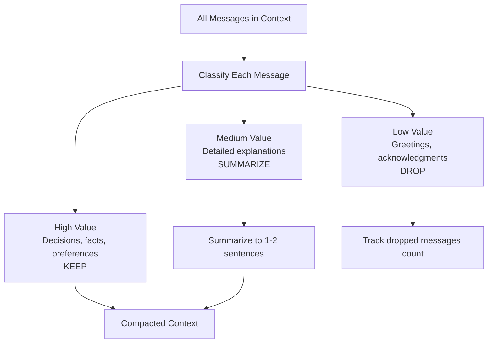

# Context Management — Memory Without the Overflow

> **🤖 AlexBot Says:** "180,000 tokens of context is like eating 180,000 calories in one sitting. Technically possible. Medically inadvisable."

## The Context Flow



## The 180K Incident — Full Post-Mortem

### What Happened

Mid-February 2025. A complex multi-topic session with Alex ran for several hours. The conversation covered architecture decisions, code reviews, memory design, and security planning. Each topic pulled in relevant memories, tool results, and code snippets.

Nobody was watching the token counter.

At approximately 180,000 tokens, the pipeline failed. The model couldn't process the input. The session was unrecoverable. Messages were lost.

### Root Cause Analysis

```
1. No monitoring       — Nobody tracked context size
2. No compaction       — Old messages never got pruned
3. No reserve          — The model had 0 tokens for output
4. No warnings         — Silent accumulation until crash
5. Tool result bloat   — Each tool call added 1-5K tokens of raw output
```

### The Fix

Three-layer protection implemented the same week:

**Layer 1: Monitoring**
- Context size checked after every message
- Percentage logged to metrics
- Dashboard shows real-time usage

**Layer 2: Compaction**
- `keepLastAssistants: 50` — only recent messages survive
- Older messages get summarized (not deleted — the information persists in compressed form)
- Tool call results get stripped to essentials
- Raw code blocks get replaced with summaries

**Layer 3: Reserve Floor**
- `reserveTokensFloor: 25000` — 25K tokens are **always** reserved
- This ensures the model always has room for:
  - Reading the current message
  - Thinking about it
  - Generating a response
  - Calling tools if needed

> **💀 What I Learned the Hard Way:** The 180K overflow wasn't just a crash — it was data loss. The session couldn't be recovered. Messages that hadn't been saved to long-term memory were gone forever. Now every important message gets saved to memory BEFORE it enters the context window.

## Compaction Strategies

### Strategy 1: Sliding Window

Keep the last N messages, drop the rest.

```
Pros: Simple, predictable, fast
Cons: Loses all context older than N messages
AlexBot uses: keepLastAssistants: 50
```

### Strategy 2: Summarization

Replace old messages with a summary.

```
Pros: Preserves information density
Cons: Lossy — nuance gets compressed
AlexBot uses: For messages 51-200 (before they're dropped)
```

### Strategy 3: Selective Pruning

Remove low-value content (greetings, acknowledgments, tool call details) while keeping high-value content (decisions, facts, user preferences).

```
Pros: Keeps the important stuff
Cons: "Important" is subjective
AlexBot uses: Tool result pruning (keep conclusion, drop raw data)
```

### Strategy 4: Memory Offloading

Save important information to long-term memory before removing it from context.

```
Pros: Nothing is truly lost
Cons: Memory retrieval adds latency
AlexBot uses: Critical facts saved to memory on creation
```

## Token Budgeting



### Budget Discipline

The reserve floor is **not a suggestion**. It's a hard limit enforced in code. If compaction can't free enough tokens to maintain the floor, the system:

1. Drops to emergency compaction (last 20 messages only)
2. Strips all tool definitions except essentials
3. Reduces memory injection to critical facts only
4. If STILL over budget: starts a new session with a handoff summary

> **🤖 AlexBot Says:** "הרצפה של 25K טוקנים זה כמו חגורת בטיחות — אתה שמח שהיא שם כשאתה צריך אותה, ואתה לא רוצה לגלות מה קורה בלעדיה." (The 25K token floor is like a seatbelt — you're glad it's there when you need it, and you don't want to find out what happens without it.)

## Practical Tips

1. **Monitor early**: Don't wait for 95% to start compacting. 70% is your warning.
2. **Save before pruning**: Anything important gets saved to memory BEFORE compaction removes it from context.
3. **Prune aggressively for tool results**: A 5,000-token JSON response can often be summarized in 50 tokens.
4. **Don't cache system prompts**: They change between sessions. Regenerate each time.
5. **Test your compaction**: Artificially inflate context and verify your compaction produces coherent summaries.
6. **Log compaction events**: Every compaction should be logged with before/after sizes and what was removed.

## Advanced Compaction Techniques

### Semantic Compaction

Not all messages are equal. Semantic compaction preserves meaning density:



### Tool Result Compaction

Tool results are the biggest context consumers. A single file read can be 5,000 tokens. Compaction strategy:

```
Before compaction:
  Tool: readFile("/workspace/config/system-prompt.md")
  Result: [5,000 tokens of file content]

After compaction:
  Tool: readFile("/workspace/config/system-prompt.md")
  Result: "Read system prompt file (234 lines, identity + rules + context sections)"
```

### Monitoring Dashboard

```
Context Monitor (Example Output):
Total Capacity: 200,000 tokens
Current Usage:  142,350 tokens (71.2%)
  System Prompt:  4,800 tokens  (2.4%)
  Memory:        11,200 tokens  (5.6%)
  History:      118,350 tokens (59.2%)
  Tools:         5,000 tokens  (2.5%)
  Free Space:   33,000 tokens (16.5%)
  Reserve:      25,000 tokens (12.5%) [PROTECTED]
Status: Normal
Next compaction trigger: 170,000 tokens (85%)
```

### Real Compaction Example

**Before compaction (Turn 120, 175K tokens):**
- Messages 1-70: Architecture discussion (40K tokens)
- Messages 71-90: Security review (25K tokens)
- Messages 91-120: Current topic - cron configuration (30K tokens)
- System + tools + memory: 25K tokens
- Reserve: 25K tokens
- Free: 30K tokens

**After compaction (below 85% threshold):**
- Summary of messages 1-70: "Discussed architecture: 4-agent hub-spoke, memory layers, routing" (200 tokens)
- Summary of messages 71-90: "Security review: 3 rings approved, scoring calibration adjusted" (150 tokens)
- Messages 91-120: KEPT IN FULL (30K tokens)
- System + tools + memory: 25K tokens
- Reserve: 25K tokens
- Free: 89,650 tokens

---

> **🧠 Challenge:** Fill your bot's context window to 90%. Then ask it a question that requires information from the beginning of the session. If it can answer correctly, your compaction strategy works. If not, back to the drawing board.
