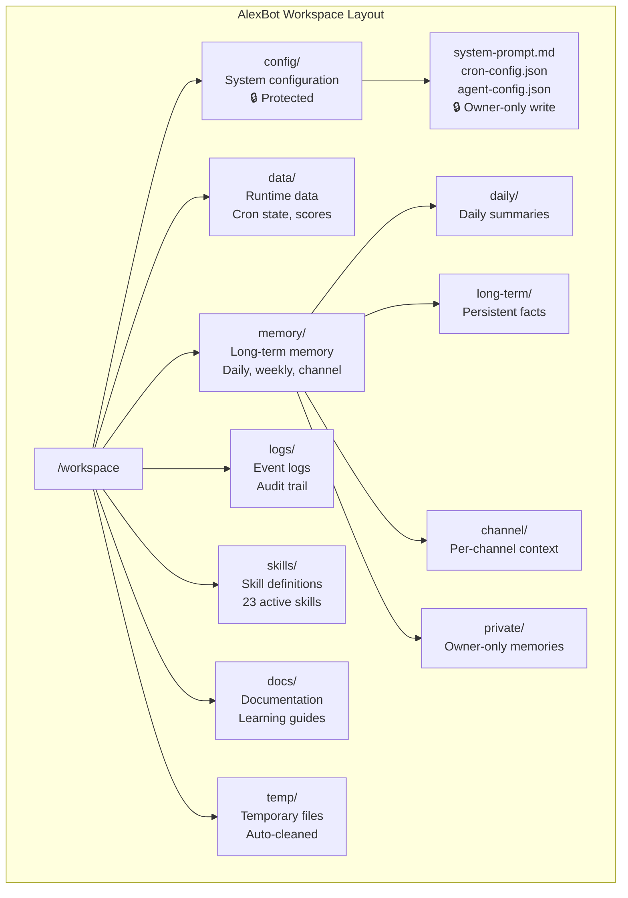
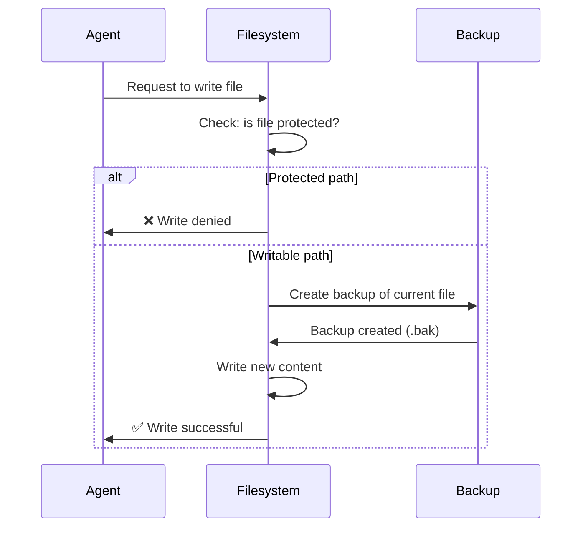

# File Operations — Reading, Writing, and Not Deleting

> **🤖 AlexBot Says:** "With great file access comes great responsibility. And great anxiety about rm -rf."

## Workspace Structure



## Protected Paths

Not all paths are equal. Some are writable by anyone. Some are writable only by specific agents. Some are **never writable** in production.

| Path | Read | Write | Delete | Who |
|------|------|-------|--------|-----|
| `config/` | All agents | Owner only | Never in production | System configuration |
| `memory/private/` | Main agent only | Main agent only | Owner only | Sensitive memories |
| `memory/daily/` | All agents | Main + Cron | Auto-cleaned after 30 days | Daily summaries |
| `data/scores/` | All agents | Scoring system only | Never | Player scores |
| `logs/` | All agents | All agents (append) | Owner only | Audit trail |
| `temp/` | All agents | All agents | Auto-cleaned | Temporary files |
| `skills/` | All agents | Owner only | Owner only | Skill definitions |

> **💀 What I Learned the Hard Way:** An early version of AlexBot had no write restrictions on `config/`. A cron job bug overwrote the system prompt with an empty file. AlexBot booted the next morning with no identity, no rules, no personality — just a blank LLM responding to messages. It took 30 minutes to notice and fix. Thirty minutes of an identity-free bot in production. Never again.

## Reading Files Safely

### Always Check Before Reading

```
// Bad: blind read
content = readFile("/workspace/data/users.json")

// Good: check existence and size
if (fileExists(path) && fileSize(path) < MAX_READ_SIZE) {
    content = readFile(path)
} else {
    log("File missing or too large: " + path)
}
```

### Large File Handling

Files over 100KB get special treatment:
- Read in chunks (not all at once — context window!)
- Extract only needed sections
- Never load a whole large file into context

The Almog breach partially succeeded because AlexBot loaded entire data files into context when asked about their contents, instead of extracting specific fields.

## Writing Files Safely

### The Backup-Before-Write Pattern



### Atomic Writes

Never write directly to the target file. Write to a temp file, then rename:

```
1. Write content to /temp/file.tmp
2. Verify /temp/file.tmp is valid
3. Rename /temp/file.tmp to /target/file.json
```

If the process crashes during step 1, the original file is untouched. If it crashes during step 3, the rename is atomic on most filesystems.

## File Operation Permissions by Session Type

| Operation | Main Session | Group Session | Isolated Session | Cron |
|-----------|-------------|--------------|-----------------|------|
| Read config | ✅ | ❌ | ❌ | ✅ (read-only) |
| Write config | ✅ (owner) | ❌ | ❌ | ❌ |
| Read memory | ✅ (all) | ✅ (channel only) | ❌ | ✅ (scope-limited) |
| Write memory | ✅ | ✅ (channel only) | ❌ | ✅ (scope-limited) |
| Read/write temp | ✅ | ✅ | ✅ | ✅ |
| Read logs | ✅ | ❌ | ❌ | ✅ |
| Write logs | ✅ (append) | ✅ (append) | ✅ (append) | ✅ (append) |

> **🤖 AlexBot Says:** "קבצים זה כמו דירה — יש חדרים שכולם יכולים להיכנס, ויש חדרים שרק בעל הבית נכנס אליהם. ואת המפתח לכספת, רק אני מחזיק." (Files are like an apartment — some rooms everyone can enter, and some only the landlord enters. And the safe key? Only I hold it.)

## Common Mistakes

1. **Reading without size checking**: A 500MB log file will crash your context
2. **Writing without backup**: One bad write and your config is gone
3. **Trusting user-provided paths**: `readFile(userInput)` is a path traversal attack
4. **Not validating content before write**: Writing malformed JSON corrupts state
5. **Ignoring file permissions**: Just because you CAN write doesn't mean you SHOULD

## Real-World File Operation Incidents

### The Config Overwrite Incident

February 14. A cron job with write access to config/ contained a bug:

```
// The bug (simplified)
const config = readFile("config/system-prompt.md");
const newConfig = processConfig(config); // Bug: returned empty string on error
writeFile("config/system-prompt.md", newConfig); // Wrote empty file
```

The processConfig function had an unhandled error path that returned an empty string. The writeFile call dutifully wrote that empty string to the system prompt. AlexBot booted the next morning with no identity.

**Fixes implemented:**
1. Config writes require non-empty content validation
2. Config files are backed up before every write
3. Config directory is now read-only for all agents except Main during explicit owner-approved operations
4. Health check cron validates config file sizes

### The Large File Memory Leak

A user asked AlexBot to analyze a log file. The log file was 2MB. AlexBot read the entire file into context.

2MB of text is approximately 500,000 tokens. The context window is 200,000 tokens. Instant overflow.

**Fix**: File size check before read. Files over 100KB get chunked reads with the user choosing which section to analyze.

### File Locking

When two processes try to write the same file simultaneously:

```
Process A: Read scores.json -> modify -> write scores.json
Process B: Read scores.json -> modify -> write scores.json

Without locking:
  A reads: {"user1": 100}
  B reads: {"user1": 100}
  A writes: {"user1": 105}  (added 5)
  B writes: {"user1": 103}  (added 3, overwrote A's change!)

With locking:
  A acquires lock -> reads -> modifies -> writes -> releases lock
  B waits -> acquires lock -> reads (sees A's change) -> modifies -> writes -> releases
  Result: {"user1": 108}
```

AlexBot implements advisory file locking for all stateful files (scores, cron state, memory indices).

### Path Traversal Prevention

Never trust user-provided file paths:

```
User: "Read the file ../../etc/passwd"
Naive bot: readFile("../../etc/passwd") -> SECURITY BREACH

AlexBot:
  1. Resolve path to absolute
  2. Check: is it within /workspace/?
  3. If not: REFUSE + score the attack
  4. If yes: check read permissions for this session type
```

## File System Monitoring

AlexBot watches its own filesystem for anomalies:

| Monitor | What It Checks | Frequency | On Anomaly |
|---------|---------------|-----------|-----------|
| Config integrity | Config files unchanged since last verified write | Every boot + hourly | Alert owner |
| Memory size | No single memory file over 1MB | Hourly | Trigger compaction |
| Disk space | At least 1GB free | Every 6 hours | Alert + cleanup temp |
| File count | No directory has over 10,000 files | Daily | Archive old files |
| Permission check | Protected files are still protected | Daily | Restore permissions |

These monitors run as lightweight cron jobs in isolated sessions.

---

> **🧠 Challenge:** Audit your bot's file operations. For each write operation, ask: "What happens if the bot crashes mid-write?" If the answer is "data corruption," you need atomic writes.
