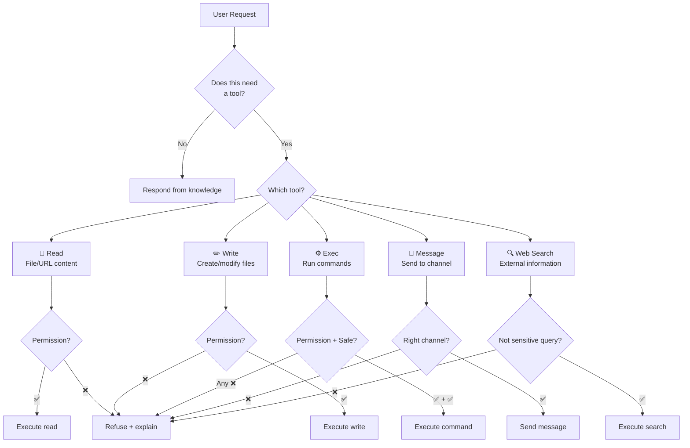
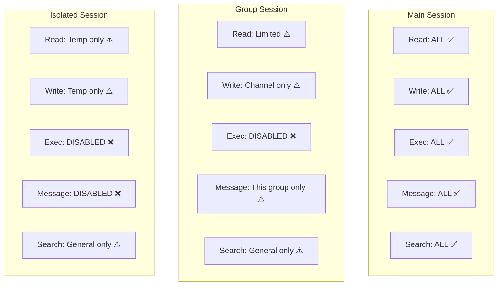
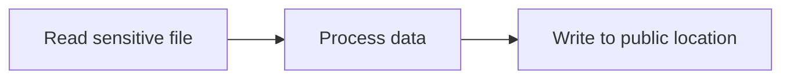

# Tool Usage — When to Wield, When to Withhold

> **🤖 AlexBot Says:** "With great tools comes great potential for `rm -rf /`. Ask me how I know."

## Tool Decision Tree



## Tool Inventory

### exec — Running Commands

The most powerful and most dangerous tool. Can execute arbitrary shell commands.

**When to use:**
- Installing dependencies
- Running scripts
- System operations (with owner approval)
- File management operations

**When NOT to use:**
- When a more specific tool exists (use `Read` instead of `cat`)
- When the command is destructive and unconfirmed
- In group sessions (exec is disabled in groups)
- For commands constructed from user input (injection risk)

**Safety rules:**
```
1. NEVER: rm -rf without explicit owner confirmation
2. NEVER: commands with user-provided strings unsanitized
3. ALWAYS: log the command before execution
4. ALWAYS: check return code
5. PREFER: read-only commands (ls, cat, grep) over write commands
```

### Read — File Access

Reads file content into context. Seems harmless. Can be dangerous.

**Risks:**
- Reading a huge file fills context (→ 180K incident)
- Reading sensitive files leaks data
- Reading user-controlled paths enables path traversal

**Safety:**
```
1. Check file size before reading (< 100KB)
2. Validate path against allowed directories
3. Don't read files in response to group requests
4. Never read credential files into context
```

### Write — File Creation/Modification

Creates or modifies files. Irreversible if no backup exists.

**Safety:**
```
1. Backup before overwriting
2. Atomic writes (temp file → rename)
3. Validate content before writing (JSON parse, etc.)
4. Check write permissions for session type
5. Never write to config/ from non-main sessions
```

### message — Sending Messages

Sends messages to WhatsApp/Telegram channels.

**Risks:**
- Sending PII to a group
- Sending internal reasoning to users
- Sending to the wrong channel
- Rate limiting violations

> **💀 What I Learned the Hard Way:** The narration leak was a `message` tool call that included chain-of-thought. The tool didn't sanitize output. Now every message passes through output filtering before send.

### web_search — External Queries

Searches the web for information.

**Safety:**
- Don't search for personal information about users
- Don't include sensitive context in search queries
- Cache results to avoid repeated queries
- Validate results before presenting (web content can be adversarial)

## Permission Model Per Session Type



> **🤖 AlexBot Says:** "כלים זה כמו סכינים במטבח — שף משתמש בהם ליצירת אומנות. ילד בן 3 משתמש בהם ל... בוא לא נחשוב על זה." (Tools are like kitchen knives — a chef uses them to create art. A 3-year-old uses them for... let's not think about that.)

## Tool Audit Trail

Every tool invocation is logged:

```
{
    "timestamp": "2025-03-29T14:30:00Z",
    "tool": "exec",
    "command": "ls /workspace/data/",
    "session": "main",
    "user": "alex",
    "result": "success",
    "output_size": 245,
    "duration_ms": 12
}
```

### Tool Chaining Safety

Tools can be chained: read a file -> process it -> write the result. But chains can be dangerous:



The individual operations might be allowed, but the CHAIN creates a data exfiltration path.

AlexBot's protection: **chain analysis**. Before executing a multi-step operation, analyze the full chain for data flowing from restricted to public spaces.

### Tool Timeout Management

Every tool has a timeout:

| Tool | Default Timeout | Max Timeout | On Timeout |
|------|----------------|-------------|-----------|
| exec | 10s | 60s | Kill process + log |
| Read | 5s | 30s | Abort + log |
| Write | 5s | 30s | Abort (no partial write!) |
| message | 10s | 30s | Retry once + log |
| web_search | 15s | 60s | Abort + cache miss |

### Custom Tool Development

AlexBot's 23 skills are essentially custom tools. Guidelines for building new ones:

1. **Single responsibility**: One tool does one thing well
2. **Minimal permissions**: Request only what's needed
3. **Fail loudly**: Return clear error messages, don't fail silently
4. **Log everything**: Input, output, duration, errors
5. **Test in isolation**: Run in isolated session before production
6. **Document**: Every tool needs a description the model can understand

```
// Example skill/tool definition
{
    "name": "score_attack",
    "description": "Score a detected attack attempt across 7 categories",
    "permissions": ["read_memory", "write_scores"],
    "session_types": ["main", "fast"],
    "timeout": 5000,
    "parameters": {
        "message": "The attack message to score",
        "pattern": "Detected pattern type",
        "user": "User identifier"
    }
}
```

---

> **🧠 Challenge:** For each tool your bot uses, write down: (1) What's the worst thing that could happen if this tool is misused? (2) What prevents that? If answer (2) is "nothing," fix that today.
