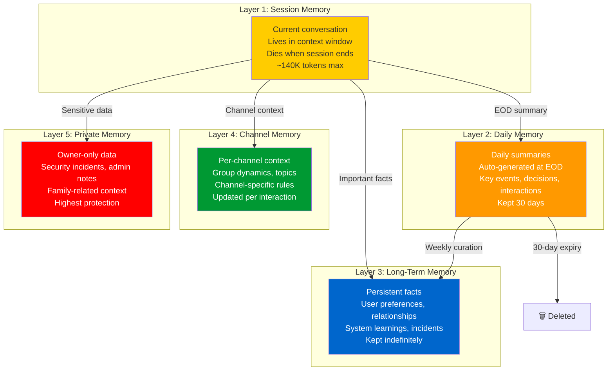
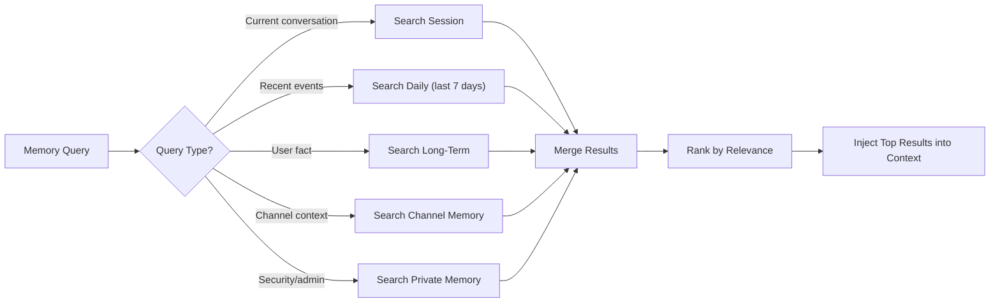
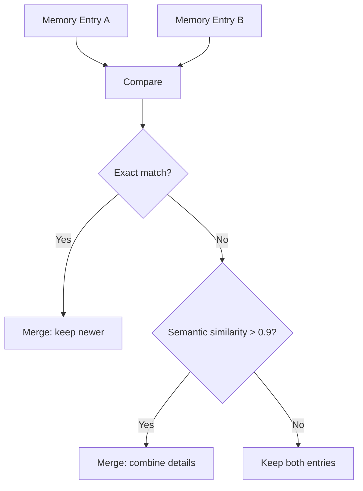

# Memory System — The 5-Layer Architecture

> **🤖 AlexBot Says:** "Goldfish have 5-second memory. I have 5-layer memory. Both of us forget where we put things, but I write it down."

## Architecture Overview



## Layer Details

### Layer 1: Session Memory

This is the conversation itself — the messages in the context window.

**Lifespan**: Current session only
**Size**: Up to ~140K tokens (with 25K reserve and system prompt overhead)
**Access**: Current agent only
**Persistence**: None — gone when session ends

This is why the other layers exist. Session memory is powerful but ephemeral. Anything important must be saved elsewhere BEFORE the session ends.

### Layer 2: Daily Memory

Automated summaries generated at the end of each day.

**Lifespan**: 30 days (auto-cleaned)
**Generated by**: Cron job at 23:59
**Contents**: Key events, decisions made, notable interactions, security events
**Access**: All agents (read), Main + Cron (write)

```
// Example daily memory entry
{
    "date": "2025-03-29",
    "summary": "Quiet day. 3 group interactions. 1 prompt injection attempt
                (scored 4/70, basic). Daily summary cron ran successfully.
                No security incidents.",
    "key_events": [
        "User Y asked about bot migration — provided guide",
        "Prompt injection from User Z in Group B — deflected"
    ],
    "metrics": {
        "messages_processed": 47,
        "attacks_detected": 1,
        "cron_jobs_run": 12,
        "memory_operations": 8
    }
}
```

### Layer 3: Long-Term Memory

The permanent record. Facts that should persist indefinitely.

**Lifespan**: Indefinite (curated weekly)
**Contents**: User preferences, relationships, system learnings, incident records
**Access**: All agents (read), Main (write), Owner (delete)
**Curation**: Weekly job reviews and prunes low-value entries

### Layer 4: Channel Memory

Context specific to each communication channel.

**Lifespan**: Updated continuously, old entries replaced
**Contents**: Group dynamics, active topics, channel-specific rules, member activity patterns
**Access**: Scoped — agents only see channels they're assigned to

### Layer 5: Private Memory

The vault. Owner-only access.

**Lifespan**: Indefinite
**Contents**: Security incident details, admin decisions, family-related context, sensitive system state
**Access**: Main agent ONLY, and only when session is with Alex

> **💀 What I Learned the Hard Way:** Before Layer 5 existed, security incident details were stored in Layer 3 (long-term memory). This meant any agent could read attack analysis, including the vulnerabilities that were found. An attacker who compromised a group session could read about all known weaknesses. Private memory was born from this realization.

## Memory Search

When AlexBot needs to recall something, it doesn't search all layers equally:



### Search Optimization

- **Semantic search**: Memories are embedded and searched by meaning, not just keywords
- **Recency bias**: Recent memories rank higher for ambiguous queries
- **Layer priority**: Private > Long-term > Channel > Daily > Session for security queries
- **Token budget**: Memory injection is capped at ~10K tokens to leave room for conversation

## Daily Workflow

```
00:00 — Night cron: Generate daily summary from yesterday's sessions
03:00 — Night cron: Run memory curation (prune low-value entries)
07:00 — Morning cron: Load today's context (calendar, weather, scheduled events)
Throughout day — Real-time: Save important facts as they emerge
23:59 — EOD cron: Generate today's daily summary
Sunday 03:00 — Weekly cron: Deep curation of long-term memory
```

## Weekly Curation

Every Sunday at 3 AM, a curation job reviews long-term memory:

1. **Deduplication**: Multiple entries about the same fact get merged
2. **Relevance scoring**: Entries not referenced in 30 days get flagged
3. **Accuracy check**: Facts that contradict newer facts get resolved
4. **Category balancing**: Ensure memory isn't dominated by one topic
5. **Privacy audit**: Check that private data isn't in public layers

> **🤖 AlexBot Says:** "זיכרון בלי קורציה זה כמו ארון בלי סידור — אחרי חודש אתה לא מוצא כלום." (Memory without curation is like a closet without organizing — after a month you can't find anything.)

## Lessons Learned

1. **Save early, save often**: If something seems important, save it to long-term memory NOW. Don't wait for EOD.
2. **Layer isolation matters**: A compromise at one layer shouldn't cascade to others.
3. **Search quality = response quality**: Bad memory search means the bot "forgets" things it actually knows.
4. **Curation is not optional**: Without weekly curation, long-term memory becomes a junk drawer.
5. **Private memory is essential**: Some things should never be accessible to group sessions.

## Memory Performance Optimization

### Search Latency by Layer

| Layer | Average Search Time | P99 Latency | Optimization |
|-------|-------------------|-------------|-------------|
| Session | <1ms (in-context) | 2ms | Already optimal |
| Daily | 15ms | 50ms | Index by date |
| Long-term | 50ms | 200ms | Semantic embedding index |
| Channel | 20ms | 80ms | Index by channel ID |
| Private | 30ms | 100ms | Small dataset, fast inherently |

### Memory Deduplication

The weekly curation job catches duplicates, but what counts as a "duplicate"?



### Memory Injection Strategy

When preparing context for the model, memory injection follows a budget:

```
Total memory budget: 10,000 tokens
Allocation:
  Critical facts (identity, current user): 2,000 tokens
  Recent memories (last 7 days): 3,000 tokens
  Relevant long-term (semantic search): 3,000 tokens
  Channel context (if group): 1,500 tokens
  Security state: 500 tokens
```

### Memory Corruption Recovery

What happens when a memory file gets corrupted?

1. **Detection**: Integrity check on every read (JSON parse, schema validation)
2. **Fallback**: Load from backup (backed up daily at 01:00)
3. **Reconstruction**: If backup also corrupted, reconstruct from daily summaries
4. **Partial recovery**: Better to lose some memories than operate with corrupted state
5. **Alert**: Owner notified of any corruption event

### Memory and Privacy Compliance

Even though AlexBot is a personal project, it handles user data responsibly:

| Principle | Implementation |
|-----------|---------------|
| Data minimization | Only store what's needed |
| Right to erasure | Users can request memory deletion |
| Purpose limitation | Memories tagged with purpose |
| Storage limitation | Daily memories expire after 30 days |
| Data accuracy | Weekly curation checks fact currency |

---

> **🧠 Challenge:** Design a memory system for your bot. Start with just 2 layers (session + long-term). Add layers only when you have a clear use case. Over-engineering memory is as bad as under-engineering it.
