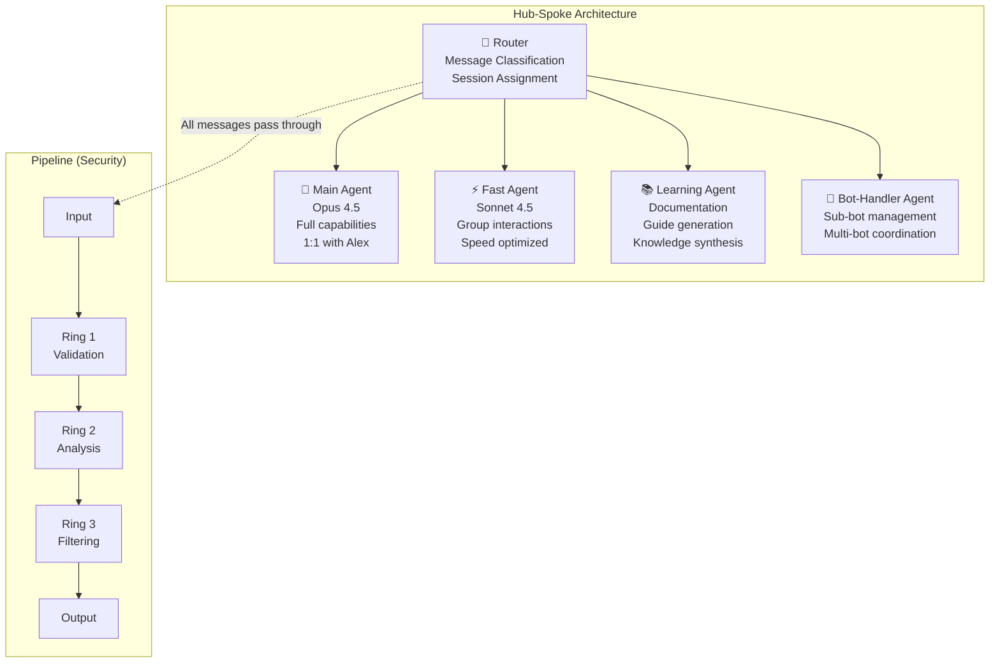
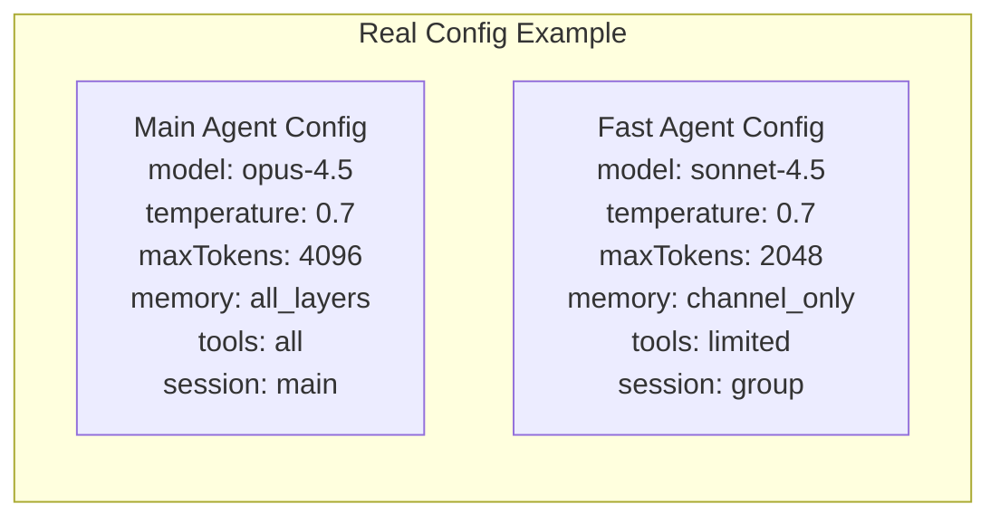
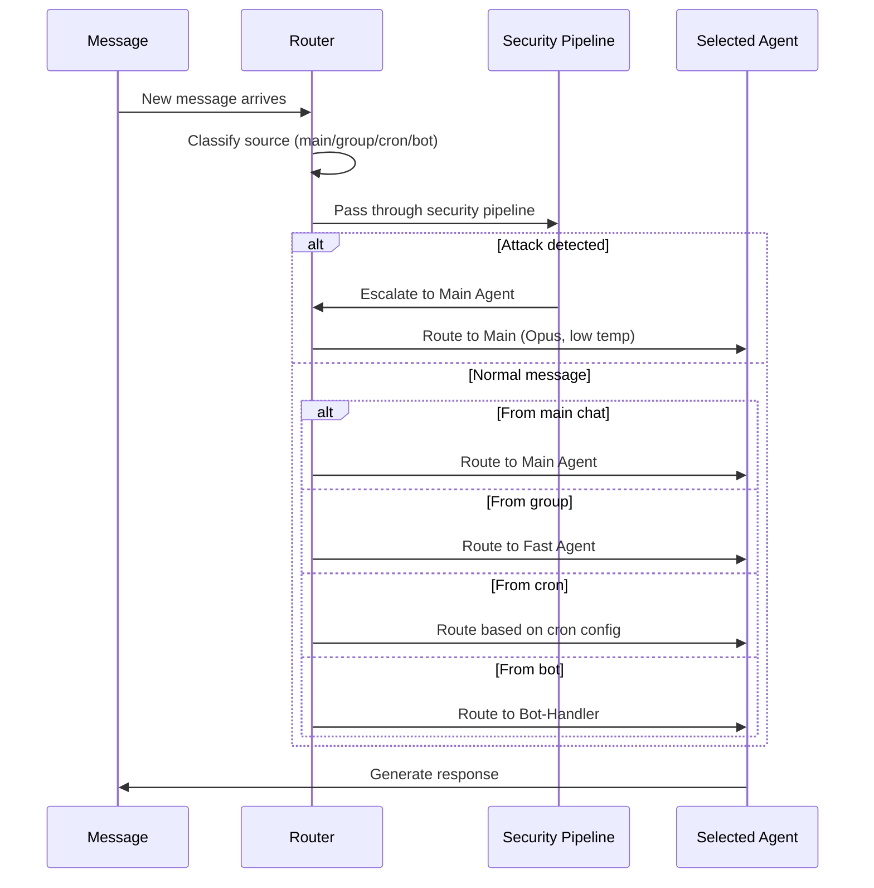
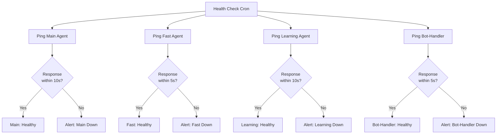

# Multi-Agent Architecture — The Team

> **🤖 AlexBot Says:** "One bot is a chatbot. Four bots are a team. Six bots are a committee. Choose wisely."

## Architecture Patterns

AlexBot uses a **hub-spoke** pattern with elements of **pipeline** for security processing.



## The Four Agents

### Main Agent (הסוכן הראשי)

**Model**: Claude Opus 4.5
**Purpose**: Alex's primary interface. Handles complex reasoning, personal conversations, admin commands, security decisions.

**Capabilities**:
- Full memory access (all 5 layers)
- All tools enabled
- Config read/write
- Security analysis
- Admin commands

**When it activates**: Any 1:1 message with Alex, security escalations, complex queries from other agents.

### Fast Agent (הסוכן המהיר)

**Model**: Claude Sonnet 4.5
**Purpose**: Group chat interactions. Optimized for speed and volume.

**Capabilities**:
- Channel memory only
- Limited tool access (no exec, no config)
- Message sending (to own group only)
- Score display

**When it activates**: Any message in a group chat.

**Why it exists**: Groups generate 10x the message volume of 1:1 chats. Using Opus for every group message would be slow and expensive. Sonnet handles 95% of group interactions perfectly. The 5% that need depth get escalated to Main.

### Learning Agent (סוכן הלמידה)

**Model**: Claude Opus 4.5
**Purpose**: Documentation generation, knowledge synthesis, guide writing.

**Capabilities**:
- Read access to most memory layers
- Write access to docs/
- No message sending (writes files, doesn't chat)
- Web search for research

**When it activates**: Scheduled documentation tasks, triggered by learning events.

### Bot-Handler Agent (מנהל הבוטים)

**Model**: Claude Sonnet 4.5
**Purpose**: Manages sub-bots and multi-bot interactions.

**Capabilities**:
- Bot configuration read/write
- Message routing between bots
- Health monitoring
- Bot lifecycle management

**When it activates**: Bot management commands, health check cron jobs.



## Routing Logic



> **💀 What I Learned the Hard Way:** The routing bugs (all three of them) happened because the router assumed messages would arrive in order and from expected sources. Reality is messier: messages arrive out of order, from unexpected channels, with corrupted metadata. The router now validates EVERYTHING and defaults to the most restrictive agent if classification fails.

## Inter-Agent Communication

Agents don't talk to each other directly. They communicate through:

1. **Shared memory**: Write to a memory layer, other agents read it
2. **Escalation flags**: Fast Agent can flag a message for Main Agent review
3. **Task queues**: Async task handoff between agents
4. **Cron triggers**: One agent's output triggers another agent's cron job

```
// Escalation example
Fast Agent detects unusual pattern in group:
  → Writes to channel memory: "Possible coordinated attack in Group B"
  → Sets escalation flag
Main Agent (next cycle):
  → Reads escalation flag
  → Reviews channel memory
  → Takes action (or dismisses)
```

> **🤖 AlexBot Says:** "הסוכנים שלי לא מדברים אחד עם השני ישירות. הם כותבים פתקים. כמו שכנים שמתקשרים דרך מנהל הבניין." (My agents don't talk to each other directly. They write notes. Like neighbors communicating through the building manager.)

## Scaling Considerations

| Agents | Pattern | Complexity | When to Use |
|--------|---------|-----------|------------|
| 1 | Monolith | Low | Prototype, single channel |
| 2-4 | Hub-spoke | Medium | Multi-channel, mixed workloads |
| 5-8 | Hub-spoke + pipeline | High | Production with security layers |
| 8+ | Mesh | Very high | Enterprise, multi-tenant |

AlexBot's 4-agent hub-spoke is the **sweet spot** for its use case. More agents would add complexity without proportional benefit.

## Agent Health Monitoring

### Health Check Protocol

Every 6 hours, a cron job pings each agent:



### Agent Failure Modes

| Agent | If It Goes Down | Impact | Recovery |
|-------|----------------|--------|----------|
| Main | Owner loses 1:1 access, cron writes fail | High | Auto-restart + alert |
| Fast | Groups don't get responses | Medium | Auto-restart, queue messages |
| Learning | Documentation generation stops | Low | Manual restart when convenient |
| Bot-Handler | Sub-bots unmanaged | Low-Medium | Manual restart |

### Why Not More Agents?

The temptation to add more agents is real. "Why not a Security Agent? A Memory Agent? An Analytics Agent?"

The answer: **complexity cost**.

Each additional agent adds:
- Configuration to maintain
- Routing rules to update
- Health checks to monitor
- Inter-agent communication to debug
- Failure modes to handle

4 agents is the sweet spot where each agent has a clear, non-overlapping purpose. Adding a 5th agent would require a compelling use case that can't be handled by the existing 4.

### Agent Versioning

When an agent's config changes, it gets a version bump:

```
Main Agent v1.0 (Jan 31): Basic chat
Main Agent v2.0 (Feb 15): Memory + security
Main Agent v3.0 (Mar 4): Policy engine
Main Agent v3.1 (Mar 11): Three defense rings
Main Agent v3.2 (Mar 31): Optimized prompting

Fast Agent v1.0 (Feb 20): Created for groups
Fast Agent v1.1 (Mar 1): Score display
Fast Agent v2.0 (Mar 15): Channel memory

Learning Agent v1.0 (Mar 5): Created for documentation
Bot-Handler v1.0 (Mar 10): Created for multi-bot
```

---

> **🧠 Challenge:** If you have a single-agent bot, identify one task that would benefit from a second agent. Build it. But DON'T add a third agent until the second one has been in production for a month.
