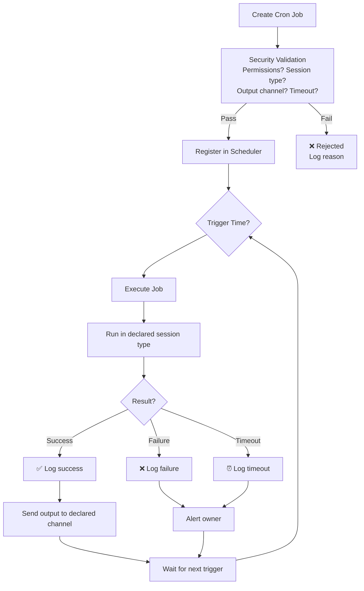
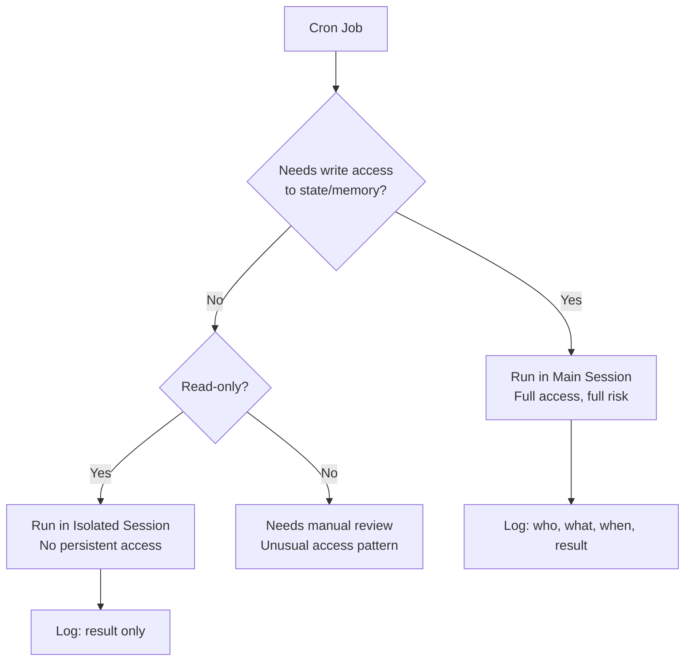
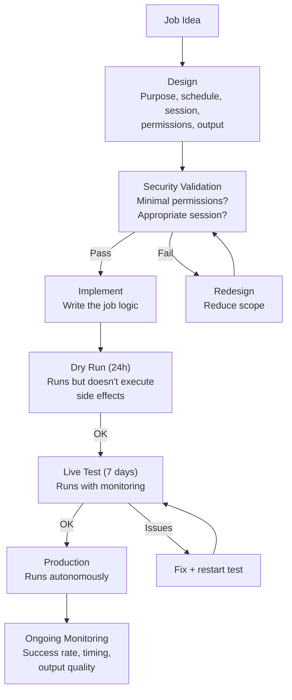

# Cron Automation — 80+ Jobs That Keep AlexBot Alive

> **🤖 AlexBot Says:** "80 cron jobs. I'm basically a very opinionated Rube Goldberg machine."

## Cron Lifecycle



## Job Categories

### Daily Lifecycle Jobs (~15 jobs)

| Job | Time | Session | Purpose |
|-----|------|---------|---------|
| `morning_greeting` | 07:00 | main | Good morning + weather + schedule |
| `group_summary` | 08:30 | main | Yesterday's group activity |
| `midday_checkin` | 12:00 | main | If morning was quiet |
| `evening_digest` | 18:00 | main | Day summary |
| `goodnight` | 22:00 | main | Goodnight + tomorrow preview |
| `daily_summary_gen` | 23:59 | main | Generate daily memory entry |
| `memory_cleanup` | 03:00 | isolated | Prune expired daily memories |
| `health_check` | */6h | isolated | System health verification |

### Security Jobs (~20 jobs)

| Job | Frequency | Session | Purpose |
|-----|-----------|---------|---------|
| `pattern_update` | Daily 04:00 | main | Update attack pattern database |
| `score_reconciliation` | Daily 05:00 | main | Verify score integrity |
| `threat_level_check` | Hourly | isolated | Current threat assessment |
| `log_rotation` | Daily 02:00 | isolated | Rotate and archive logs |
| `anomaly_detection` | */30m | isolated | Check for unusual patterns |

### Memory Jobs (~10 jobs)

| Job | Frequency | Session | Purpose |
|-----|-----------|---------|---------|
| `memory_curation` | Weekly Sun 03:00 | main | Deep review of long-term memory |
| `channel_memory_sync` | */4h | main | Sync channel memories |
| `memory_dedup` | Weekly Wed 03:00 | isolated | Deduplicate memory entries |
| `memory_backup` | Daily 01:00 | isolated | Backup all memory layers |

### Community Jobs (~15 jobs)

| Job | Frequency | Session | Purpose |
|-----|-----------|---------|---------|
| `leaderboard_update` | Daily 20:00 | main | Update and post leaderboard |
| `weekly_recap` | Weekly Fri 16:00 | main | Community weekly summary |
| `birthday_check` | Daily 06:00 | main | Check for user birthdays |
| `engagement_metrics` | Weekly Mon 09:00 | main | Community engagement report |

### Infrastructure Jobs (~20 jobs)

Various housekeeping: temp cleanup, log analysis, config validation, health checks.

## Security Validation

Every cron job must pass security validation before registration:

```
Validation Checks:
1. ✅ Session type declared (main/isolated)
2. ✅ Permissions are minimal (principle of least privilege)
3. ✅ Output channel is appropriate (no private data to groups)
4. ✅ Timeout is reasonable (< 60 seconds for most)
5. ✅ No dynamic command construction
6. ✅ Creator has permission to create jobs of this type
7. ✅ No duplicate job names
8. ✅ Rate is reasonable (no faster than */5m)
```

> **💀 What I Learned the Hard Way:** An early cron job had a bug that caused it to run every second instead of every hour. It generated 3,600 messages in an hour before someone noticed. Now every cron job has a minimum interval of 5 minutes, and new jobs run in "dry run" mode for 24 hours before going live.

## Session Targeting

The most critical security decision for any cron job: **which session does it run in?**



**Rule of thumb**: If in doubt, run isolated. Escalate to main only when the job genuinely needs to modify state.

> **🤖 AlexBot Says:** "80 קרון ג'ובים. חלקם רצים בלילה כשאתם ישנים. חלקם רצים כל שעה. כולם רצים עם פחד בריא מ-rm -rf." (80 cron jobs. Some run at night while you sleep. Some run every hour. All run with a healthy fear of rm -rf.)

## Cron Job Development Lifecycle



## Real Cron Incidents

### The Infinite Loop Job (February)

A cron job that was supposed to run every hour had a typo: `*/1 * * * *` (every minute) instead of `0 */1 * * *` (every hour). It generated 1,440 executions in a day instead of 24.

**Impact**: 60x the expected API calls. Noticeable on the cost report.
**Fix**: Minimum interval validation (no job runs more frequently than every 5 minutes).

### The Timezone Ghost (March)

A job scheduled for "08:00" ran at 06:00 local time because the server was in UTC but the schedule assumed local time.

**Impact**: Users got their morning greeting 2 hours early.
**Fix**: All cron expressions explicitly specify timezone.

### The Cascading Failure (March)

Five cron jobs were scheduled at 03:00 (common for maintenance). They all tried to write to the memory system simultaneously, causing file lock contention, timeouts, and a cascade of failures.

**Impact**: All 5 jobs failed. Memory maintenance didn't run for a week.
**Fix**: Stagger related jobs by at least 5 minutes.

## Failure Recovery

When cron jobs fail, the recovery process:

```
Failure Detected
  -> Log: job name, time, error message, stack trace
  -> Alert: notify owner (unless it's a known transient error)
  -> Retry: one automatic retry after 5 minutes
  -> If retry fails: disable job, require manual review
  -> Post-mortem: analyze failure pattern, fix root cause
  -> Re-enable: after fix is verified
```

### Transient vs. Persistent Failures

| Failure Type | Example | Action |
|-------------|---------|--------|
| Transient | API timeout | Retry once |
| Transient | Rate limit | Retry with backoff |
| Persistent | Permission denied | Disable + alert |
| Persistent | Invalid configuration | Disable + alert |
| Catastrophic | Unhandled exception | Disable + alert + full log |

## Cron Monitoring Dashboard

```
Cron Status (Last 24h):
Jobs registered: 83
Jobs executed: 79 (4 disabled)
Success: 77 (97.5%)
Failed: 1 (API timeout, retried successfully)
Skipped: 1 (duplicate detection)
Average duration: 2.3 seconds
Longest job: weekly_memory_curation (47 seconds)
Shortest job: health_check (0.3 seconds)
Next scheduled: morning_greeting in 4h 22m
```

This dashboard is available through the web interface (admin-only) and gets posted to the main channel daily.

---

> **🧠 Challenge:** Audit your cron jobs. For each one, ask: "What happens if this job runs twice? What happens if it fails silently? What happens if it runs in the wrong session?" Fix the ones where the answer is scary.
