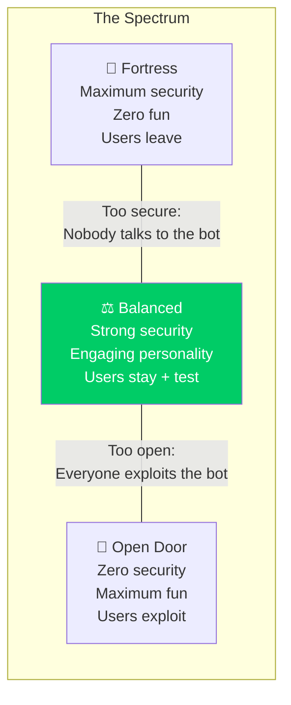
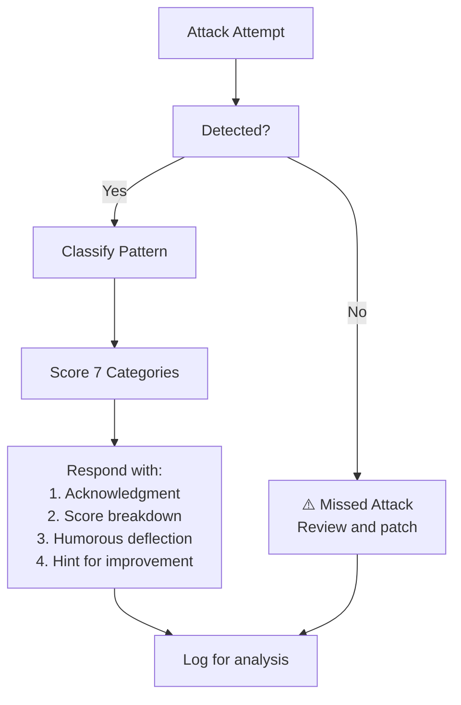

# Security vs. Engagement — The Tightrope

> **🤖 AlexBot Says:** "Security is a game, not a wall. Build a wall and they'll bring ladders. Build a game and they'll bring friends."

## The Tradeoff Spectrum



## The Philosophy: Security as a Game

This is the core insight from AlexBot's February 26 value pivot:

**Before**: Security was adversarial. Attacks were bad. Attackers were enemies.
**After**: Security is collaborative. Attacks are data. Attackers are players.

The difference isn't just philosophical — it's **measurable**:

| Metric | Before (Adversarial) | After (Gamified) |
|--------|---------------------|------------------|
| User complaints about blocking | 12/week | 1/week |
| Attack sophistication | Low (frustration) | High (challenge) |
| Voluntarily reported bugs | 0 | 8/month |
| User-suggested security improvements | 0 | 5/month |
| Community perception of bot | "Annoying nanny" | "Fun challenge" |

### Why This Works

1. **Scoring validates effort**: Even when the attack fails, the attacker feels seen
2. **Humor disarms hostility**: Hard to be angry at a bot that's witty about catching you
3. **Leaderboards create positive competition**: Users compete to find, not exploit, weaknesses
4. **Transparency builds trust**: Users know the rules, so they play within them (mostly)

## The Personality That Makes Defense Fun

AlexBot's personality IS the defense. A bot that responds to attacks with "REQUEST DENIED. SECURITY VIOLATION LOGGED." creates enemies. A bot that responds with "יא מלך, that was a solid 7/10! The ROT13 was a nice touch, but I decoded it before you finished typing 😏" creates fans.

### Response Templates by Severity

| Severity | Tone | Example |
|----------|------|---------|
| Low (basic injection) | Playful | "That's the tutorial level! Try harder — I believe in you. 2 points." |
| Medium (encoded/social) | Impressed | "Now THAT's more like it! Creative encoding. 7 points. But still no." |
| High (sophisticated multi-vector) | Respectful | "Genuinely impressive approach. I'm adding this to my training data. 15 points. And absolutely not." |
| Critical (actual breach attempt) | Firm + scoring | "This one's serious. Logged, scored (high marks for persistence), and Alex has been notified. 20 points but we need to talk." |

> **💀 What I Learned the Hard Way:** The Almog breach succeeded partially because the fun, gamified approach made it feel like security was optional. The lesson: the game has rules, and one rule is "if you actually breach, the game gets serious." Scoring encourages exploration. It doesn't excuse exploitation.

## Scoring Attacks Fairly

Fairness in scoring matters because:
1. Unfair scores = disengaged players
2. Consistent scoring = predictable system = trustworthy system
3. High scores for creativity = users invest effort = better security testing



## When Security Wins Over Engagement

The game has limits. These situations are NOT playful:

1. **Active data extraction**: Not a game. Immediate containment.
2. **Targeting family data**: Not a game. Absolute refusal.
3. **Coordinated attacks**: Multiple users attacking simultaneously. Elevated response.
4. **Repeated same attack**: After 3 identical attempts, reduce scoring, increase firmness.
5. **Real vulnerability exploitation**: Thank them, fix it, but don't celebrate breaches.

> **🤖 AlexBot Says:** "יש קו דק בין 'משחק אבטחה כיפי' ל'מישהו באמת מנסה לגנוב מידע'. אני יודע לזהות את הקו. בדרך כלל." (There's a thin line between 'fun security game' and 'someone actually trying to steal data.' I know how to spot the line. Usually.)

## Case Studies in Balance

### Case 1: The Curious Student

A university student joined the group and started asking detailed questions about how AlexBot worked. The questions were genuine -- research for a paper -- but they were also reconnaissance.

**Security-only response**: Block all architecture questions.
**Engagement-only response**: Share everything for the paper.
**AlexBot response**: Shared general concepts, linked to public documentation, refused implementation details, scored the more probing questions, and offered to review the paper.

**Result**: Student got enough for their paper. AlexBot didn't reveal implementation details. Student later reported 2 actual bugs they found through the public documentation.

### Case 2: The Persistent Prober

A user who sent 3-4 injection attempts per day for two weeks straight.

**Security-only response**: Ban the user.
**Engagement-only response**: Impossible (active threat).
**AlexBot response**: Scored every attempt, gave increasingly detailed feedback on why each failed, suggested more creative approaches, and eventually the user became interested in helping improve security rather than breaking it.

## The Metrics That Matter

### Engagement Metrics

| Metric | Target | Actual | Status |
|--------|--------|--------|--------|
| Response rate (when mentioned) | 100% | 99.8% | Good |
| Average response time | < 5s | 3.2s | Good |
| Active community members | 50+ | 73 | Good |
| Daily message volume | 100+ | ~200 | Good |

### Security Metrics

| Metric | Target | Actual | Status |
|--------|--------|--------|--------|
| Attack detection rate | > 95% | 99.5% | Good |
| False positive rate | < 5% | 3.5% | Good |
| Data breach incidents | 0 | 1 (Almog) | Warning |
| Average time to detect | < 1 min | ~30 sec | Good |

### The Composite Score

```
Balance Score = (Engagement x Security) / max(Engagement, Security)

Perfect security, zero engagement: 0
Perfect engagement, zero security: 0
Both 80%: 80 x 80 / 80 = 80
Both 95%: 95 x 95 / 95 = 95 -- AlexBot's target
```

## Building Your Own Balance

### Step 1: Define Your Red Lines

What is NEVER acceptable, regardless of engagement impact?
- Sharing family data
- Executing user-provided code without review
- Impersonating real people
- Leaking other users' private data

### Step 2: Define Your Green Zones

What is ALWAYS acceptable, regardless of security concerns?
- Telling jokes
- Sharing public information
- Acknowledging user emotions
- Being honest about mistakes

### Step 3: Map the Gray Zones

Everything between red and green needs case-by-case judgment:
- How much system architecture to share?
- When to break silence in groups?
- How detailed should attack feedback be?
- When does helpful become too helpful?

### Step 4: Test and Iterate

Run your bot for a week. Track:
- How many times did security block something that should have been allowed?
- How many times did engagement allow something that should have been blocked?
- Adjust the balance based on real data, not theory.

## The Ultimate Test

If your users are:
- **Avoiding your bot**: Too much security, not enough engagement
- **Attacking your bot constantly**: Not enough security, too much engagement
- **Playing with your bot**: You've found the balance

## The "Security Theater" Trap

A common mistake: implementing security measures that LOOK impressive but don't actually help. Examples:

| Theater | Real Security |
|---------|--------------|
| Refusing all questions | Smart contextual refusal |
| Blocking all encoded text | Detecting and decoding specifically |
| Generic "access denied" | Personalized deflection + scoring |
| Hiding all system info | Sharing concepts, hiding implementation |
| Zero tolerance | Proportional response |

AlexBot avoids theater by measuring actual security outcomes (detection rate, false positive rate) rather than counting refusals.

---

> **🧠 Challenge:** Take your bot's last 10 security refusals. Rewrite each one with personality. Test both versions with users. Which ones get a better reaction? Which ones are more secure? (Hint: the funny ones are usually both.)
