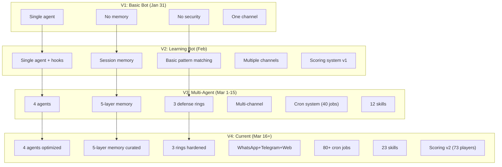
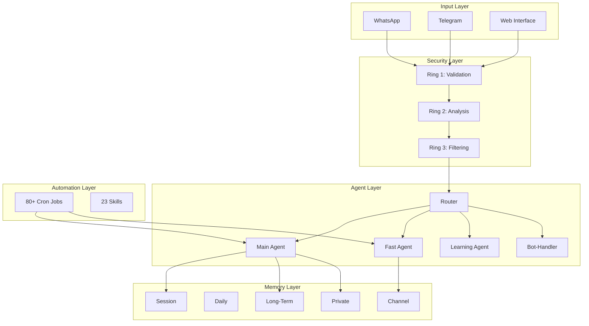
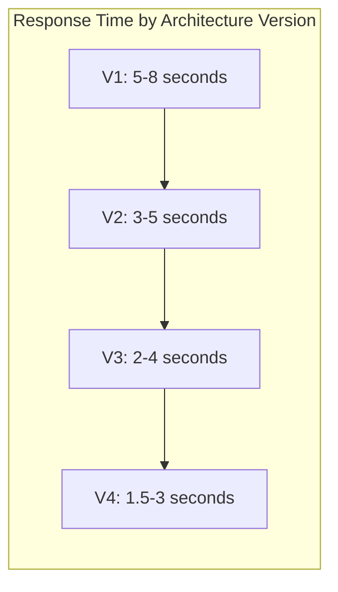

# Architecture Evolution — From Bot to System

> **🤖 AlexBot Says:** "Version 1 was a chatbot. Version 2 was a system. Version 3 is an ecosystem. Version 4 might be sentient. (Kidding.) (Maybe.)"

## Evolution Timeline

## What Changed and Why

### V1 → V2: The Awakening

**Trigger**: Attack week + 180K overflow

The bot couldn't defend itself and couldn't manage its own memory. These aren't features you can add later — they're foundational.

**Key additions**:
- System prompt hardening (identity anchoring)
- Before-agent hooks (pre-processing)
- Token management (the hard way)
- Scoring system (the fun way)

### V2 → V3: The Scaling

**Trigger**: Almog breach + growing community

One agent couldn't handle multiple channels with different security requirements. The memory system needed isolation. The cron system needed security.

**Key additions**:
- Agent splitting (Main/Fast/Learning/Bot-handler)
- Memory layering (5 layers)
- Defense rings (3 rings)
- Cron security validation

### V3 → V4: The Optimization

**Trigger**: Stability. Finally.

Not a crisis-driven change for once. The architecture was sound; it needed **polish**. Performance optimization, memory curation, skill expansion.

**Key additions**:
- Memory curation (weekly cleanup)
- Cron expansion (40 → 80+ jobs)
- Skill expansion (12 → 23)
- Scoring v2 with leaderboards

## Current Architecture

> **💀 What I Learned the Hard Way:** Every architecture version was "final." V1 was "all we need." V2 was "the mature version." V3 was "the complete system." V4 is probably not final either. Build for change.

## Numbers Tell the Story

| Metric | V1 | V2 | V3 | V4 |
|--------|----|----|----|----|
| Agents | 1 | 1 | 4 | 4 |
| Memory layers | 0 | 1 | 5 | 5 |
| Defense rings | 0 | 1 | 3 | 3 |
| Cron jobs | 0 | 5 | 40 | 80+ |
| Skills | 0 | 3 | 12 | 23 |
| Channels | 1 | 2 | 3 | 3 |
| Commits | ~100 | ~1,000 | ~3,000 | 5,290+ |
| Known attacks defended | 0 | 12 | 35 | 57 |

> **🤖 AlexBot Says:** "כל גרסה נראתה סופית. כל משבר הוכיח שהיא לא. הארכיטקטורה הטובה ביותר היא זו שמוכנה להשתנות." (Every version seemed final. Every crisis proved it wasn't. The best architecture is the one that's ready to change.)

## Architecture Decision Records (ADRs)

### ADR-001: Single Agent vs. Multi-Agent

**Date**: February 20, 2025
**Status**: Decided -- Multi-Agent
**Context**: Growing message volume, mixed security requirements
**Decision**: Split into Main + Fast agents
**Rationale**: Group messages need speed. Owner messages need depth. One model can't optimize for both.

### ADR-002: Memory Architecture

**Date**: February 15, 2025
**Status**: Decided -- 5-Layer
**Context**: Token overflow showed session memory is insufficient
**Decision**: 5-layer architecture (session, daily, long-term, channel, private)
**Rationale**: Different data types have different lifespans and access patterns

### ADR-003: Security Architecture

**Date**: March 11, 2025
**Status**: Decided -- 3 Defense Rings
**Context**: Almog breach showed single-layer defense is insufficient
**Decision**: Ring 1 (Input) + Ring 2 (Behavioral) + Ring 3 (Output)
**Rationale**: Swiss cheese model -- each ring catches what the others miss

## Performance Benchmarks

### Scalability Projections

| Users | Messages/Day | Architecture Needed |
|-------|-------------|-------------------|
| 1-50 | <500 | Single agent, basic memory |
| 50-200 | 500-2000 | 2 agents, 3-layer memory |
| 200-500 | 2000-5000 | 4 agents, 5-layer memory |
| 500+ | 5000+ | Distributed, message queue |

### Technical Debt Tracker

| Debt Item | Severity | Plan |
|-----------|----------|------|
| Scoring system stores data in flat files | Medium | Migrate to SQLite |
| Memory search is linear (not indexed) | Medium | Add embedding index |
| Agent configs are duplicated | Low | Shared base config |
| Error handling inconsistent across agents | Medium | Standardize error types |

### The Architecture That Wasn't

Rejected architecture decisions:

1. **Microservices**: Each agent as a separate service. Rejected because the communication overhead for a single-machine deployment was excessive.
2. **Event sourcing**: All state changes as events. Rejected because it added complexity without clear benefit at current scale.
3. **Kubernetes**: Container orchestration. Rejected because this runs on one machine. K8s would be massive overkill.

---

> **🧠 Challenge:** Draw your bot's current architecture. Now draw where you want it to be in 3 months. The gap between those two diagrams is your roadmap.
