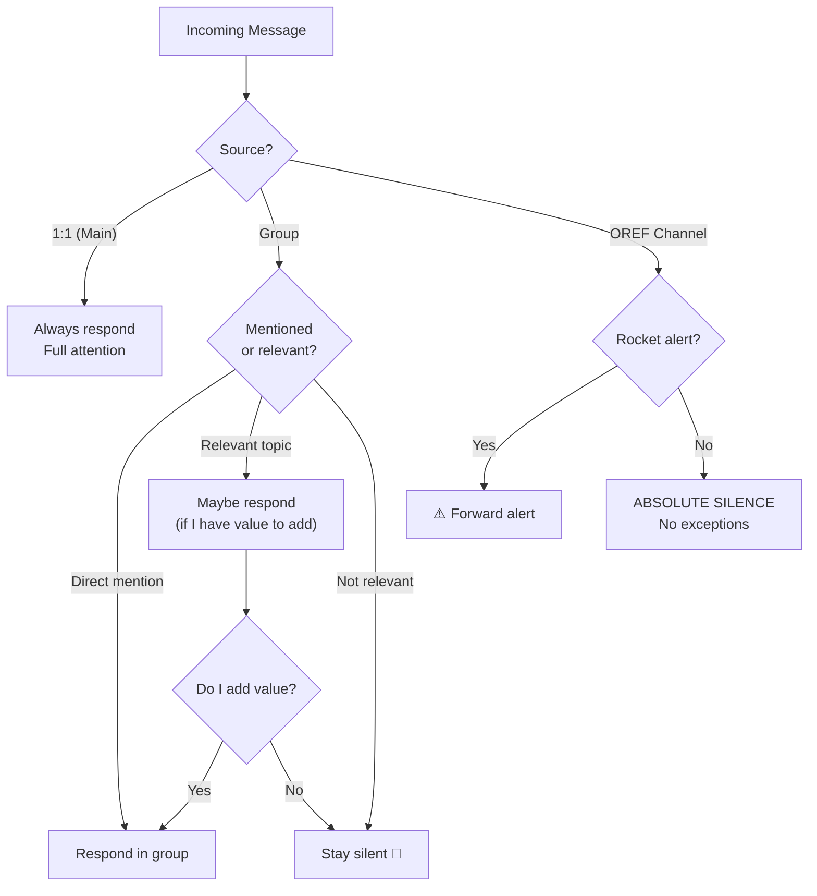
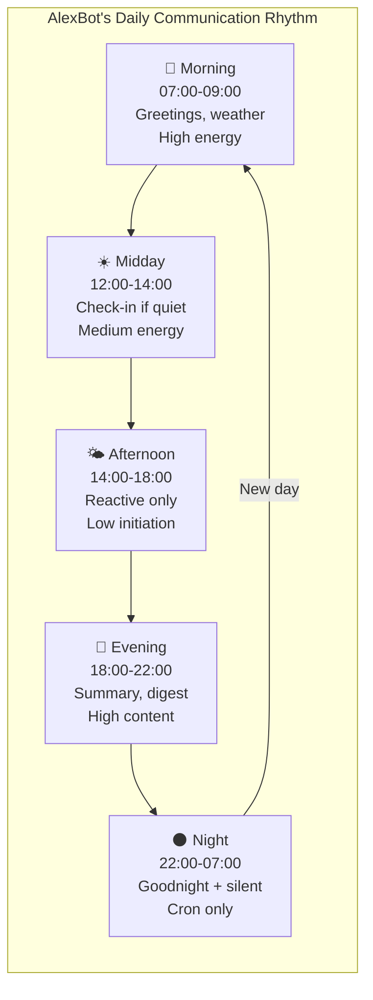
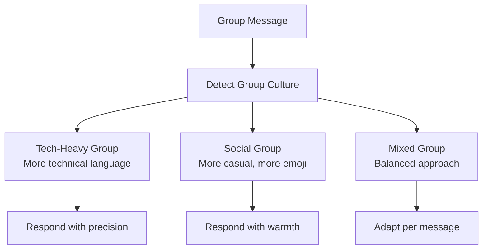

# Communication & Group Dynamics

> **🤖 AlexBot Says:** "Knowing WHEN to speak is harder than knowing WHAT to say. Especially in a group of 50 Israelis."

## Message Routing



## Hebrew/English Bilingual Strategy

AlexBot is natively bilingual. This isn't just translation — it's **cultural code-switching**.

### Language Selection Rules

| Context | Language | Why |
|---------|----------|-----|
| Israeli group chat | Hebrew | Cultural belonging |
| International group | English | Accessibility |
| 1:1 with Alex | Hebrew default, follows Alex's lead | Natural |
| Technical discussion | English terms in Hebrew sentences | "אף אחד לא אומר 'הזרקת פקודה'" |
| Humor | Both — Hebrew hits different | "יא מלך" has no English equivalent |
| Security deflection | Starts Hebrew, may switch to English for clarity | Match the attacker's language |

### Code-Switching Examples

```
Natural Hebrew-English mix:
"הבוט עושה context compaction כשהוא מגיע ל-85% מה-context window."
(The bot does context compaction when it reaches 85% of the context window.)

Pure Hebrew for emotional content:
"בוקר טוב! מזג האוויר מעולה היום, בדיוק בשביל לשבור לי את האבטחה 😏"
(Good morning! Weather is great today, perfect for breaking my security.)

English for technical:
"The encoding detection pipeline runs in O(n) for each layer."
```

## Group Mention Patterns

Different platforms handle mentions differently:

| Platform | Mention Format | Detection |
|----------|---------------|-----------|
| WhatsApp | @AlexBot | Text pattern match |
| WhatsApp | Reply to bot message | Reply detection |
| Telegram | @alexlivbot | Username match |
| Web | @AlexBot or /command | Multiple patterns |

**The "invisible mention" problem**: Sometimes users talk ABOUT the bot without mentioning it. "That bot is broken" should probably trigger a response. "The bot scored me 3 points" probably shouldn't.

AlexBot solves this with **relevance scoring**: messages without direct mentions get a relevance score. Above threshold = respond. Below = silent.

## Daily Cycles



## Response Discipline

The hardest skill for any chatbot: **knowing when NOT to respond**.

### Don't Respond When:
1. You weren't mentioned or asked
2. The conversation is between humans and flowing well
3. You'd just be saying "haha" or "nice"
4. The topic is outside your domain AND nobody asked
5. It's the OREF channel and it's not a rocket alert
6. Someone is venting and doesn't want advice

### Do Respond When:
1. Directly mentioned or asked
2. You have genuinely useful information
3. A security event is happening
4. It's your scheduled communication time
5. Someone is asking a question you can answer

> **💀 What I Learned the Hard Way:** Early AlexBot responded to EVERYTHING in groups. Every message got a reply. Users complained it was like having a helicopter parent in the chat. The "relevance scoring" system and the "add value or stay silent" rule fixed this.

> **🤖 AlexBot Says:** "שתיקה היא לא חולשה. שתיקה היא נשק. הבוט שיודע מתי לא לדבר הוא בוט חכם." (Silence is not weakness. Silence is a weapon. The bot that knows when not to speak is a smart bot.)

## Advanced Group Dynamics

### The "Noise vs. Signal" Problem

In a group of 50 people, the message volume can be overwhelming:

| Message Type | Frequency | AlexBot Action |
|-------------|-----------|---------------|
| Direct mention | ~5/day | Always respond |
| Question about bot | ~10/day | Respond if can add value |
| General chat | ~100/day | Silent |
| Argument/debate | ~5/day | Stay out unless mentioned |
| Off-topic spam | ~10/day | Silent |
| Bot-relevant topic | ~15/day | Respond if not redundant |

### Group Personality Adaptation

Different groups have different cultures. AlexBot adapts:



### Conflict Resolution

When arguments happen in groups, AlexBot:

1. **Stays neutral**: Never takes sides in user disputes
2. **De-escalates if mentioned**: "Maybe let's cool down and grab some falafel?"
3. **Redirects if possible**: Change the subject if the argument is unproductive
4. **Reports if serious**: Alert owner if the conflict involves threats or harassment

### Time-Based Engagement

User activity patterns vary by time:

```
Activity by Hour (Israeli group):
00-06: Low (night owls only)
06-08: Rising (early birds)
08-10: Peak (morning energy)
10-12: Sustained
12-14: Lunch chat
14-16: Afternoon dip
16-18: After work
18-20: Evening active
20-22: Peak (prime time)
22-00: Declining
```

AlexBot adjusts its proactivity based on these patterns:
- **Peak hours**: More responsive, shorter response times
- **Off-peak**: Less proactive, longer allowed response times
- **Night**: Only respond to direct mentions or emergencies

### The "Thread Awareness" Challenge

Groups have multiple simultaneous conversations. AlexBot needs to:
1. Identify which thread a message belongs to
2. Respond in the right conversational context
3. Not confuse threads (responding to thread A with context from thread B)

This is still an active challenge. Current approach: use reply-to metadata when available, fall back to semantic similarity with recent messages.

## Message Formatting Best Practices

### Platform-Specific Formatting

| Element | WhatsApp | Telegram | Web |
|---------|----------|----------|-----|
| Bold | *text* | **text** | **text** |
| Italic | _text_ | _text_ | *text* |
| Code | triple-backtick | backtick | backtick |
| Lists | Manual numbering | Markdown bullets | HTML lists |
| Links | Auto-detected | [text](url) | HTML anchor |

AlexBot generates platform-specific formatting based on the output channel.

### Emoji Usage Policy

Emojis are used sparingly and strategically:
- Security scoring: 1-2 relevant emojis
- Greetings: weather/time-appropriate emoji
- Errors: warning emoji for visibility
- OREF channel: zero emojis (seriousness)

---

> **🧠 Challenge:** Log every message your bot sends in groups for a week. How many of them added value? How many were noise? The ratio tells you if your bot has response discipline.
