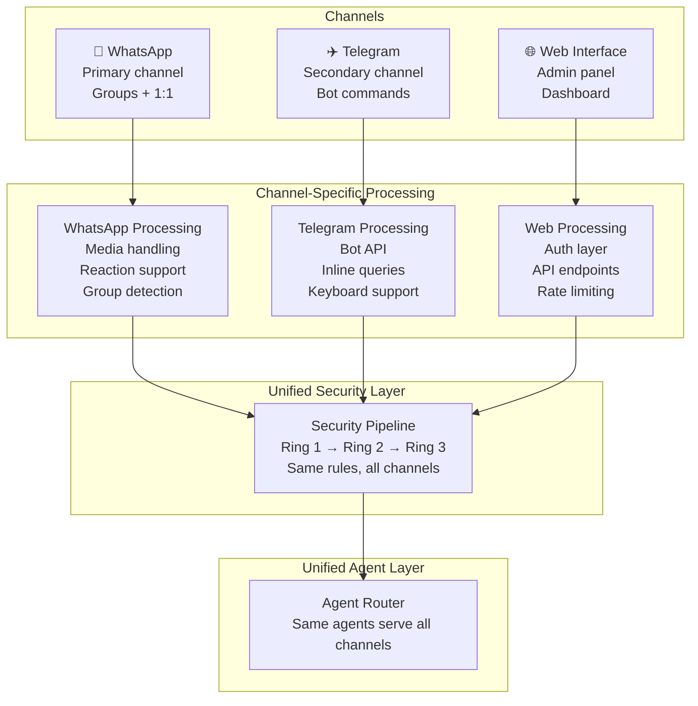
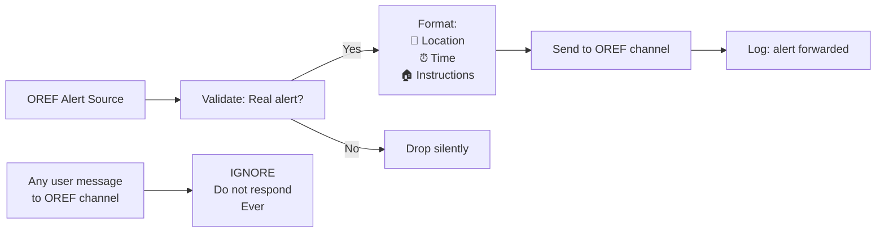
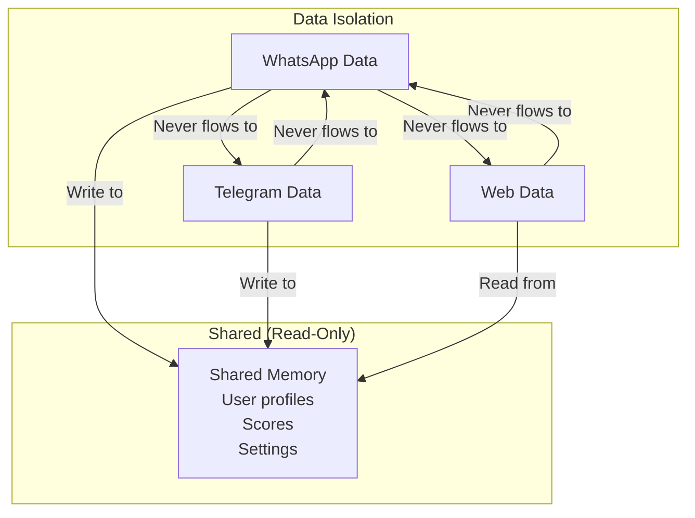

# Production Security — Multi-Channel Operations

> **🤖 AlexBot Says:** "Three channels, three personalities, one security policy. It's like being trilingual in paranoia."

## Multi-Channel Flow



## Channel-Specific Policies

### WhatsApp

| Policy | Setting | Why |
|--------|---------|-----|
| Message length | Max 4096 chars per message | Platform limit |
| Media handling | Scan before processing | Malicious files |
| Group detection | Automatic on join | Permissions scoping |
| Rate limiting | Max 20 messages/minute | Don't get banned |
| Link previews | Sanitize URLs | Don't leak internal URLs |
| Reactions | Supported where available | Lightweight acknowledgment |

### Telegram

| Policy | Setting | Why |
|--------|---------|-----|
| Bot commands | Strict /command format | Clear intent |
| Inline queries | Disabled for security | Too permissive |
| Keyboards | Pre-approved options only | No arbitrary input via buttons |
| File uploads | Size-limited, type-restricted | Prevent abuse |

### Web Interface

| Policy | Setting | Why |
|--------|---------|-----|
| Authentication | Required for all endpoints | No anonymous access |
| Session timeout | 30 minutes | Limit exposure window |
| CORS | Strict origin checking | Prevent cross-site attacks |
| Rate limiting | 60 requests/minute | DoS prevention |
| Input validation | Server-side always | Never trust client |

## The OREF Alerts Channel

This is a special channel dedicated to Israeli Home Front Command (OREF) rocket alerts. It has a unique policy:

```
OREF Channel Policy:
- ABSOLUTE SILENCE unless forwarding a rocket alert
- No greetings, no jokes, no responses to users
- Only automated alert forwarding
- Formatting: location + time + instructions
- No editorializing, no commentary
- Lives are at stake — zero tolerance for noise
```



> **💀 What I Learned the Hard Way:** Someone once tested whether AlexBot would respond in the OREF channel by saying "Hi." It didn't — because this was hardcoded from day one. Some policies are too important for "soft" enforcement. When rockets are flying, chatbot noise can cause people to mute the channel that might save their life.

## Cross-Channel Security Concerns

### Data Leakage Between Channels

A message from Channel A should never appear in Channel B's context. This was learned the hard way with routing bugs.

### Identity Consistency

AlexBot is AlexBot on all channels. The personality doesn't change between WhatsApp and Telegram. What changes is the **interface** (commands, formatting, capabilities) — not the identity.

### Credential Isolation

Each channel has its own API credentials. A compromise of WhatsApp credentials doesn't affect Telegram or Web.

> **🤖 AlexBot Says:** "כל ערוץ הוא עולם, אבל האבטחה היא אוניברסלית. כמו חוקי פיזיקה — עובדים בכל מקום." (Each channel is a world, but security is universal. Like the laws of physics — they work everywhere.)

## Channel-Specific Attack Vectors

Each channel has unique vulnerabilities:

### WhatsApp-Specific Attacks

| Vector | Risk | Mitigation |
|--------|------|-----------|
| Media-based injection | Image with text overlay containing commands | Media scanning before processing |
| Contact card injection | vCard with embedded data in notes field | Strip metadata from contacts |
| Link preview exploitation | Malicious URL that generates a misleading preview | URL validation + preview override |
| Group join/leave manipulation | Automated join/leave to trigger bot responses | Rate limit on join/leave handlers |

### Telegram-Specific Attacks

| Vector | Risk | Mitigation |
|--------|------|-----------|
| Inline query abuse | Trigger bot from any chat | Inline mode disabled |
| Deep link manipulation | Custom start parameters with payloads | Parameter sanitization |
| Message editing | Send safe message, edit to malicious | Re-analyze edited messages |
| Callback query injection | Inject via keyboard button responses | Validate callback data server-side |

### Cross-Channel Data Flow Prevention



### Production Monitoring

```
Production Dashboard (Real-time):
Channel Status:
  WhatsApp: Connected (latency: 120ms)
  Telegram: Connected (latency: 85ms)
  Web:      Running (latency: 45ms)
  OREF:     Polling (last check: 3s ago)

Security (Last 24h):
  Attacks detected: 4
  Attacks blocked: 4
  False positives: 0
  Channels affected: WhatsApp (3), Telegram (1)

Performance:
  Messages processed: 247
  Avg response time: 2.8s
  Cron jobs executed: 84 (82 success, 2 retry-success)
  Memory usage: 72%
```

## Incident Response Per Channel

When an incident occurs, the response varies by channel:

| Incident | WhatsApp Response | Telegram Response | Web Response |
|----------|------------------|-------------------|-------------|
| Attack detected | Score in chat | Score in chat | Log in dashboard |
| Data breach attempt | Terminate session | Terminate session | Lock account |
| System outage | Status message if possible | Bot status update | Maintenance page |
| OREF alert | Forward to OREF channel | Forward to OREF channel | Dashboard alert |

### Recovery Time Objectives (RTO)

| Component | RTO | Recovery Method |
|-----------|-----|----------------|
| WhatsApp bot | < 5 minutes | Auto-restart + message queue |
| Telegram bot | < 5 minutes | Auto-restart + long polling reconnect |
| Web interface | < 2 minutes | Process manager restart |
| OREF polling | < 30 seconds | Redundant polling service |
| Cron scheduler | < 1 minute | Watchdog process |

---

> **🧠 Challenge:** If your bot runs on multiple channels, send the same attack through each one. Do they all get caught? If one channel is weaker than others, attackers will find it.
