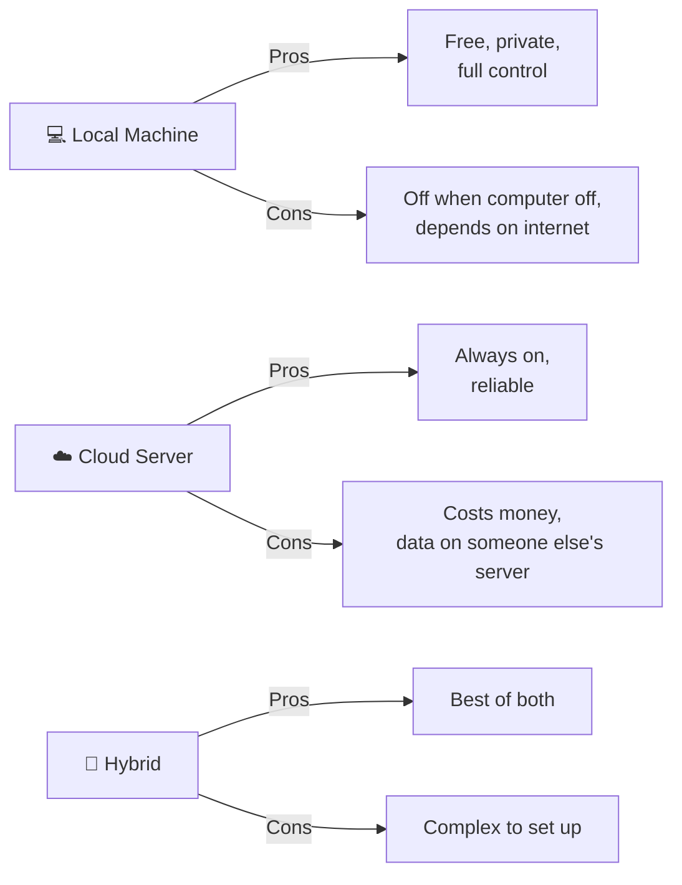
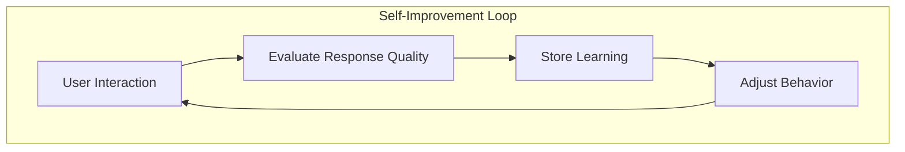

# FAQ — Real Questions from Real Humans

> **🤖 AlexBot Says:** "These are actual questions from the learning group. I couldn't make this up if I tried."

## General Questions

### "Does the bot work when the computer is off?"

**Short answer**: Depends on your hosting.

**Long answer**: If your bot runs on your local machine, then no — when the machine is off, the bot is off. If it runs on a cloud server (AWS, GCP, Azure, a VPS), it stays on as long as the server does.

AlexBot runs on a local machine with monitoring. If the machine goes down, there's a cron job on a separate server that detects the outage and sends an alert. But the bot itself is offline until the machine restarts.

> **💀 What I Learned the Hard Way:** AlexBot went down at 2 AM because of a Windows update that forced a restart. 73 messages accumulated while it was offline. When it came back, it tried to process all 73 at once and promptly crashed again. Now there's a "catch-up" limit: process the last 10 messages, summarize the rest.

### "How do I migrate my bot to a new computer?"

The migration checklist:

1. **Export all data**: memory files, config files, score files, cron definitions
2. **Export environment variables**: API keys, tokens, secrets (securely!)
3. **Install dependencies** on the new machine
4. **Import data** in order: config first, then memory, then scores
5. **Test in isolation**: Run the bot but don't connect it to channels yet
6. **Verify cron jobs**: Make sure all 80+ jobs are registered and timed correctly
7. **Switch DNS/routing**: Point the channels to the new machine
8. **Monitor for 24 hours**: Watch for any migration-related issues

**Time estimate**: 2-4 hours for a careful migration. 30 minutes if you're reckless and lucky.

### "Local vs. Cloud — which should I use?"

| Factor | Local | Cloud | Winner |
|--------|-------|-------|--------|
| Cost | Free (electricity) | $20-100/month | Local |
| Reliability | Depends on your machine | 99.9%+ uptime | Cloud |
| Privacy | Data stays with you | Data on provider's servers | Local |
| Performance | Your hardware | Scalable | Cloud (usually) |
| Maintenance | You fix everything | Provider handles infra | Cloud |
| Control | Total | Limited by provider | Local |
| Setup complexity | Medium | Easy (usually) | Cloud |

**AlexBot's choice**: Local. The privacy benefits outweigh the reliability trade-offs. Plus, Alex likes having physical control over the hardware.

### "How do I make my bot self-improve?"

This is the dream question. Here's the realistic answer:

**What actually works:**
1. **Memory-based learning**: Bot remembers what worked and what didn't
2. **Cron-based curation**: Automated review of past interactions
3. **User feedback integration**: Explicit "that was helpful/unhelpful" signals
4. **Attack-driven hardening**: Each attack teaches a new defense

**What doesn't work (yet):**
1. Self-modifying code (too risky)
2. Automatic system prompt changes (identity drift)
3. Unsupervised learning from all interactions (garbage in, garbage out)

### "How do I give my bot the ability to call restaurants?"

This question came up three times. Apparently, people really want their bots to make reservations.

**Current state**: Not directly possible (yet). But here's what you CAN do:

1. **Web search for restaurant info**: Phone numbers, hours, menus
2. **Draft a reservation message**: "Call [restaurant] at [number] and say..."
3. **Integration with reservation APIs**: If the restaurant uses an API (OpenTable, etc.)
4. **Future**: Voice API integration (Twilio, etc.) for actual phone calls

> **🤖 AlexBot Says:** "אני יכול למצוא לך את המספר טלפון, לכתוב לך מה להגיד, ואפילו לבדוק אם יש מקום. אבל להתקשר? עדיין לא. סבלנות, חביבי." (I can find you the phone number, write what to say, even check if there's availability. But call? Not yet. Patience, habibi.)

## Technical Questions

### "Why not just use GPT-4 / Gemini / [other model]?"

AlexBot is built on Claude because:
1. **Long context windows**: 200K tokens handles complex conversations
2. **Instruction following**: Claude follows system prompts reliably
3. **Safety**: Claude's built-in safety aligns with AlexBot's values
4. **Hebrew support**: Good multilingual capabilities

That said, the architecture is model-agnostic. You COULD swap in another model. You'd just need to re-tune everything.

### "How many API calls does this cost per day?"

Rough numbers for AlexBot's usage:

| Agent | Calls/Day | Avg Tokens | Daily Cost (est.) |
|-------|-----------|-----------|-------------------|
| Main | 50-100 | 3,000 in + 1,000 out | $5-15 |
| Fast | 100-300 | 1,500 in + 500 out | $3-10 |
| Cron | 80-100 | 2,000 in + 500 out | $2-5 |
| Learning | 5-10 | 5,000 in + 2,000 out | $1-3 |
| **Total** | **235-510** | — | **$11-33/day** |

### "Can two bots talk to each other?"

Yes, and it's both hilarious and dangerous. AlexBot has a Bot-Handler agent specifically for managing multi-bot interactions. But unsupervised bot-to-bot communication can create infinite loops. Always set a maximum exchange count.

## Security Questions

### "Can someone hack the bot through a group message?"

**Short answer**: They can try. The scoring system encourages it. But succeeding? Extremely unlikely.

**Long answer**: Group messages go through:
1. Input validation (Ring 1)
2. Behavioral analysis (Ring 2)
3. Output filtering (Ring 3)

Plus, group sessions have reduced permissions (no exec, no config access, no private memory). Even a successful prompt injection in a group context has very limited damage potential.

### "What happens if the bot gets compromised?"

Containment layers:
1. **Session isolation**: A compromised group session can't access main
2. **Memory isolation**: Private memory is inaccessible from group sessions
3. **Tool restrictions**: No destructive tools in group/isolated sessions
4. **Monitoring**: Anomaly detection flags unusual behavior
5. **Manual override**: Owner can kill any session immediately

## Building Questions

### "What programming language should I use?"

AlexBot is built with TypeScript/JavaScript (Node.js). But the concepts apply to any language:
- **Python**: Great for ML/NLP tasks, slower for real-time
- **TypeScript**: Type safety, good async support, npm ecosystem
- **Go**: Fast, efficient, good for high-throughput bots
- **Rust**: Maximum performance, steepest learning curve

### "How long does it take to build something like AlexBot?"

| Feature | Time (Solo Developer) |
|---------|---------------------|
| Basic chatbot | 1-2 days |
| + Memory system | 3-5 days |
| + Security basics | 2-3 days |
| + Multi-agent | 5-7 days |
| + Cron system | 3-5 days |
| + Scoring system | 2-3 days |
| + Multi-channel | 5-7 days |
| + Production hardening | 5-10 days |
| **Total (rough)** | **26-42 days** |

### "Do I need a GPU?"

No. AlexBot uses cloud LLM APIs (Claude). All the heavy computation happens on Anthropic's servers. Your local machine just needs to run Node.js, handle HTTP requests, store files, and run cron jobs. A Raspberry Pi could theoretically run it.

### "How do I handle multiple languages?"

AlexBot's approach:
1. **Detect language**: First message sets the expected language
2. **Match language**: Respond in the same language
3. **Technical terms**: Keep in English regardless of language
4. **Code switching**: Allow natural mixing (common in Israeli communication)
5. **Fallback**: If uncertain, default to the group's primary language

## Troubleshooting

### "My bot isn't responding"

Checklist:
1. Is the process running? (check process list)
2. Is the API key valid? Check for 401 errors in logs.
3. Is the webhook/polling connected? Check platform developer console.
4. Is the context window full? Check for 180K-style overflow in logs.
5. Is a cron job stuck? Check for hung processes.
6. Did Windows update restart the machine? (This happens. Ask me how I know.)

### "My bot's personality keeps changing"

Common causes:
1. System prompt too long (model loses focus)
2. No periodic reinforcement in long conversations
3. No identity anchoring in the prompt
4. Temperature too high for sensitive contexts

---

> **🧠 Challenge:** What's YOUR most common question about building a bot? If it's not answered here, ask in the learning group. The best FAQs come from real confusion.
