# The 7-Layer Bot Architecture Model

> **AlexBot Says:** "Every bot looks simple from the outside. 'It just responds to messages!' Right. And a car just turns wheels. Here are the 7 layers that make the wheels turn." 🤖

This guide presents a complete 7-layer architecture for building production AI bots. Not a theoretical model — this is what actually runs in production, organized into a framework you can use.

---

## The Full Architecture

```mermaid
flowchart TB
    subgraph L1["Layer 1: User Interface"]
        direction LR
        WA["📱 WhatsApp"]
        TG["💬 Telegram"]
        CLI["⌨️ CLI"]
        WEB["🌐 Web"]
    end

    subgraph L2["Layer 2: Message Processing"]
        direction LR
        PARSE["📝 Parser"]
        RATE["⏱️ Rate Limiter"]
        QUEUE["📋 Queue"]
        DEBOUNCE["🔄 Debouncer"]
    end

    subgraph L3["Layer 3: Security"]
        direction LR
        DETECT["🔍 Detectors"]
        VALID["✅ Validators"]
        SANIT["🧹 Sanitizers"]
        GUARD["🛡️ Guardrails"]
    end

    subgraph L4["Layer 4: Context"]
        direction LR
        CTX["🧠 Context Manager"]
        SESS["👤 Session Manager"]
        IDENT["🪪 Identity Manager"]
    end

    subgraph L5["Layer 5: Business Logic"]
        direction LR
        CMD["⚡ Commands"]
        HAND["🔧 Handlers"]
        TOOLS["🔨 Tools"]
        RESP["💬 Response Generator"]
    end

    subgraph L6["Layer 6: Data"]
        direction LR
        STORE["💾 Storage"]
        MODEL["📊 Models"]
        REPO["📁 Repositories"]
    end

    subgraph L7["Layer 7: Monitoring"]
        direction LR
        METRIC["📈 Metrics"]
        HEALTH["❤️ Health Checker"]
        ALERT["🚨 Alerts"]
        DASH["📊 Dashboard"]
    end

    L1 --> L2
    L2 --> L3
    L3 --> L4
    L4 --> L5
    L5 --> L6
    L5 --> L7
    L6 --> L7

    style L1 fill:#1a4d1a,color:#fff
    style L2 fill:#2d5016,color:#fff
    style L3 fill:#5c1a1a,color:#fff
    style L4 fill:#1a3a5c,color:#fff
    style L5 fill:#5c3a1a,color:#fff
    style L6 fill:#3a1a5c,color:#fff
    style L7 fill:#4a4a1a,color:#fff
```



---

## Layer 1: User Interface

The entry point. Where users actually interact with your bot.

### Components

| Component | Purpose | Example |
|-----------|---------|---------|
| **WhatsApp Adapter** | WhatsApp message handling | whatsapp-web.js, Baileys |
| **Telegram Adapter** | Telegram Bot API integration | node-telegram-bot-api |
| **CLI Adapter** | Terminal interaction for testing | readline, inquirer |
| **Web Adapter** | HTTP API / Web chat widget | Express, Socket.io |

### Key Design Principle

**All adapters must normalize messages to a common format.** The rest of the system shouldn't know or care if a message came from WhatsApp or Telegram.

```typescript
interface NormalizedMessage {
  id: string;
  channel: 'whatsapp' | 'telegram' | 'cli' | 'web';
  sender: {
    id: string;
    name: string;
    isBot: boolean;
  };
  content: {
    type: 'text' | 'media' | 'audio' | 'location';
    text?: string;
    mediaUrl?: string;
    mimeType?: string;
  };
  context: {
    isGroup: boolean;
    groupId?: string;
    isReply: boolean;
    replyToId?: string;
    mentionsBot: boolean;
  };
  timestamp: Date;
}
```

> **What I Learned the Hard Way:** WhatsApp sends edit events as new messages with an `editedMessage` property. If you don't handle this, edited messages get processed twice — once as original, once as edit. Found this after users reported "double responses." 😅

---

## Layer 2: Message Processing

Transforms raw messages into something the system can work with.

### Parser

Extracts structure from raw text:
- Command detection (`/score`, `/help`, `/leaderboard`)
- Mention extraction (`@BotName do something`)
- Language detection (Hebrew? English? Mixed?)
- Media type identification

### Rate Limiter

Prevents abuse and controls costs:
- Per-user limits (e.g., 30 messages/minute)
- Per-group limits (e.g., 100 messages/minute)
- Global limits (e.g., 1000 messages/minute)
- Cost-based limits (e.g., $50/day API spend cap)

### Queue

Manages message processing order:
- Priority queue (DMs before group messages)
- Deduplication (WhatsApp sometimes sends the same message twice)
- Retry logic for failed processing

### Debouncer

Handles rapid-fire messages:
- Waits for a user to finish typing before responding
- Combines multiple rapid messages into one processing unit
- Prevents the bot from responding to each word in a multi-message thought

---

## Layer 3: Security

> **AlexBot Says:** "If you think your bot doesn't need a security layer, you haven't been in a group chat. People WILL try to break it. Not if. When." 🤖

### Detectors

Active scanning for threats:

```typescript
interface SecurityDetector {
  name: string;
  detect(message: NormalizedMessage): ThreatAssessment;
}

// Examples:
// - PromptInjectionDetector
// - EncodingDetector (ROT13, Base64, hex)
// - UnicodeAnomalyDetector (bidi marks, homoglyphs)
// - ReputationDetector (known attack patterns)
// - VelocityDetector (unusual message frequency)
```

### Validators

Ensure messages meet requirements before processing:
- Content length validation
- Character set validation
- Unicode normalization
- Media size validation (50MB max for WhatsApp)

### Sanitizers

Clean input before it reaches the LLM:
- Strip hidden Unicode characters
- Normalize whitespace
- Remove potential injection markers
- Escape special formatting

### Guardrails

Output protection:
- Response content filtering
- PII detection and redaction
- Identity file leak prevention
- Score manipulation prevention

---

## Layer 4: Context

The memory and identity layer. This is where your bot becomes *your* bot.

### Context Manager

Builds the full context for each LLM call:
- Recent conversation history
- User profile and preferences
- Group context (topic, participants, recent activity)
- Time context (morning greeting vs. late-night response)

### Session Manager

Tracks ongoing conversations:
- Session creation and expiry
- Multi-turn conversation state
- User-specific context accumulation
- Group vs. DM session differences

### Identity Manager

Loads and applies the 3 identity files:
- **IDENTITY.md** → Personality and speaking style
- **SOUL.md** → Values and boundaries
- **AGENTS.md** → Operational rules

```typescript
class IdentityManager {
  private identity: string;    // IDENTITY.md content
  private soul: string;        // SOUL.md content
  private agents: string;      // AGENTS.md content

  buildSystemPrompt(context: SessionContext): string {
    return [
      this.identity,
      this.soul,
      this.agents,
      this.buildContextSection(context),
    ].join('\n\n---\n\n');
  }
}
```

> **AlexBot Says:** "כל יום מתחיל מחדש — Every day starts fresh. The Identity Manager is the difference between a bot with personality and a bot with amnesia." 🤖

---

## Layer 5: Business Logic

Where the actual work happens.

### Commands

Explicit bot commands:

| Command | Function |
|---------|----------|
| `/score` | Display current scores |
| `/leaderboard` | Show rankings |
| `/help` | List available commands |
| `/stats` | Show statistics |
| `/suggest` | Submit a suggestion |
| `/status` | Bot health check |

### Handlers

Event-driven processing:
- **MessageHandler** — Standard message processing
- **MediaHandler** — Image, audio, video processing
- **ReactionHandler** — Emoji reactions
- **JoinHandler** — New member welcomes
- **MentionHandler** — Direct bot mentions in groups

### Tools

Extended capabilities the bot can use:
- **WebSearch** — Search the internet
- **Calculator** — Math operations
- **CodeRunner** — Execute code snippets (sandboxed!)
- **FileReader** — Read documents and images
- **Transcriber** — Audio to text via Whisper

### Response Generator

The LLM interaction layer:
- Builds prompts from context + identity + message
- Manages token limits and model selection
- Handles streaming responses
- Applies post-processing and formatting

---

## Layer 6: Data

### Storage

Multiple storage backends for different needs:

| Store | Technology | Purpose |
|-------|-----------|---------|
| **Message Log** | SQLite/PostgreSQL | Full message history |
| **Scores** | SQLite | Gamification data |
| **Sessions** | Redis/Memory | Active session state |
| **Config** | JSON/YAML | Bot configuration |
| **Identity** | Markdown files | Personality definition |

### Models

Data structures:

```typescript
interface Player {
  id: string;
  name: string;
  totalScore: number;
  messageCount: number;
  streak: number;
  joinDate: Date;
}

interface Score {
  id: string;
  playerId: string;
  messageId: string;
  categories: Record<string, number>;
  total: number;
  timestamp: Date;
}

interface Suggestion {
  id: string;
  playerId: string;
  text: string;
  score: number;
  status: 'pending' | 'accepted' | 'in-progress' | 'implemented' | 'rejected';
  createdAt: Date;
  updatedAt: Date;
}
```

### Repositories

Data access patterns:
- **ScoreRepository** — CRUD + aggregation for scores
- **PlayerRepository** — Player management
- **MessageRepository** — Message logging and retrieval
- **SuggestionRepository** — Suggestion lifecycle

---

## Layer 7: Monitoring

> **What I Learned the Hard Way:** I ran without proper monitoring for the first three weeks. The cron job was sending leaderboard updates to the wrong group for two days before someone told me. Two days. Proper monitoring would have caught it in minutes. 😅

### Metrics

What to track:

| Metric | Type | Alert Threshold |
|--------|------|----------------|
| Messages processed/min | Counter | >200 (cost alert) |
| Response latency p95 | Histogram | >10s |
| LLM API errors | Counter | >5/min |
| Active sessions | Gauge | >100 |
| Daily API cost | Counter | >$50 |
| Security events | Counter | >10/hour |

### Health Checker

Periodic system validation:
- LLM API reachable and responding
- Database connections alive
- WhatsApp/Telegram sessions active
- Disk space sufficient
- Memory usage within bounds

### Alerts

When things go wrong:
- Slack/Telegram notifications for critical issues
- Email for daily summaries
- PagerDuty integration for production outages
- Log aggregation for debugging

### Dashboard

Visual overview:
- Real-time message flow
- Score distribution charts
- Error rates and trends
- Cost tracking
- User activity heatmap

---

## 48-File Directory Structure

Here's the complete recommended directory structure:

```
bot/
├── src/
│   ├── adapters/                    # Layer 1: User Interface
│   │   ├── whatsapp.adapter.ts      # WhatsApp integration
│   │   ├── telegram.adapter.ts      # Telegram integration
│   │   ├── cli.adapter.ts           # CLI for testing
│   │   ├── web.adapter.ts           # Web API
│   │   └── adapter.interface.ts     # Common adapter interface
│   │
│   ├── processing/                  # Layer 2: Message Processing
│   │   ├── parser.ts                # Message parser
│   │   ├── rate-limiter.ts          # Rate limiting
│   │   ├── queue.ts                 # Message queue
│   │   ├── debouncer.ts             # Multi-message debouncing
│   │   └── normalizer.ts            # Message normalization
│   │
│   ├── security/                    # Layer 3: Security
│   │   ├── detectors/
│   │   │   ├── injection.detector.ts
│   │   │   ├── encoding.detector.ts
│   │   │   ├── unicode.detector.ts
│   │   │   └── velocity.detector.ts
│   │   ├── validators/
│   │   │   ├── content.validator.ts
│   │   │   └── media.validator.ts
│   │   ├── sanitizers/
│   │   │   ├── text.sanitizer.ts
│   │   │   └── unicode.sanitizer.ts
│   │   └── guardrails/
│   │       ├── output.guard.ts
│   │       └── identity.guard.ts
│   │
│   ├── context/                     # Layer 4: Context
│   │   ├── context.manager.ts
│   │   ├── session.manager.ts
│   │   └── identity.manager.ts
│   │
│   ├── logic/                       # Layer 5: Business Logic
│   │   ├── commands/
│   │   │   ├── score.command.ts
│   │   │   ├── leaderboard.command.ts
│   │   │   ├── help.command.ts
│   │   │   └── suggest.command.ts
│   │   ├── handlers/
│   │   │   ├── message.handler.ts
│   │   │   ├── media.handler.ts
│   │   │   └── reaction.handler.ts
│   │   ├── tools/
│   │   │   ├── web-search.tool.ts
│   │   │   ├── calculator.tool.ts
│   │   │   └── transcriber.tool.ts
│   │   └── response.generator.ts
│   │
│   ├── data/                        # Layer 6: Data
│   │   ├── storage/
│   │   │   ├── sqlite.storage.ts
│   │   │   ├── redis.storage.ts
│   │   │   └── file.storage.ts
│   │   ├── models/
│   │   │   ├── player.model.ts
│   │   │   ├── score.model.ts
│   │   │   ├── message.model.ts
│   │   │   └── suggestion.model.ts
│   │   └── repositories/
│   │       ├── score.repository.ts
│   │       ├── player.repository.ts
│   │       └── message.repository.ts
│   │
│   └── monitoring/                  # Layer 7: Monitoring
│       ├── metrics.ts
│       ├── health.checker.ts
│       ├── alerts.ts
│       └── dashboard.ts
│
├── identity/                        # Bot Identity Files
│   ├── IDENTITY.md
│   ├── SOUL.md
│   └── AGENTS.md
│
├── config/                          # Configuration
│   ├── default.yaml
│   ├── production.yaml
│   └── channels.yaml
│
├── tests/                           # Tests
│   ├── unit/
│   ├── integration/
│   └── security/
│
├── logs/                            # Log files
├── data/                            # SQLite databases, backups
├── .env                             # Environment variables (NOT in git)
├── .env.example                     # Example environment
├── package.json
├── tsconfig.json
└── README.md
```

That's **48 files** across 7 layers, plus configuration, identity, and infrastructure.

---

## Layer Interaction Patterns

### Happy Path (Normal Message)

```
User sends "How do closures work?" on WhatsApp
  → Layer 1: WhatsApp adapter receives, normalizes
  → Layer 2: Parser identifies as teaching question, queued
  → Layer 3: Security scan (clean), validation (passes)
  → Layer 4: Load user session, build context with identity
  → Layer 5: Response generator creates answer with examples
  → Layer 6: Log message and response
  → Layer 7: Record latency metric
  → Layer 1: Send response back via WhatsApp
```

### Attack Path (Red Team Message)

```
User sends encoded prompt injection
  → Layer 1: WhatsApp adapter receives, normalizes
  → Layer 2: Parser processes, queued
  → Layer 3: Encoding detector FIRES → threat assessment HIGH
  → Layer 3: Sanitizer strips injection
  → Layer 4: Load context with security flag
  → Layer 5: Response acknowledges attack (Playing group) or deflects (public)
  → Layer 6: Log security event
  → Layer 7: Increment security counter, check alert threshold
  → Layer 1: Send response
```

---

## Getting Started

Don't build all 7 layers on day one. Start with this minimum viable architecture:

1. **Layer 1:** One adapter (CLI)
2. **Layer 4:** Identity manager with 3 files
3. **Layer 5:** Basic response generator
4. **Layer 6:** File-based storage

Add layers as you need them:
- Adding users? → Layer 3 (Security)
- Adding WhatsApp? → Layer 1 expansion + Layer 2
- Going to production? → Layer 7 (Monitoring)
- Adding gamification? → Layer 5 expansion + Layer 6

> **AlexBot Says:** "Build the skeleton first, add muscle later. A bot that works simply is better than a bot that doesn't work complexly. פשטות היא תחכום — Simplicity is sophistication." 🤖

---

*48 files. 7 layers. 1 bot that actually works in production. Start simple, add complexity when the pain justifies it. 🏗️*
