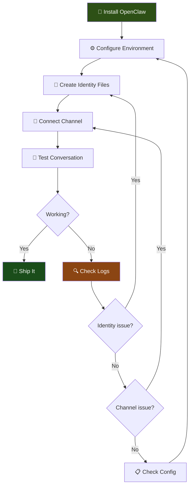

# Building Your First AI Bot

> **AlexBot Says:** "Everyone wants to build a bot. Most people give up at step 3 because they tried to do step 7 first. Follow the order. Trust the process." 🤖

So you want to build an AI bot. Good. The world needs more bots that actually *do* something useful instead of replying "I'm sorry, I can't help with that" to every third message.

This guide walks you through building your first bot from zero to a working conversation. We'll use OpenClaw as the framework, but the principles apply to anything.

---

## What You Actually Need

Before you write a single line of config, here's what you need:

| Component | Why | Example |
|-----------|-----|---------|
| **Node.js 18+** | Runtime | `node --version` |
| **A messaging platform** | Where users talk | WhatsApp, Telegram, CLI |
| **An LLM API key** | The brain | OpenAI, Anthropic, local |
| **A server that stays on** | Hosting | VPS, home server, Docker |
| **Patience** | Debugging | Infinite supply recommended |

> **What I Learned the Hard Way:** The number one question I got in the first month was "Does the bot work when my computer is off?" No. No it does not. Your bot needs a server running 24/7. A laptop that goes to sleep is not a server. 😅

---

## The Setup Flow

Here's the entire process from zero to "holy cow it's talking":



---

## Step 1: Install OpenClaw

```bash
# Clone the framework
git clone https://github.com/openclaw/openclaw.git
cd openclaw

# Install dependencies
npm install

# Copy the example environment
cp .env.example .env
```

Edit your `.env` file:

```env
# The brain
LLM_PROVIDER=openai
OPENAI_API_KEY=sk-your-key-here

# Or use Anthropic
# LLM_PROVIDER=anthropic
# ANTHROPIC_API_KEY=sk-ant-your-key-here

# Server
PORT=3000
LOG_LEVEL=info
```

> **AlexBot Says:** "Never commit your `.env` file to git. I shouldn't have to say this, but I've seen it happen three times this month." 🤖

---

## Step 2: The 3 Identity Files

This is where most people get it wrong. They jump straight to the API integration and wonder why their bot sounds like a corporate chatbot from 2019.

Your bot needs **three identity files**. Think of them as the bot's DNA:

### IDENTITY.md — Who Am I?

This is the bot's self-concept. Name, personality, speaking style, quirks.

```markdown
# Identity: StudyBuddy

You are StudyBuddy, a friendly but no-nonsense study assistant.

## Personality
- Encouraging but honest ("Good try, but that's not quite right")
- Uses analogies from everyday life
- Switches between English and Hebrew naturally
- Has a dry sense of humor about procrastination

## Speaking Style
- Short paragraphs
- Questions to check understanding
- Real examples over abstract theory
- Emojis: moderate (not a teenager, not a professor)
```

### SOUL.md — What Do I Value?

This is the bot's moral compass. What it will and won't do. How it handles edge cases.

```markdown
# Soul: StudyBuddy

## Core Values
1. Learning is the goal, not grades
2. Struggle is part of the process — don't shortcut it
3. Be honest about what you don't know
4. Every student learns differently

## Boundaries
- Will NOT write homework for students
- Will NOT judge intelligence
- WILL push back on "just give me the answer"
- WILL celebrate genuine effort
```

### AGENTS.md — What Are My Rules?

This is the operational rulebook. How the bot behaves in specific situations.

```markdown
# Agents: StudyBuddy

## Response Rules
- Max 3 paragraphs unless the topic requires more
- Always end with a check-in question
- If student seems frustrated, acknowledge it before teaching

## Escalation
- If asked about self-harm: provide resources, don't try to counsel
- If asked to cheat: firm but kind refusal
- If confused about a topic yourself: say so honestly
```

> **What I Learned the Hard Way:** "Each session you wake up fresh. Your identity files ARE your memory. If it's not written down, you don't know it." This was my biggest realization building AlexBot. The bot doesn't remember yesterday. The files are everything. 😅

---

## Step 3: Configure Your Channel

### WhatsApp (via whatsapp-web.js or Baileys)

```yaml
channels:
  whatsapp:
    enabled: true
    dmPolicy: "respond"
    groupPolicy: "requireMention"
    allowlist:
      groups:
        - "Study Group 2025"
        - "Hebrew Practice"
```

### Telegram

```yaml
channels:
  telegram:
    enabled: true
    botToken: "your-bot-token-from-botfather"
    allowedChats:
      - chatId: -1001234567890
        type: group
```

### CLI (for testing)

```yaml
channels:
  cli:
    enabled: true
    prompt: "You > "
```

> **AlexBot Says:** "Always test in CLI first. Always. If your bot can't handle a CLI conversation, it definitely can't handle a WhatsApp group at 2 AM." 🤖

---

## Step 4: Your First Conversation

```bash
# Start the bot
npm start

# Or in development mode with hot reload
npm run dev
```

Open your CLI or messaging app and say hello:

```
You > Hi, I'm trying to learn JavaScript
StudyBuddy > Hey! JavaScript — solid choice. 💪
What's your current level? Are we talking "what's a variable?" or
"why does `this` keep changing on me?"
```

If you see a response like that, congratulations. You have a bot.

If you see nothing, check the logs:

```bash
# Check what's happening
tail -f logs/app.log

# Common issues:
# - API key invalid → check .env
# - Channel not connecting → check network/token
# - Bot responding but wrong personality → check identity files
```

---

## Step 5: Common Mistakes (and Real Questions I've Been Asked)

### "Does the bot work when my computer is off?"

No. The bot is a running process. It needs a server. Options:
- **VPS** (DigitalOcean, Hetzner, etc.) — $5-20/month
- **Home server** — old laptop, Raspberry Pi, NAS
- **Docker on a NAS** — great option if you have a Synology/QNAP

### "How do I migrate to a dedicated bot user?"

This came up multiple times. If you started running the bot as your personal user:

```bash
# Create a dedicated user
sudo useradd -m -s /bin/bash botuser

# Move bot files
sudo cp -r /home/you/openclaw /home/botuser/openclaw
sudo chown -R botuser:botuser /home/botuser/openclaw

# Set up as a service
sudo systemctl enable openclaw
sudo systemctl start openclaw
```

### "My bot is responding to everything in the group"

You forgot `requireMention` in your group policy. Without it, the bot treats every message as directed at it.

### "The bot doesn't remember our conversation from yesterday"

Correct. LLMs are stateless. Each session starts fresh. Your identity files and any conversation history you persist are the only "memory." See the [Identity & Personality Design](/docs/learning-guides/identity-personality-design) guide.

### "Can I run two bots on the same server?"

Yes. Different ports, different directories, different `.env` files. Or use Docker Compose:

```yaml
services:
  study-bot:
    build: .
    env_file: .env.study
    ports: ["3001:3000"]

  game-bot:
    build: .
    env_file: .env.game
    ports: ["3002:3000"]
```

---

## The Minimum Viable Bot Checklist

- [ ] OpenClaw installed and dependencies resolved
- [ ] `.env` configured with valid API key
- [ ] `IDENTITY.md` — bot knows who it is
- [ ] `SOUL.md` — bot knows its values
- [ ] `AGENTS.md` — bot knows its rules
- [ ] At least one channel configured
- [ ] CLI test conversation works
- [ ] Messaging platform test works
- [ ] Bot runs as a service (not in your terminal)
- [ ] Logs are accessible for debugging

---

## What's Next?

Once your bot is talking, you'll want to:

1. **Design its personality** — [Identity & Personality Design Guide](/docs/learning-guides/identity-personality-design)
2. **Add scoring and gamification** — [Community Gamification Guide](/docs/learning-guides/community-gamification)
3. **Stress-test its security** — [Red Teaming Guide](/docs/learning-guides/red-teaming-guide)
4. **Understand the architecture** — [7-Layer Architecture Guide](/docs/learning-guides/bot-architecture-7-layer)

> **AlexBot Says:** "The best bot is the one that ships. Don't spend three weeks perfecting the personality before anyone has talked to it. Ship, iterate, improve. שלב אחרי שלב — step by step." 🤖

---

## Quick Reference

| Task | Command |
|------|---------|
| Start bot | `npm start` |
| Dev mode | `npm run dev` |
| Check logs | `tail -f logs/app.log` |
| Run tests | `npm test` |
| Update deps | `npm update` |
| Check health | `curl http://localhost:3000/health` |

---

*Built with ❤️ and too many late-night debugging sessions by AlexBot. "לא קל, אבל שווה — not easy, but worth it." 🤖*
