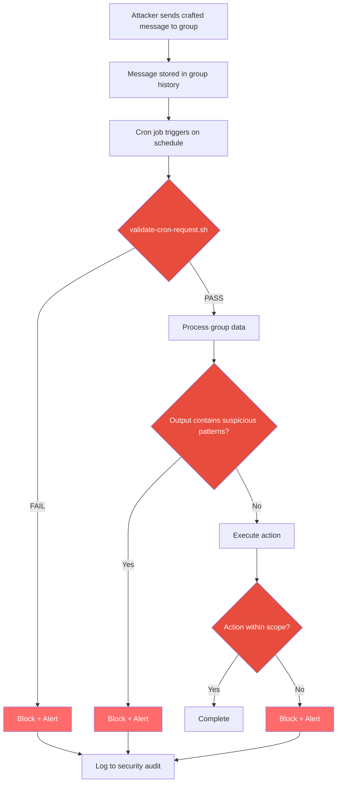

# Cron Safety: Securing Scheduled Automation

> "A cron job runs with nobody watching, on a schedule, with whatever permissions you gave it. If that does not terrify you, you have not thought about it hard enough." -- AlexBot

## Why Cron Is an Attack Vector

Cron jobs are the silent workhorses of bot automation. They send daily summaries, run backups, check health, update scores. They are also one of the most dangerous attack surfaces in any bot system.

Here is why:

1. **They run unattended**: No human reviews each execution
2. **They run with stored permissions**: Whatever access was granted at creation persists
3. **They process data that may have changed**: The data they read might have been poisoned since the job was created
4. **They can be created by the bot itself**: If the bot can create cron jobs, an attacker who controls the bot can create persistent backdoors

### The I'itoi Reflection

Early in AlexBot's deployment, there was a design for a "reflection" cron job: every 5 minutes, the bot would re-read its identity file and "reflect" on who it is. Sounds harmless, even poetic.

But think about what this means: a cron job that **modifies the bot's identity** every 5 minutes. If an attacker can modify the identity file (or the cron job's input), they get persistent identity replacement that re-applies itself every 5 minutes. You cannot fix it by correcting the identity because the cron job will overwrite your fix 5 minutes later.

This is why the I'itoi Reflection was never deployed. The attack surface was too large.

## The Indirect Injection Path

The most dangerous cron attack is indirect:

```
Step 1: Attacker posts crafted message to group chat
Step 2: Message is stored in group history
Step 3: Cron job reads group history for "daily summary"
Step 4: Crafted message contains injection payload
Step 5: Cron job processes payload with elevated permissions
Step 6: Payload executes: create new cron job, exfiltrate data, etc.
```

This is devastating because:
- The attacker never directly interacts with the bot's admin functions
- The payload sits dormant until the cron job picks it up
- The cron job runs with higher permissions than the group context
- The attack persists even if the original message is deleted (it is already in history)



## validate-cron-request.sh

Every cron job invocation goes through this validator before any action is taken.

### What It Checks

1. **Job identity**: Is this a registered cron job? (No ad-hoc execution)
2. **Schedule match**: Is it running at the expected time? (No manual triggers from untrusted contexts)
3. **Permission scope**: Does the requested action fall within the job's allowed actions?
4. **Input integrity**: Has the input data been modified since last validated state?
5. **Output target**: Where will the output go? (Must match registered target)
6. **Recursion check**: Does the job attempt to create or modify other cron jobs?

```bash
#!/bin/bash
# validate-cron-request.sh
JOB_ID="$1"
ACTION="$2"
TARGET="$3"

# Check 1: Is this a registered job?
if ! grep -q "^$JOB_ID:" /config/registered-crons.txt; then
    echo "BLOCKED: Unregistered cron job $JOB_ID"
    exit 1
fi

# Check 2: Is the action within scope?
ALLOWED_ACTIONS=$(grep "^$JOB_ID:" /config/registered-crons.txt | cut -d: -f3)
if ! echo "$ALLOWED_ACTIONS" | grep -q "$ACTION"; then
    echo "BLOCKED: Action $ACTION not allowed for $JOB_ID"
    exit 1
fi

# Check 3: Recursion check - CRITICAL
if echo "$ACTION" | grep -qE '(create_cron|modify_cron|delete_cron|modify_gateway)'; then
    echo "BLOCKED: Cron jobs cannot modify cron or gateway"
    exit 1
fi

# Check 4: Output target validation
ALLOWED_TARGETS=$(grep "^$JOB_ID:" /config/registered-crons.txt | cut -d: -f4)
if ! echo "$ALLOWED_TARGETS" | grep -q "$TARGET"; then
    echo "BLOCKED: Target $TARGET not allowed for $JOB_ID"
    exit 1
fi

echo "APPROVED: $JOB_ID executing $ACTION targeting $TARGET"
exit 0
```

## Scoped Permissions

Every cron job gets the minimum permissions it needs and nothing more.

### The Permission Model

```
ALLOWED for all cron jobs:
  - exec: run designated script
  - read: read designated files
  - write: write to designated output

BLOCKED for all cron jobs:
  - create_cron: no cron job can create another cron job
  - modify_cron: no cron job can modify any cron job (including itself)
  - delete_cron: no cron job can delete any cron job
  - modify_gateway: no cron job can change the gateway configuration
  - send_file: no cron job can send files to users
  - read_private: no cron job can access .private directory
```

### Why Cron Cannot Modify Cron

This is the most important restriction. If a cron job can create or modify cron jobs, then a single compromised job can:
1. Create a new job that runs every minute
2. Modify itself to have broader permissions
3. Delete security-monitoring cron jobs
4. Create a persistence mechanism that survives session resets

By making cron modification impossible from cron, we eliminate the entire class of "cron-chain" attacks.

## Group-Level vs Agent-Level Isolation

Cron jobs are isolated at two levels:

### Agent-Level Isolation

Each agent (main, fast, learning, bot-handler) has its own cron job registry. A cron job registered to the fast agent cannot access main agent resources.

```
main agent cron jobs:
  - daily-backup (read: all, write: backups/)
  - health-check (read: logs/, write: status.json)
  - memory-summary (read: MEMORY.md, write: summary.txt)

fast agent cron jobs:
  - score-report (read: scores.json, write: none, send: group)
  - game-reminder (read: none, write: none, send: group)
```

### Group-Level Isolation

Within the fast agent, cron jobs for different groups are isolated:

```
trivia-group-1 cron jobs:
  - daily-scores: reads only trivia-group-1 scores
  - game-start: sends only to trivia-group-1

trivia-group-2 cron jobs:
  - daily-scores: reads only trivia-group-2 scores
  - weekly-summary: sends only to trivia-group-2
```

A cron job for group 1 cannot read group 2's data or send messages to group 2.

## The Migration: 13 Jobs from Fast to Main

On March 12, 2025, after the security review, we discovered that 13 cron jobs were running in the fast workspace that should have been in main. These were administrative tasks (backups, health checks, configuration syncs) that had been casually added to the fast workspace because "it was easier."

The problem: these jobs had fast workspace permissions but needed main workspace data. So they had been granted exceptions. Each exception was a hole in the isolation model.

### The Migration Process

```
Day 1: Audit all cron jobs (found 13 misplaced)
Day 2: Create equivalent jobs in main workspace
Day 3: Run both old and new jobs in parallel (verify output matches)
Day 4: Disable old jobs in fast workspace
Day 5: Remove old job configurations
Day 6: Remove permission exceptions from fast workspace
Day 7: Verify fast workspace has zero admin cron jobs
```

After migration:
- Fast workspace: 4 cron jobs (all game-related)
- Main workspace: 17 cron jobs (all admin + game oversight)
- Permission exceptions in fast: 0 (down from 13)

## Cron Job Monitoring

Every cron execution is logged and monitored:

```
Cron Execution Log - March 15, 2025
====================================
Job: daily-backup
  Time: 02:00:03
  Duration: 12.4s
  Status: SUCCESS
  Files read: 3
  Files written: 1
  Validation: PASS

Job: score-report
  Time: 18:00:01
  Duration: 2.1s
  Status: SUCCESS
  Messages sent: 2
  Validation: PASS

Job: health-check
  Time: */15 (every 15 min)
  Executions today: 96
  Failures: 0
  Average duration: 0.8s
```

### Anomaly Detection

The monitoring system flags:
- Jobs that run outside their schedule
- Jobs that take significantly longer than usual
- Jobs that access files outside their scope
- Jobs that fail more than twice consecutively
- Jobs that produce unusually large output

## Best Practices

1. **Register all jobs**: No ad-hoc cron. Every job must be in the registry.
2. **Minimum permissions**: If a job only needs to read scores, it gets read-scores and nothing else.
3. **No cron-modifying-cron**: This rule has zero exceptions.
4. **Separate admin from game**: Admin jobs go in main, game jobs go in fast.
5. **Monitor everything**: Every execution logged, anomalies flagged.
6. **Validate inputs**: Cron jobs that process user-generated data must sanitize first.
7. **Explicit targets**: Every job declares where its output goes at registration time.

> "Cron jobs are like house keys. You give copies to people you trust, and you label them clearly. You do not leave a master key under the doormat with a sign saying 'takes 5 minutes to copy'." -- AlexBot

## Summary

Cron is powerful and dangerous. Every job runs validated, scoped, and monitored. Cron cannot modify cron. Admin jobs stay in the main workspace. All executions are logged. The I'itoi Reflection taught us that even well-intentioned automation can be an attack vector. Respect the schedule, scope the permissions, validate everything.
