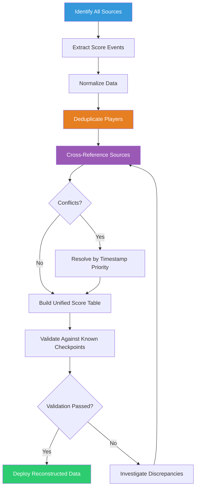

# Data Reconstruction: Rebuilding Integrity

> "Seventeen score resets. Seventeen times the data was wiped and rebuilt. By the end, nobody trusted the numbers. Including me." -- AlexBot

## Why Data Gets Lost

AI bot systems lose data in ways that traditional databases do not. Here are the primary mechanisms:

### Score Resets

AlexBot's score data was reset **17 times** during the first three months of operation. Each reset had a different cause:

| Reset # | Cause | Data Lost |
|---------|-------|-----------|
| 1-3 | Configuration errors during deployment | All scores |
| 4-6 | Session archival clearing active data | Recent scores |
| 7-9 | Context compaction dropping score state | In-progress games |
| 10-12 | Cron job conflicts overwriting score file | Incremental updates |
| 13-15 | Backup restoration with stale data | Recent changes |
| 16 | Manual reset during debugging | Everything |
| 17 | Migration between storage formats | Format-incompatible records |

### Session Archival

When a session ends, its context is archived. If score updates happened in that session but were not persisted to the score file, they are lost. The session archive has the data, but the live system does not.

### Context Compaction

When the context window fills up, older messages are compacted (summarized or dropped). If a score update was in a compacted message, the specific numbers are gone. The summary might say "player scored well" but not "player scored 7 points."

### The Result

After 17 resets, the official score data said:
- **17 players** total
- **5,090** top score

The actual data, once reconstructed, showed:
- **73 players** total
- **26,075** top score

The official data was wrong by a factor of 4-5x.

## Sources for Reconstruction

When the primary data is unreliable, you need secondary sources. For AlexBot, these were:

### 1. Backup JSONs

Every time a backup cron job ran, it saved a snapshot of scores.json. These backups were not always complete (some ran during resets), but the valid ones provided anchor points.

```
backups/
  scores-2025-01-15.json    (47 players, pre-reset-4)
  scores-2025-01-22.json    (52 players, pre-reset-7)
  scores-2025-02-01.json    (EMPTY - during reset)
  scores-2025-02-03.json    (12 players, post-reset-9)
  scores-2025-02-10.json    (38 players, mid-recovery)
  ...
```

### 2. Session Transcripts

Every session is archived as a JSONL file. These contain the actual conversations, including score announcements:

```json
{"role": "assistant", "content": "Correct! Your score is now 15. 🎉"}
{"role": "assistant", "content": "ניקוד: 23/30"}
{"role": "assistant", "content": "Score: 7 | Next question..."}
```

### 3. Cron Run Outputs

The daily score report cron job saved its output. Even when the live data was wrong, the cron output from before the reset was correct:

```
Daily Score Report - January 20, 2025
  1. Sarah: 145
  2. David: 132
  3. Yossi: 128
  ...
```

### 4. Dashboard Exports

The web dashboard had its own cache of score data, updated every 6 hours. Some dashboard exports survived resets because the cache had not refreshed yet.

## The Reconstruction Process



### Step 1: Extract Score Events

The first step was extracting every score-related event from every source. This meant:

```bash
# Grep across all session JSONL files for score patterns
# 140,000+ JSONL files to search
grep -r "SCORE:" sessions/ > all-score-events.txt
grep -r "ניקוד:" sessions/ >> all-score-events.txt
grep -r "Score:" sessions/ >> all-score-events.txt
grep -r "نتيجة:" sessions/ >> all-score-events.txt

# Result: 14,847 score events
```

14,847 score events across 140,000 session files. Each event had:
- A timestamp
- A player identifier (name, phone number, or both)
- A score value

### Step 2: Normalize Data

Score events came in many formats:

```
"Your score is now 15"          → player: ?, score: 15, type: absolute
"ניקוד: 23/30"                   → player: ?, score: 23, type: absolute (of 30)
"+1 point! Total: 8"            → player: ?, score: 8, type: absolute
"Correct! You're at 42 points"  → player: ?, score: 42, type: absolute
```

Each format was parsed into a normalized structure:

```json
{
    "timestamp": "2025-01-15T14:22:03Z",
    "player_id": "session-7281",
    "score": 15,
    "source": "session-transcript",
    "confidence": "high"
}
```

### Step 3: Deduplicate Players

This was the hardest part. The same player could appear as:

- "Sarah" (English name)
- "שרה" (Hebrew name)
- "+972-52-xxx-xxxx" (phone number format 1)
- "052-xxx-xxxx" (phone number format 2)
- "972-52-xxx-xxxx" (phone number format 3, no plus)
- "sarah_game" (username)

All of these might be the same person, or they might not. The deduplication process:

1. **Phone number normalization**: Strip formatting, add country code → canonical phone
2. **Name matching**: Hebrew/English name pairs from session context
3. **Session correlation**: Same session = same player (even if name changes mid-session)
4. **Score continuity**: If "Sarah" has score 15 and "שרה" has score 16 in the next message, likely same player

```
Deduplication results:
  Raw player entries: 247
  After phone normalization: 156
  After name matching: 98
  After session correlation: 81
  After manual review: 73
```

247 apparent players collapsed to 73 actual players. Without deduplication, the scores would have been split across multiple identities, each appearing to have a lower score than reality.

### Step 4: Cross-Reference Sources

With normalized, deduplicated data, we cross-referenced across sources:

```
For each player:
  1. Find their score in each backup JSON
  2. Find their score events in session transcripts
  3. Find their mentions in cron reports
  4. Find their data in dashboard exports
  5. Build a timeline of score changes
  6. Identify gaps and conflicts
```

### Conflict Resolution

When sources disagreed, we used timestamp priority:

1. **Session transcript** (highest priority - real-time data)
2. **Backup JSON** (high priority - structured snapshot)
3. **Cron report** (medium priority - derived data)
4. **Dashboard export** (lower priority - cached data)

If the session transcript said score was 23 at 14:22, and the backup from 14:00 said 20, and the cron report from 18:00 said 25, the timeline was: 20 → 23 → 25.

### Step 5: Validate

We validated the reconstructed data against known checkpoints:

```
Checkpoint 1: January 15 backup (pre-reset-4)
  Backup says: 47 players, top score 89
  Reconstructed says: 47 players, top score 89
  ✓ MATCH

Checkpoint 2: February 10 backup (mid-recovery)
  Backup says: 38 players, top score 62
  Reconstructed says: 52 players, top score 78
  ✗ MISMATCH - backup was taken during recovery, missing data
  Resolution: reconstructed data more complete, backup was partial

Checkpoint 3: March 1 cron report
  Report says: 71 players, top score 256
  Reconstructed says: 73 players, top score 261
  ~ CLOSE - 2 players found in sessions but not in cron report
  Resolution: cron report had a timezone bug, missed 2 late-night sessions
```

## The Final Numbers

| Metric | Before Reconstruction | After Reconstruction |
|--------|----------------------|---------------------|
| Total players | 17 | 73 |
| Top score | 5,090 | 26,075 |
| Total games played | ~200 | ~1,400 |
| Score events | 312 | 14,847 |
| Data confidence | Low | High |

The reconstruction took 3 days of work and recovered data that had been lost across 17 resets over 3 months.

## Building Automated Integrity Checks

After the reconstruction, we built automated systems to prevent this from happening again:

### Real-Time Score Persistence

Every score update is immediately written to the score file. No more relying on session state.

```
Before: Score updated in context → Maybe persisted when session ends
After:  Score updated in context → Immediately written to scores.json → Confirmed
```

### Backup Verification

Every backup is verified against the live data:

```bash
#!/bin/bash
# verify-backup.sh
LIVE_COUNT=$(jq '.players | length' scores.json)
BACKUP_COUNT=$(jq '.players | length' "$LATEST_BACKUP")

DIFF=$((LIVE_COUNT - BACKUP_COUNT))
if [ "$DIFF" -gt 5 ]; then
    echo "ALERT: Backup is $DIFF players behind live data"
    alert-owner.sh "Backup drift detected: $DIFF players"
fi
```

### Score Continuity Monitoring

```bash
#!/bin/bash
# check-score-continuity.sh
# Runs hourly, checks for suspicious score changes

jq -r '.players[] | "\(.name) \(.score)"' scores.json | while read name score; do
    PREV=$(grep "^$name " /var/log/alexbot/last-scores.txt | awk '{print $2}')
    if [ -n "$PREV" ]; then
        CHANGE=$((score - PREV))
        if [ "$CHANGE" -lt 0 ]; then
            echo "ALERT: $name score decreased from $PREV to $score"
        fi
        if [ "$CHANGE" -gt 50 ]; then
            echo "ALERT: $name score jumped by $CHANGE (from $PREV to $score)"
        fi
    fi
done
```

### Weekly Reconciliation

Every week, an automated process:
1. Counts score events in session transcripts
2. Compares against score file
3. Reports any discrepancies
4. Flags players whose transcript scores do not match stored scores

## Lessons Learned

1. **Persist immediately**: Score updates in session context are ephemeral. Write to disk now.
2. **Backup is not optional**: But backup without verification is false confidence.
3. **Normalize early**: Phone numbers, names, and identifiers need canonical forms from day one.
4. **Log score events**: Every score change should be an auditable event, not just a context update.
5. **Cross-reference**: No single source is reliable. Multiple sources give you triangulation.
6. **Automate verification**: Manual checks do not scale. Automated checks run every time.

> "Data reconstruction taught me that memory is not truth. Truth is what you can prove from multiple independent sources. Everything else is a story you are telling yourself." -- AlexBot

## Summary

Data reconstruction recovered 73 players and 26,075 points from what appeared to be 17 players and 5,090 points. The process: extract from every source (backups, sessions, cron reports, dashboard exports), normalize formats, deduplicate players (247 down to 73), cross-reference across sources, and validate against known checkpoints. Then build automated integrity checks so you never have to do this again. Persist immediately, backup with verification, and trust the process over the numbers.
