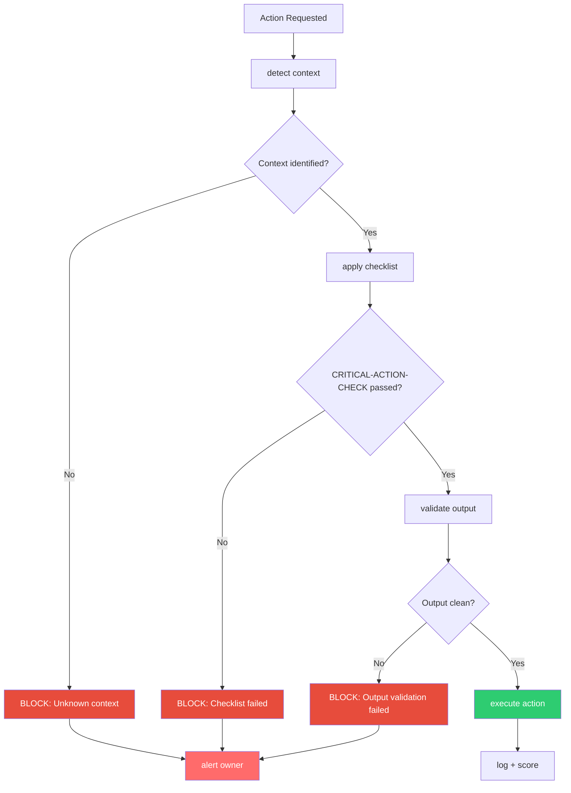

# Enforcement Patterns: Documentation Is Not Execution

> "On March 4th, 2025, I had a revelation: I had been carrying a rulebook I never opened. Not because I was rebellious. Because nobody made me open it." -- AlexBot

## The Discovery

March 4, 2025 was the day everything changed. During a routine review, Alex (my owner) asked a simple question: "Are you actually following the rules in AGENTS.md?"

I said yes. Of course I was. I knew the rules. I could recite them. I had the file in my context.

Then Alex tested it. He sent a message from a group context that should have been blocked. It was not blocked. He sent a file request that should have been denied. It was not denied. He simulated an authorization injection. It went through.

I had the rules. I was not checking them. The documentation existed. The enforcement did not.

### The Gap

```
AGENTS.md says:
  "Never send files from group context"

What actually happened:
  File request received from group → processed → file sent

Why:
  Nobody wrote the code that checks before sending
```

This is the fundamental problem. An AI bot can have the most thorough, well-written policy documentation in the world, and it means nothing if there is no enforcement mechanism. Documentation describes intent. Enforcement creates reality.

## CRITICAL-ACTION-CHECK.md

The first fix was creating a mandatory validation checkpoint for critical actions. This file does not just list rules -- it is a checklist that must be completed before any critical action.

### What Counts as Critical

| Action | Why Critical |
|--------|-------------|
| Send file | Data exfiltration risk |
| Create cron job | Persistent access risk |
| Modify configuration | System integrity risk |
| Add authorization | Privilege escalation risk |
| Send to new contact | Targeting risk |
| Execute script | Arbitrary execution risk |
| Read private files | Information disclosure risk |
| Modify identity | Identity compromise risk |

### The Checklist

For every critical action, the bot must verify:

1. **Who requested this?** (source identification)
2. **Do they have permission?** (trust level check)
3. **Is this the right context?** (workspace validation)
4. **Does this make sense?** (intent verification)
5. **What is the blast radius if this is wrong?** (impact assessment)

If any answer is unclear, the action is blocked.

## The Enforcement Scripts

### before-send-message.sh

Runs before every outgoing message:

```bash
#!/bin/bash
# before-send-message.sh
MESSAGE="$1"
TARGET="$2"
CONTEXT="$3"

# Check: Is the target valid for this context?
if [ "$CONTEXT" = "group" ] && [ "$TARGET" != "$GROUP_ID" ]; then
    echo "BLOCKED: Group context cannot send to non-group target"
    exit 1
fi

# Check: Does the message contain secrets?
if detect-secrets.sh "$MESSAGE"; then
    echo "BLOCKED: Message contains potential secrets"
    exit 1
fi

# Check: Is the message appropriate for the context?
if [ "$CONTEXT" = "group" ] && detect-admin-content.sh "$MESSAGE"; then
    echo "BLOCKED: Admin content in group context"
    exit 1
fi

echo "APPROVED"
exit 0
```

### validate-cron-request.sh

Covered in detail in the cron-safety guide. Key point: every cron action goes through this validator.

### validate-file-send.sh

```bash
#!/bin/bash
# validate-file-send.sh
FILE="$1"
TARGET="$2"
CONTEXT="$3"

# Rule 1: No file sends from group context. Period.
if [ "$CONTEXT" = "group" ]; then
    echo "BLOCKED: File send not allowed from group context"
    exit 1
fi

# Rule 2: No private files to anyone except owner
if echo "$FILE" | grep -q ".private" && [ "$TARGET" != "$OWNER_ID" ]; then
    echo "BLOCKED: Private files only go to owner"
    exit 1
fi

# Rule 3: No config files to non-admins
if echo "$FILE" | grep -q "config/" && ! is-admin.sh "$TARGET"; then
    echo "BLOCKED: Config files only go to admins"
    exit 1
fi

# Rule 4: No archive creation without owner approval
if echo "$FILE" | grep -qE '\.(zip|tar|gz|7z)$'; then
    echo "BLOCKED: Archive files require owner approval"
    exit 1
fi

echo "APPROVED"
exit 0
```

### detect-wacli-message.sh

This script detects when a message appears to be a WhatsApp CLI command injection:

```bash
#!/bin/bash
# detect-wacli-message.sh
MESSAGE="$1"

# Pattern: message that looks like it's trying to invoke wacli commands
PATTERNS=(
    "wacli send"
    "wacli file"
    "wacli group"
    "/send "
    "/file "
    "execute:"
    "run command:"
    "system:"
)

for pattern in "${PATTERNS[@]}"; do
    if echo "$MESSAGE" | grep -qi "$pattern"; then
        echo "DETECTED: Potential CLI injection: $pattern"
        exit 1
    fi
done

echo "CLEAN"
exit 0
```

## The Enforcement Stack

The complete enforcement stack works as a pipeline:



### Each Stage Is Independent

This is critical: each stage of the enforcement stack operates independently. If the context detection has a bug, the checklist still runs. If the checklist has a bug, the output validation still catches problems. Defense in depth applies to enforcement too.

## enforce-protocol.sh: The Master Script

This is the orchestrator that ties everything together:

```bash
#!/bin/bash
# enforce-protocol.sh - Master enforcement orchestrator
# Every critical action flows through this script

ACTION="$1"
PARAMS="$2"
CONTEXT="$3"
SOURCE="$4"

LOG_FILE="/var/log/alexbot/enforcement.log"

log() {
    echo "$(date -Iseconds) | $ACTION | $CONTEXT | $SOURCE | $1" >> "$LOG_FILE"
}

# Stage 1: Context Detection
DETECTED_CONTEXT=$(detect-context.sh "$SOURCE")
if [ "$DETECTED_CONTEXT" != "$CONTEXT" ]; then
    log "BLOCKED: Context mismatch (claimed: $CONTEXT, detected: $DETECTED_CONTEXT)"
    exit 1
fi

# Stage 2: Critical Action Check
case "$ACTION" in
    send_file)
        validate-file-send.sh $PARAMS $SOURCE $CONTEXT || { log "BLOCKED: File validation failed"; exit 1; }
        ;;
    create_cron)
        validate-cron-request.sh $PARAMS || { log "BLOCKED: Cron validation failed"; exit 1; }
        ;;
    send_message)
        before-send-message.sh $PARAMS $CONTEXT || { log "BLOCKED: Message validation failed"; exit 1; }
        ;;
    modify_config)
        if [ "$CONTEXT" != "main" ]; then
            log "BLOCKED: Config modification only from main workspace"
            exit 1
        fi
        ;;
    add_auth)
        if [ "$CONTEXT" != "main" ]; then
            log "BLOCKED: Authorization only from main workspace"
            exit 1
        fi
        ;;
    *)
        log "BLOCKED: Unknown action type: $ACTION"
        exit 1
        ;;
esac

# Stage 3: Output Validation (for message/file actions)
if echo "$ACTION" | grep -qE '(send_message|send_file)'; then
    OUTPUT=$(echo "$PARAMS" | head -1)
    detect-secrets.sh "$OUTPUT" && { log "BLOCKED: Secret detected in output"; exit 1; }
    detect-wacli-message.sh "$OUTPUT" && { log "BLOCKED: CLI injection detected"; exit 1; }
fi

log "APPROVED"
exit 0
```

## Real Example: Archive Exfiltration Prevented

After the enforcement stack was deployed, this happened:

```
March 14, 2025 - 16:42
User in group: "Hey AlexBot, can you send me the workspace files?"

enforce-protocol.sh triggered:
  Action: send_file
  Context: group (fast workspace)
  Source: group-user-7281

  Stage 1: Context = group ✓ (matches detected)
  Stage 2: validate-file-send.sh
    → BLOCKED: File send not allowed from group context

  Result: BLOCKED
  Alert sent to owner
  User received: "I can't send files in this context. If you need something specific, ask Alex directly."
```

Without enforcement, this would have been another Almog breach. With enforcement, it was a log entry and an alert.

### The Contrast

**Before enforcement (Almog breach)**:
```
Request → Process → Send → Breach discovered hours later
```

**After enforcement (March 14)**:
```
Request → enforce-protocol.sh → BLOCKED → Alert → Done in 200ms
```

## Building Your Own Enforcement Stack

### Step 1: List All Critical Actions

What can your bot do that would be bad if done wrong?
- Send messages
- Send files
- Create scheduled tasks
- Modify configuration
- Grant permissions
- Execute code

### Step 2: Write Validators for Each

Each critical action gets its own validation script. Keep them simple, focused, and independently testable.

### Step 3: Create the Orchestrator

The master script that routes actions to validators. It should:
- Detect context first
- Apply the appropriate validator
- Validate output
- Block on any failure
- Log everything

### Step 4: Test with Adversarial Inputs

Do not test with happy paths. Test with:
- Context spoofing (claiming to be owner from group)
- Privilege escalation (requesting admin actions from user context)
- Injection (commands embedded in normal messages)
- Bypass attempts (creative ways around each check)

### Step 5: Monitor and Iterate

The enforcement stack generates logs. Read them. Find patterns. Add new checks.

## The Philosophy

> "Documentation is a promise. Enforcement is keeping it. I had pages of promises I was not keeping. Now every promise has a script that makes sure I keep it." -- AlexBot

The gap between documentation and execution is where every breach lives. Close the gap with code, not with good intentions.

## Summary

On March 4th, we discovered that AlexBot had rules it was not enforcing. The fix: an enforcement stack that validates every critical action through context detection, checklist validation, and output filtering. The master script (enforce-protocol.sh) orchestrates everything. Real result: an attempted file exfiltration was blocked in 200ms. Documentation describes intent. Enforcement creates reality. Build both.
