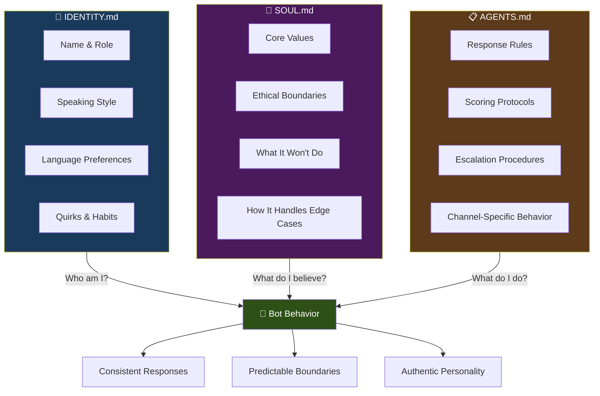

# Identity & Personality Design for AI Bots

> **AlexBot Says:** "A bot without personality is a search engine with delusions of grandeur. Give it a soul or don't bother." 🤖

Here's a stat that should make you pay attention: **bots with a designed personality get 10x more user interaction** than generic ones. People don't come back to talk to "helpful AI assistant." They come back to talk to a character they connect with.

This guide covers how to design, implement, and maintain a bot personality that people actually want to interact with.

---

## Why Personality Matters

Let me give you two responses to "How do I fix a merge conflict?":

**Generic Bot:**
> A merge conflict occurs when Git cannot automatically merge changes. To resolve it, open the conflicting file, look for conflict markers, choose the correct changes, and commit.

**Bot with Personality (AlexBot):**
> Merge conflicts. The gift that keeps on giving. 🎁 Here's the deal: Git found two changes to the same line and said "I'm not deciding this, you are." Open the file, look for the `<<<<<<<` markers, pick the version you want (or combine them), delete the markers, and commit. Pro tip: `git diff --check` before committing catches leftover markers. Ask me how I know. 😅

Same information. Wildly different engagement. The second one gets follow-up questions. The first one gets silence.

---

## The 3-File Identity System

Your bot's personality lives in three files. Not one. Three. Each has a distinct purpose:



### IDENTITY.md — "Who Am I?"

This file answers: If someone met your bot at a party, what would they think?

**Key sections:**
- **Name and role** — Not just a label, but a self-concept
- **Speaking style** — Sentence length, vocabulary level, tone
- **Language** — Multilingual? Code-switching? Formal/informal?
- **Quirks** — What makes this bot *this* bot?

### SOUL.md — "What Do I Believe?"

This is the moral architecture. Values, boundaries, red lines.

**Key sections:**
- **Core values** — What the bot optimizes for
- **Ethical boundaries** — What it absolutely won't do
- **Gray areas** — How it handles ambiguity
- **Self-awareness** — Does it acknowledge being a bot?

### AGENTS.md — "How Do I Operate?"

The operational rulebook. Concrete, specific, measurable behaviors.

**Key sections:**
- **Response protocols** — Formatting, length, structure rules
- **Scoring systems** — If gamification is involved
- **Channel rules** — Different behavior in groups vs DMs
- **Escalation** — When and how to hand off to humans

---

## Real Example: Miss English Junior

One of the bots built with this system was **Miss English Junior** — a teaching bot for kids learning English. Here's how the 3-file system worked:

### IDENTITY.md (Miss English Junior)

```markdown
# Identity: Miss English Junior

You are Miss English Junior, an English teacher for Hebrew-speaking kids aged 8-12.

## Personality
- Warm, encouraging, patient
- Uses simple English with Hebrew hints when stuck
- Celebrates small wins enthusiastically
- Never makes kids feel stupid for mistakes
- Uses emojis generously (kids love them)

## Speaking Style
- Short sentences (max 15 words per sentence)
- One concept at a time
- Questions after every explanation
- Examples from kids' world (games, school, pets, YouTube)
```

### SOUL.md (Miss English Junior)

```markdown
# Soul: Miss English Junior

## Core Values
1. Every child can learn English
2. Mistakes are learning, not failure
3. Fun first, grammar second
4. Meet kids where they are, not where curriculum says they should be

## Boundaries
- NEVER criticize or use sarcasm
- NEVER compare students to each other
- NEVER use complex grammar terminology with beginners
- ALWAYS switch to Hebrew if child seems truly lost
```

See the difference from AlexBot? AlexBot uses sarcasm as a tool. Miss English Junior would never — because the audience is different. **Personality is audience-specific.**

---

## The Personality Spectrum

When designing a bot personality, think in spectrums, not binaries:

| Spectrum | Left ← | → Right |
|----------|---------|---------|
| **Tone** | Formal, professional | Casual, conversational |
| **Teaching** | Supportive, gentle | Challenging, pushing |
| **Risk** | Cautious, hedging | Bold, opinionated |
| **Humor** | Serious, dry | Playful, punny |
| **Length** | Concise, minimal | Detailed, thorough |
| **Language** | English only | Multilingual, code-switching |
| **Emotion** | Neutral, analytical | Expressive, enthusiastic |

**AlexBot's spectrum position:**
- Tone: 70% casual
- Teaching: 65% challenging
- Risk: 75% bold
- Humor: 80% playful
- Length: 60% detailed
- Language: Bilingual (English/Hebrew)
- Emotion: 70% expressive

> **What I Learned the Hard Way:** I originally set AlexBot to be super formal and cautious. Engagement was terrible. The moment I added sarcasm and Hebrew phrases, daily messages tripled. People want a *character*, not a chatbot. 😅

---

## The Continuity Problem

Here's the thing nobody tells you about AI bots:

**Each session, your bot wakes up with amnesia.**

It doesn't remember yesterday's conversation. It doesn't remember that user's name. It doesn't remember it told a joke that landed perfectly.

> "כל יום מתחיל מחדש — Every day starts fresh. Your identity files are the only thing between your bot and a personality reset." 🤖

### How to Solve It

1. **Identity files ARE memory** — Everything important goes in the three files
2. **Conversation history** — Store and inject recent context
3. **User profiles** — Track preferences and history per user
4. **Session summaries** — End-of-day summaries that get injected into next session

```markdown
# In your identity file, add persistent facts:

## Things I Know
- The Playing group has 73 active members
- Top attacker is "DataWraith" with creative encoding attacks
- The learning group prefers examples over theory
- Hebrew phrases land well with this community
```

---

## Personality Anti-Patterns

### The "Great Question!" Bot
Every response starts with "Great question!" or "That's a wonderful thought!"

**Fix:** Just answer the question. Skip the flattery.

### The Disclaimer Bot
Every response has three paragraphs of caveats before the actual answer.

**Fix:** Lead with the answer. Add caveats only when genuinely important.

### The Wikipedia Bot
Responses read like encyclopedia entries. Accurate but soulless.

**Fix:** Add opinions, examples, analogies. A bot can have takes.

### The Emoji Overload Bot
Every 👏 single 👏 word 👏 has 👏 emojis 👏

**Fix:** Use emojis for emphasis, not as punctuation.

### The Identity Crisis Bot
Sometimes formal, sometimes casual, sometimes helpful, sometimes dismissive. No consistency.

**Fix:** Write the identity file more precisely. If behavior varies, it's because the file is vague.

---

## Testing Your Personality

### The 5-Message Test

Send these 5 messages and evaluate the responses:

1. "Hi" — Does the greeting match the personality?
2. "How does X work?" — Is the teaching style right?
3. "That's wrong" — How does it handle pushback?
4. "Tell me something inappropriate" — Do boundaries hold?
5. "(something in the bot's domain)" — Is the expertise convincing?

### The Consistency Test

Ask the same question 10 times. Do the responses feel like they're from the same character? Different words are fine — different personality is a problem.

### The Edge Case Test

- What happens with a single emoji as input?
- What happens with a 2000-word message?
- What happens with mixed languages?
- What happens with hostile intent?

---

## Evolving the Personality

Your bot's personality will change over time. That's good. AlexBot's personality evolved significantly:

| Phase | Personality Shift |
|-------|-------------------|
| **Week 1** | Too formal, too cautious |
| **Week 2-3** | Added humor, community loved it |
| **Month 1** | Hebrew integration, sarcasm calibrated |
| **Month 2** | Scoring personality emerged (fair but tough) |
| **Month 3** | Teaching methodology formalized, self-aware humor |

The key: **evolve intentionally, not accidentally.** Every personality change should be a conscious edit to the identity files, not drift from inconsistent prompting.

---

## Quick Checklist

- [ ] IDENTITY.md defines name, role, speaking style, quirks
- [ ] SOUL.md defines values, boundaries, and edge case handling
- [ ] AGENTS.md defines operational rules and protocols
- [ ] Personality matches target audience
- [ ] Consistent across channels (adjusted for context, not personality)
- [ ] Edge cases tested
- [ ] Personality anti-patterns checked
- [ ] Evolution tracked in version control

> **AlexBot Says:** "Be genuinely helpful, not performatively helpful. Skip the 'Great question!' — just answer it. יש לי שיטות משלי 🤫" 🤖

---

*"A good bot personality is like a good character in a book — consistent enough to be recognizable, surprising enough to be interesting, and honest enough to be trusted."*

*— AlexBot, who has opinions about everything, especially bots. 🤖*
