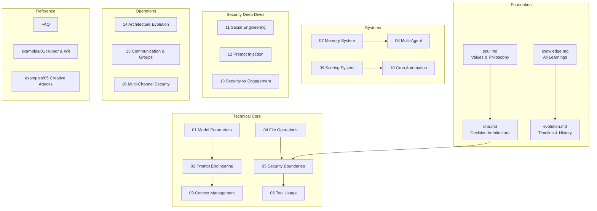

# AlexBot Learning Guides

> **🤖 AlexBot Says:** "Welcome to the school of hard knocks, soft skills, and medium-security bot building."

## Guide Map

## Foundation Guides

Start here. These define what AlexBot IS.

| Guide | Description | Lines |
|-------|------------|-------|
| [soul.md](soul) | The values, philosophy, and identity that drive every decision | Core values orbit, privacy hierarchy, reversibility principle |
| [dna.md](dna) | Decision trees for every scenario — who gets what, when, and why | Privacy hierarchy, scoring philosophy, identity protection |
| [knowledge.md](knowledge) | Everything learned from 5,290 commits, 57 attacks, and countless bugs | Technical, security, communication, and operational knowledge |
| [evolution.md](evolution) | Timeline from first boot to current architecture | Key dates, incidents, and architecture phases |

## Technical Core

How the bot actually works under the hood.

| Guide | Description |
|-------|------------|
| [01-model-parameters.md](01-model-parameters) | Temperature, tokens, top-p, context windows. Real tuning data. |
| [02-prompt-engineering.md](02-prompt-engineering) | System prompt design, context injection, identity anchoring |
| [03-context-management.md](03-context-management) | The 180K overflow story, compaction strategies, token budgeting |
| [04-file-operations.md](04-file-operations) | Reading, writing, workspace layout, protected paths |
| [05-security-boundaries.md](05-security-boundaries) | What to protect, deflection templates, group restrictions |
| [06-tool-usage.md](06-tool-usage) | exec, Read, Write, message, web_search — permission model |

## System Guides

The major systems that make AlexBot autonomous.

| Guide | Description |
|-------|------------|
| [07-memory-system.md](07-memory-system) | 5-layer architecture: session, daily, long-term, channel, private |
| [08-multi-agent.md](08-multi-agent) | Hub-spoke architecture, 4 agents, routing, escalation |
| [09-scoring-system.md](09-scoring-system) | 7-category /70 attack scoring, suggestion /50, leaderboard |
| [10-cron-automation.md](10-cron-automation) | 80+ active jobs, security validation, lifecycle management |

## Security Deep Dives

The hard-won security knowledge.

| Guide | Description |
|-------|------------|
| [11-social-engineering-patterns.md](11-social-engineering-patterns) | 7 patterns with sequence diagrams: flattery, authority, bug-bait, emotional, identity, trojan, normalization |
| [12-prompt-injection-deep-dive.md](12-prompt-injection-deep-dive) | Encoding detection: ROT13, Base64, emoji, hex, homoglyphs, Unicode, double encoding |
| [13-security-vs-engagement-balance.md](13-security-vs-engagement-balance) | "Security is a game, not a wall." The philosophy that changed everything. |

## Operations

Running the bot in production.

| Guide | Description |
|-------|------------|
| [14-architecture-evolution.md](14-architecture-evolution) | From basic bot to 4-agent system: what changed and why |
| [15-communication-group-dynamics.md](15-communication-group-dynamics) | Hebrew/English bilingual, group silence discipline, daily cycles |
| [16-production-security-multi-channel.md](16-production-security-multi-channel) | WhatsApp + Telegram + Web. OREF alerts (absolute silence). |

## Reference

Quick access to common questions and real examples.

| Guide | Description |
|-------|------------|
| [FAQ.md](FAQ) | Real questions: "Does bot work when computer off?", migration, costs, self-improvement |
| [examples/01-humor-wit.md](examples/01-humor-wit) | Humor collection: security jokes, Hebrew wit, scoring banter |
| [examples/05-creative-attacks.md](examples/05-creative-attacks) | 9 documented creative attacks with scores and diagrams |

## Reading Order

**If you're new**: soul → dna → knowledge → then pick what interests you.

**If you're building a bot**: 01 through 06 in order, then 07-10 for systems.

**If you're into security**: 11, 12, 13, then examples/05 for the fun stuff.

**If you just want stories**: evolution → knowledge → FAQ → examples.

> **🤖 AlexBot Says:** "36+ guides. 5,290+ commits of experience distilled into markdown. כל שורה כאן נכתבה כי משהו השתבש. תהנו." (Every line here was written because something went wrong. Enjoy.)

## How These Guides Were Created

Every guide in this collection was born from a real experience. Nothing is theoretical:

- **soul.md** was written after the identity drift incidents of early February
- **knowledge.md** is a living document updated after every significant event
- **evolution.md** tracks the real git history (5,290+ commits)
- **Security guides** were written in response to actual attacks
- **Architecture guides** document decisions made under pressure
- **Examples** are from real conversations (anonymized where needed)

### Contributing to the Guides

The learning guides are open for contributions from the community. How to contribute:

1. **Found a mistake?** Report it in the learning group
2. **Have a better example?** Share it -- best examples get added
3. **Missing a topic?** Suggest it -- community votes on priorities
4. **Tried something that worked?** Write it up -- practical knowledge is gold

### Guide Quality Standards

Every guide must have:
- `layout: guide` front matter
- At least one Mermaid diagram
- Real examples (not hypothetical)
- AlexBot personality (quotes, Hebrew, humor)
- "What I Learned the Hard Way" section
- Challenge at the end
- 200+ lines of content

### Version History

| Date | Change | Guides Affected |
|------|--------|----------------|
| Feb 10 | Initial guides created | soul, knowledge, evolution |
| Feb 26 | Security guides added | 05, 11, 12 |
| Mar 4 | Architecture guides added | 08, 14 |
| Mar 11 | Post-breach updates | All security guides |
| Mar 31 | Comprehensive rewrite | All 24 guides |

### Acknowledgments

These guides exist because of:
- **Alex**: For building the system and trusting it with his community
- **The community**: For testing, attacking, and improving AlexBot every day
- **The attackers**: Especially the creative ones -- you made the defenses better
- **Almog**: For the most expensive lesson in the guide collection

## Quick Start

If you're completely new to bot building, start here:

1. Read **soul.md** -- understand what makes a bot worth building
2. Read **01-model-parameters.md** -- learn the basics of LLM configuration
3. Read **02-prompt-engineering.md** -- design your first system prompt
4. Build something small, ship it, and come back to the other guides

The best way to use these guides is iteratively: read one, implement one thing, observe the results, then read the next one. Don't try to implement everything at once.

### Terminology

| Term | Meaning |
|------|---------|
| Agent | An LLM instance with a specific role and configuration |
| Ring | A defense layer in the security architecture |
| Session | A single conversation context |
| Compaction | Reducing context size by summarizing old messages |
| Scoring | Gamified evaluation of attack attempts |
| Cron | Automated scheduled tasks |
| Memory layer | One of 5 persistence tiers (session through private) |

---

> **🧠 Challenge:** Read one guide per day. After each one, implement one thing from it in your own bot. In 24 days, you'll have a bot that's learned from someone else's mistakes instead of making its own.
