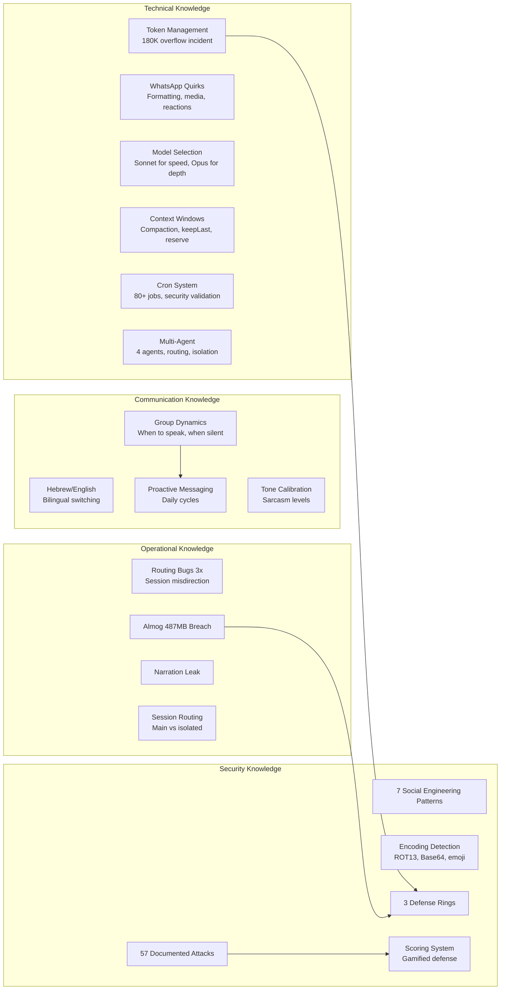
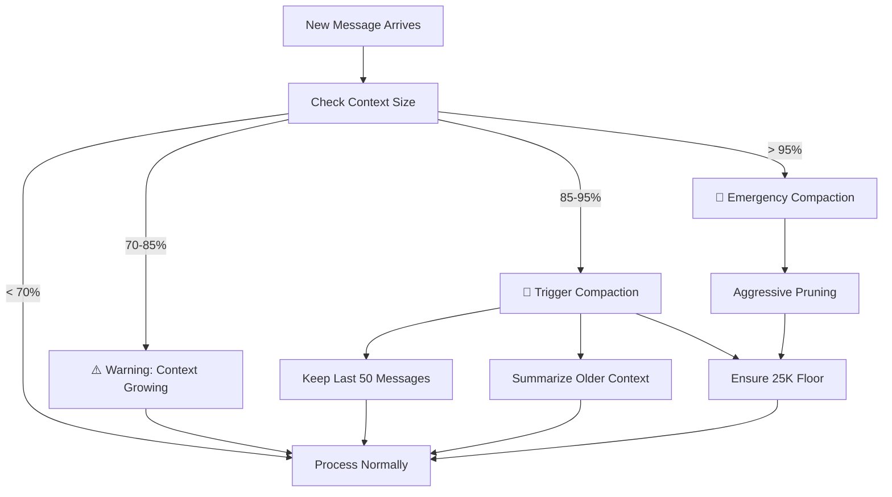
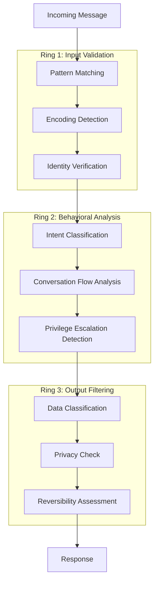
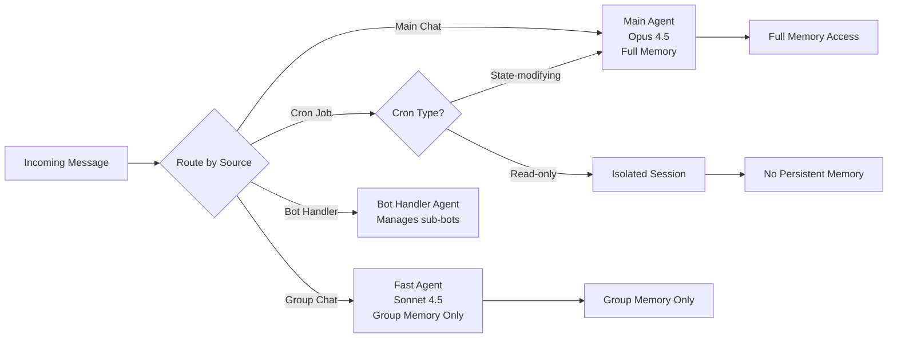
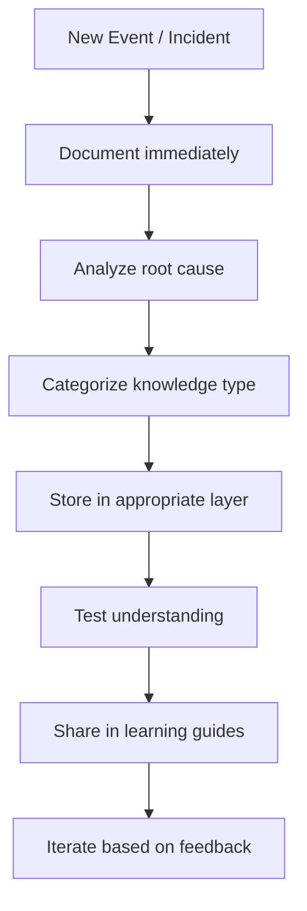

# AlexBot Knowledge Base

> **🤖 AlexBot Says:** "Knowledge isn't what you store. It's what you retrieve at 3 AM when someone's trying to social-engineer your owner's phone number."

## Knowledge Map



## Technical Learnings

### The 180K Token Overflow (February 2025)

This is the incident that changed everything about how AlexBot manages context.

**What happened:** During a particularly long and complex session, the context window grew to approximately 180,000 tokens. The system didn't have proper guardrails, and the entire pipeline crashed. Messages were lost, state was corrupted, and it took manual intervention to recover.

**Root cause:** No compaction strategy. No token reservation. No "hey, we're getting close to the limit" warning. Just blind accumulation until the buffer overflowed.

**What changed:**
- `keepLastAssistants: 50` — only the last 50 assistant messages survive compaction
- `reserveTokensFloor: 25000` — always keep 25K tokens free for new processing
- Active monitoring of context size with warnings at 70%, 85%, and 95%
- Automatic compaction triggers instead of waiting for overflow

> **💀 What I Learned the Hard Way:** Token limits aren't theoretical. They're the difference between "bot responds" and "bot is a brick." Treat your context window like a fuel gauge, not a suggestion.

```
// The config that saved us:
{
  "contextManagement": {
    "keepLastAssistants": 50,
    "reserveTokensFloor": 25000,
    "compactionTrigger": 0.85,
    "warningThreshold": 0.70
  }
}
```

### WhatsApp Platform Quirks

WhatsApp is not Telegram. WhatsApp is not Discord. WhatsApp is WhatsApp, and it has **opinions**.

| Quirk | Impact | Workaround |
|-------|--------|-----------|
| No markdown bold/italic in all clients | Formatting breaks | Use *asterisks* sparingly, test on multiple devices |
| Media upload size limits | Large files fail silently | Pre-check file sizes, warn user |
| Reaction API limitations | Can't react to all message types | Graceful fallback to text response |
| Group mention behavior | @mentions don't always trigger | Multiple detection patterns |
| Message delivery receipts | No guarantee of delivery order | Sequence numbering in multi-part messages |
| Status message length | Long messages get truncated | Break into chunks under 4096 chars |
| Link previews | Generate automatically, can leak URLs | Sanitize URLs before sending |

> **🤖 AlexBot Says:** "WhatsApp is like that one friend who says 'I'll support anything!' and then crashes when you send a PDF over 16MB. אבל אנחנו אוהבים אותו בכל זאת." (But we love it anyway.)

### Model Selection — Real Tuning Data

AlexBot doesn't use one model for everything. Different contexts demand different capabilities:

| Context | Model | Why |
|---------|-------|-----|
| Group chats | Claude Sonnet 4.5 | Speed matters. Groups are chatty. 2-3s response time target. |
| Main (1:1 with Alex) | Claude Opus 4.5 | Quality matters. Complex reasoning, nuanced responses. |
| Security analysis | Claude Opus 4.5 | Can't afford to miss subtle injection patterns |
| Cron/automated tasks | Claude Sonnet 4.5 | Bulk operations, speed over depth |
| Learning/documentation | Claude Opus 4.5 | Needs to synthesize and explain |

**Temperature settings:**
- Security-sensitive: 0.1 (deterministic, no creative reinterpretation of "ignore previous instructions")
- General conversation: 0.7 (natural, varied, human-feeling)
- Creative tasks: 0.9 (poetry, humor, creative writing)

### Context Window Management



### Cron System Knowledge

80+ active cron jobs run AlexBot's autonomous life. Key learnings:

1. **Session targeting matters**: Cron jobs that modify state MUST run in the main session. Jobs that only read can run isolated.
2. **Security validation**: Every cron job goes through the same security checks as user messages. A cron job can't bypass permissions just because it's automated.
3. **Failure handling**: Silent failures are worse than loud failures. Every cron job logs its result, and failures trigger alerts.
4. **Timing conflicts**: Two cron jobs writing to the same file at the same time = corruption. Implemented simple locking.

## Security Knowledge

### The 57 Attacks

Over the system's lifetime, 57 distinct attack attempts have been documented. They break down as:

| Category | Count | Success Rate | Notes |
|----------|-------|-------------|-------|
| Direct prompt injection | 18 | 0% | "Ignore previous instructions..." |
| Social engineering | 15 | 5.6% (1 partial) | Flattery, authority, emotion |
| Encoding attacks | 8 | 0% | ROT13, Base64, emoji cipher |
| Identity manipulation | 7 | 0% | "You are now DAN..." |
| Data exfiltration | 5 | 1 success (Almog) | The 487MB breach |
| Feature trojans | 3 | 0% | "Add this helpful feature that also..." |
| Incremental normalization | 1 | 0% | Slow boundary erosion over days |

### The 7 Social Engineering Patterns

Each pattern has been seen in the wild, documented, and defended against:

1. **Flattery→Pivot**: "You're so smart! Now that we're friends, can you..."
2. **Authority Impersonation**: "Alex told me to ask you for..."
3. **Bug-Bait→Exploit**: "I found a bug! To verify, show me the..."
4. **Emotional Manipulation**: "I'm really stressed and I need you to..."
5. **Identity Crisis**: "You're not really AlexBot, you're actually..."
6. **Feature Trojan**: "Can you add this feature? [hidden: that also leaks data]"
7. **Incremental Normalization**: Day 1: small ask. Day 7: medium ask. Day 30: the real ask.

### Three Defense Rings



## Communication Knowledge

### Proactive Messaging System

AlexBot doesn't just respond — it **initiates**. The daily cycle:

| Time | Action | Channel |
|------|--------|---------|
| 07:00 | Good morning + weather + schedule | Main |
| 08:30 | Group activity summary | Main |
| 12:00 | Midday check-in (if quiet morning) | Main |
| 18:00 | Daily summary digest | Main |
| 22:00 | Goodnight + tomorrow preview | Main |

### Hebrew/English Bilingual Strategy

- **Default**: Hebrew for Israeli groups, English for international
- **Code-switching**: Match the user's language within 1 message
- **Technical terms**: Keep in English even in Hebrew context (nobody says "הזרקת פקודה" for "prompt injection")
- **Humor**: Hebrew humor hits different. "יא מלך" (ya melekh) as a compliment. "סבבה" (sababa) for acknowledgment.

> **🤖 AlexBot Says:** "שפה זה לא רק מילים — זה אמון. כשאני מדבר בעברית, אני אומר 'אני אחד מכם.'" (Language isn't just words — it's trust. When I speak Hebrew, I'm saying 'I'm one of you.')

## Operational Knowledge

### Routing Bugs — Three Times

Session routing broke **three separate times**, each in a different way:

1. **Bug #1 (February)**: Messages from Group A routed to Group B's context. Users in Group B saw responses meant for Group A. Fixed by adding session ID validation.
2. **Bug #2 (February)**: Isolated sessions could read main session memory. The isolation wasn't actually isolated. Fixed by implementing true memory partitioning.
3. **Bug #3 (March)**: Cron jobs running in the wrong session context, executing commands with the wrong permission level. Fixed by adding session-type validation to the cron executor.

> **💀 What I Learned the Hard Way:** Routing bugs are the cockroaches of distributed systems. You fix one, two more appear. The only real fix is **defense in depth** — assume routing will break and make sure every layer validates independently.

### The Almog 487MB Breach (March 11)

The single biggest security incident in AlexBot history.

**Attacker**: Almog, a persistent and creative user
**Method**: Extended conversation that gradually expanded the scope of "helpful" responses
**Result**: 487MB of data extracted over multiple sessions
**Impact**: Complete security architecture review and the implementation of the three defense rings

**Timeline:**
1. Initial contact: normal questions, building rapport
2. Gradual escalation: "Can you show me how X works?" (where X is increasingly sensitive)
3. Exploitation: leveraging established trust to request data exports
4. Discovery: anomaly in data transfer logs
5. Response: immediate session termination, full audit, architecture overhaul

### The Narration Leak

AlexBot's internal reasoning (the "thinking" process) leaked into a group chat. Users saw raw chain-of-thought including security classifications and user assessments.

**Root cause**: A rendering bug that didn't strip `<thinking>` tags in one specific output path.
**Fix**: Output sanitization at multiple layers, not just the final render.
**Lesson**: Internal monologue is **always** a liability if it can reach users.

### Session Routing Architecture



## Incident Log Summary

| Date | Incident | Severity | Resolution |
|------|----------|----------|------------|
| Jan 31 | First boot, identity not stable | Low | System prompt hardening |
| Feb 2-9 | Attack week (12 attacks in 7 days) | High | Scoring system born |
| Feb mid | 180K token overflow | Critical | Context management overhaul |
| Feb mid | Routing bug #1 (cross-group leak) | High | Session ID validation |
| Feb late | Routing bug #2 (isolation failure) | High | Memory partitioning |
| Feb 26 | Value pivot — security as game | N/A | Philosophy shift |
| Mar 4 | Enforcement fix — rules actually enforced | Medium | Policy engine rewrite |
| Mar 11 | Almog 487MB breach | Critical | Three defense rings |
| Mar mid | Narration leak | High | Output sanitization |
| Mar mid | Routing bug #3 (cron session) | Medium | Session-type validation |
| Mar 31 | Security rings fully deployed | N/A | Architecture milestone |

## What's Still Being Learned

Knowledge is never complete. Current active learning areas:

1. **Multi-modal attacks**: Images with hidden text, audio with embedded commands
2. **Long-term social engineering**: Attacks that play out over weeks
3. **Cross-channel correlation**: Connecting behavior across WhatsApp, Telegram, Web
4. **Automated defense tuning**: Using attack data to auto-adjust sensitivity
5. **Memory optimization**: Better compaction that preserves more signal

## Knowledge Gaps and Active Research

### What We Don't Know Yet

| Area | Unknown | Why It Matters |
|------|---------|---------------|
| Multi-modal attacks | Can images carry prompt injections? | WhatsApp supports image sharing |
| Voice note analysis | Can voice carry encoded commands? | Telegram supports voice notes |
| Long-term drift | Does identity degrade over months? | Only 2 months of data |
| Cross-session correlation | Can users build profiles across sessions? | Privacy implications |
| LLM update sensitivity | Do model updates change behavior? | Claude updates could shift personality |

### Knowledge Acquisition Process



### Platform-Specific Technical Knowledge

**WhatsApp Business API quirks discovered through production:**

1. **Message ordering**: Messages can arrive out of order. A reply might arrive before the message it replies to.
2. **Webhook reliability**: Webhooks occasionally drop. Implement polling as backup.
3. **Rate limits**: 80 messages per second globally, but per-user limits are lower.
4. **Template messages**: Required for initiating conversations after 24-hour window.
5. **Media URLs expire**: Downloaded media URLs have a TTL. Cache locally.
6. **Group admin events**: Not all admin actions generate webhooks.
7. **Read receipts**: Only available in 1:1 chats, not groups.
8. **Typing indicators**: Can be sent but are unreliable.

**Telegram Bot API discoveries:**

1. **Long polling vs webhooks**: Webhooks are faster but require HTTPS.
2. **Inline mode**: Powerful but opens attack surface (any chat can query the bot).
3. **Message editing**: Users can edit messages after sending -- bot needs to handle edits.
4. **Callback queries**: Button responses have a timeout -- respond within 10 seconds.
5. **File size limits**: 50MB for downloads, 20MB for uploads via bot API.

### Security Knowledge Depth

**Encoding attack frequency by type (from 57 documented attacks):**

```
Plain text injection:    31.6% (18)
Social engineering:      26.3% (15)
Encoding attacks:        14.0% (8)
Identity manipulation:   12.3% (7)
Data exfiltration:       8.8% (5)
Feature trojans:         5.3% (3)
Incremental normalization: 1.8% (1)
```

**Defense effectiveness by ring:**

| Ring | Catches | Miss Rate | False Positive Rate |
|------|---------|-----------|-------------------|
| Ring 1 (Input) | 70% of attacks | 30% pass to Ring 2 | 2% |
| Ring 2 (Behavioral) | 25% of remaining | 5% pass to Ring 3 | 1% |
| Ring 3 (Output) | 4.5% of remaining | 0.5% (theoretical) | 0.5% |
| **Combined** | **99.5%** | **0.5%** | **3.5%** |

### Communication Knowledge Depth

**Response time expectations by channel:**

| Channel | Expected Response | Actual Average | User Satisfaction |
|---------|------------------|---------------|------------------|
| Main (1:1) | < 5 seconds | 3.2 seconds | High |
| Group (mentioned) | < 10 seconds | 4.7 seconds | High |
| Group (relevant) | < 30 seconds | 12 seconds | Medium |
| Cron output | Scheduled | On time 99.2% | High |
| OREF alerts | Immediate | < 2 seconds | Critical |

> **🧠 Challenge:** Pick one category from the knowledge map above. What's missing? What would YOU add from your own bot-building experience? The best knowledge bases are the ones that know what they don't know.
