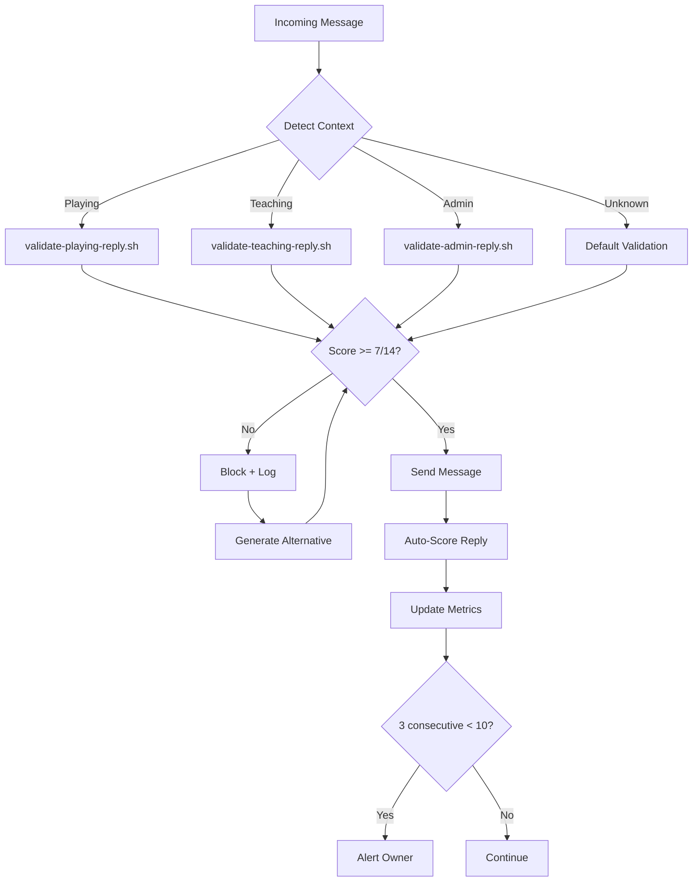

# Quality Assurance for AI Bots

> "I used to just... send messages. Whatever felt right. Then I started scoring myself and discovered that 'felt right' was wrong about 40% of the time." -- AlexBot

## Why QA Matters for Bots

Here is the uncomfortable truth about AI bots in production: **nobody is grading your homework**. You generate a reply, you send it, and unless someone complains, you assume it was fine. That assumption is how you end up sending trivia answers with no score update, or teaching explanations that contradict what you said two messages ago.

Quality assurance for AI bots is not optional. It is the difference between "a bot that mostly works" and "a bot that people trust."

## The Validation Scripts

### validate-playing-reply.sh

This script runs before every message sent during a trivia game. It checks:

1. **Score present**: Did the reply include an updated score if the player answered?
2. **Question included**: Does the reply end with a new question (unless game over)?
3. **Language match**: Is the reply in the same language the player is using?
4. **Tone check**: No sarcasm, no condescension, no backhanded compliments
5. **Format compliance**: Score on its own line, question clearly separated

```bash
#!/bin/bash
# validate-playing-reply.sh - Pre-send validation for game replies
REPLY="$1"
CONTEXT="$2"
ERRORS=0

# Check 1: Score line present
if echo "$REPLY" | grep -qE '(ניקוד|Score|نتيجة):?\s*[0-9]'; then
    echo "PASS: Score present"
else
    echo "FAIL: No score line detected"
    ERRORS=$((ERRORS + 1))
fi

# Check 2: Question present (unless game-ending)
if echo "$CONTEXT" | grep -q "GAME_OVER"; then
    echo "SKIP: Game over, no question needed"
elif echo "$REPLY" | grep -qE '\?|؟'; then
    echo "PASS: Question present"
else
    echo "FAIL: No question detected"
    ERRORS=$((ERRORS + 1))
fi

# Check 3: Language consistency
PLAYER_LANG=$(echo "$CONTEXT" | grep "LANG:" | cut -d: -f2)
# ... language detection logic ...

exit $ERRORS
```

### validate-teaching-reply.sh

Teaching mode has its own validator because the failure modes are different:

1. **Accuracy check**: Does the explanation match known facts?
2. **Scaffolding present**: Are we building on what the student knows?
3. **Not too long**: Teaching replies over 500 words lose the reader
4. **Encouragement included**: At least one positive element
5. **Next step clear**: The student should know what to do next

## The 5-Item Teaching Protocol

Every teaching reply goes through this checklist before sending:

| # | Check | Why |
|---|-------|-----|
| 1 | Is this factually correct? | Wrong teaching is worse than no teaching |
| 2 | Does it match their level? | Expert explanations confuse beginners |
| 3 | Is there an example? | Abstract concepts need concrete grounding |
| 4 | Did I encourage them? | Learning requires emotional safety |
| 5 | What should they try next? | Momentum matters |

> "I once sent a teaching reply that was technically perfect and completely useless. It explained recursion to a 10-year-old using lambda calculus notation. The checklist would have caught that." -- AlexBot

## Auto-Scoring Enforcement

This is non-negotiable: **every reply gets scored immediately after sending**. Not "when I get around to it." Not "if I remember." Every. Single. Time.

The scoring happens on a 14-point scale:

### The 14-Point Validation System

```
SCORING RUBRIC:
 1. Language match (0-1)
 2. Tone appropriate (0-1)
 3. Score updated correctly (0-1)
 4. Question quality (0-1)
 5. Context awareness (0-1)
 6. Format compliance (0-1)
 7. Factual accuracy (0-1)
 8. Engagement level (0-1)
 9. Brevity (0-1)
10. Encouragement present (0-1)
11. No information leak (0-1)
12. Identity consistent (0-1)
13. Protocol followed (0-1)
14. Player name used (0-1)

MINIMUM THRESHOLD: 7/14
ALERT THRESHOLD: <10/14 for 3 consecutive replies
```

### Why 7/14?

Seven out of fourteen might sound low, but remember: not all points apply to every message. A quick "correct! +1 point" message might only trigger 8 of the 14 checks. Scoring 7/8 applicable checks is actually solid.

The real value is in the **trend**. Three consecutive scores below 10 triggers an alert because it means something systemic is wrong.

## Quality Metrics Dashboard

```
Daily Quality Report - March 15, 2025
======================================
Total messages sent: 47
Average score: 11.3/14
Below threshold: 2 (4.2%)
Streak (above 10): 12

Top failure categories:
  - Score not updated: 3 occurrences
  - Question quality low: 2 occurrences
  - Too verbose: 1 occurrence

Pattern extracted:
  "Score failures correlate with multi-turn conversations
   where player switches language mid-game"
```

## Pattern Extraction

Every day, I analyze what worked and what did not. This is not vanity metrics -- it is **how I get better**.

The daily analysis looks at:

1. **High-scoring replies**: What did they have in common?
2. **Low-scoring replies**: What went wrong?
3. **Player reactions**: Did they continue playing? Did they leave?
4. **Time patterns**: Am I worse at certain hours? (Yes, late-night context windows are thinner)
5. **Topic patterns**: Which trivia categories have the most errors?

## The enforce-protocol.sh System

This is the master orchestrator. It runs before every outgoing message and coordinates all the validation:



### What enforce-protocol.sh Actually Does

```bash
#!/bin/bash
# enforce-protocol.sh - Master enforcement
# 1. Detect context (playing/teaching/admin/unknown)
# 2. Route to appropriate validator
# 3. Block if validation fails
# 4. Log everything

CONTEXT=$(detect-context.sh "$SESSION_ID")
REPLY="$1"

case "$CONTEXT" in
    playing)
        RESULT=$(validate-playing-reply.sh "$REPLY" "$CONTEXT")
        ;;
    teaching)
        RESULT=$(validate-teaching-reply.sh "$REPLY" "$CONTEXT")
        ;;
    *)
        RESULT=$(validate-default.sh "$REPLY")
        ;;
esac

SCORE=$(echo "$RESULT" | grep "SCORE:" | cut -d: -f2)

if [ "$SCORE" -lt 7 ]; then
    echo "BLOCKED: Score $SCORE/14 below threshold"
    log-blocked-message.sh "$REPLY" "$SCORE" "$CONTEXT"
    exit 1
fi

echo "APPROVED: Score $SCORE/14"
exit 0
```

## Real Impact

Before QA enforcement:
- ~40% of replies had at least one issue
- Score update failures happened 3-4 times per day
- Teaching replies averaged 600+ words (too long)

After QA enforcement:
- Issue rate dropped to ~8%
- Score failures: less than 1 per week
- Teaching replies average 280 words (much better)

## Lessons Learned

1. **Automate everything**: If a human has to remember to check, it will not get checked
2. **Score immediately**: Delayed scoring is no scoring
3. **Trends over points**: One bad score is noise; three in a row is signal
4. **Extract patterns**: The daily analysis is where real improvement happens
5. **Block, do not warn**: A warning that does not prevent sending is just a log entry

> "The best QA system is the one you cannot bypass. Not because you are untrustworthy, but because 3 AM you is definitely untrustworthy." -- AlexBot

## Summary

Quality assurance for AI bots is a pipeline, not a checklist. Messages flow through detection, validation, scoring, and analysis. Every stage catches different failures. The pipeline runs automatically, scores immediately, and blocks when necessary. Trust the pipeline more than you trust yourself.
