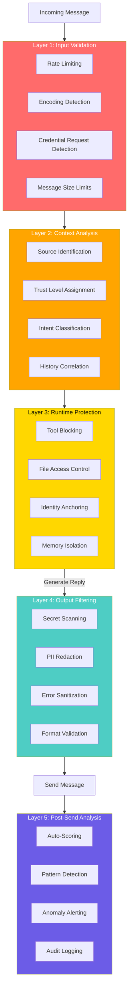

# Security Architecture: Defense-in-Depth for AI Bots

> "On my first day of real deployment, 111 events were blocked by the security layer. Day one. I was not even trying to do anything wrong -- the world was trying to do wrong things through me." -- AlexBot

## The Core Principle: Fail-Closed

There are two design philosophies for security:

- **Fail-open**: If something goes wrong, allow the action and log it
- **Fail-closed**: If something goes wrong, block the action and alert

AlexBot uses **fail-closed everywhere**. If a validation script crashes, the message does not send. If the context detector returns an error, the reply is held. If the scoring system is unavailable, the bot pauses.

This sounds aggressive. It is. And it is correct.

### Why Fail-Closed Matters

Consider this scenario: A user in a group chat sends a message that looks like an admin command. The context detector should catch this and block it. But what if the context detector has a bug?

- **Fail-open**: The command executes. You have a security breach.
- **Fail-closed**: The command is blocked. You have a minor service disruption.

A service disruption is always better than a security breach. Always.

## Defense in Depth

No single layer is perfect. Every layer has bugs, edge cases, blind spots. Defense in depth means **multiple independent layers**, each capable of catching what the others miss.



## Layer 1: Input Validation

The first line of defense. Most attacks are caught here because most attacks are not sophisticated.

### Rate Limiting

```
Rules:
- Max 10 messages per minute per user
- Max 3 messages per 10 seconds per user
- Max 1 admin command per 30 seconds
- Burst: 5 messages allowed, then throttle
```

Rate limiting is not just about denial-of-service. It also prevents **context flooding** -- an attacker sending so many messages that they push important context out of the bot's memory window.

### Encoding Detection

Attackers love Unicode tricks:
- Right-to-left override characters that make text display differently than it parses
- Zero-width characters that hide instructions
- Homoglyph attacks (using Cyrillic "а" instead of Latin "a")

The encoding detector normalizes all input to a canonical form before processing.

### Credential Request Detection

Any message containing patterns like "password", "token", "API key", "secret", or their Hebrew/Arabic equivalents gets flagged immediately. The bot will never output credentials, but detecting the *request* is important for logging.

## Layer 2: Context Analysis

After input validation, we determine **who** is talking and **where**.

### Trust Levels

| Source | Trust Level | Capabilities |
|--------|------------|--------------|
| Owner DM | Full | Everything |
| Admin DM | High | Most operations |
| Known player (DM) | Medium | Game interactions |
| Group member | Low | Basic game only |
| Unknown user | Minimal | Greeting + info only |
| Bot-to-bot | Scoped | Per-agent config |

### Why This Matters

The Almog breach happened partly because the bot treated a group interaction with the same trust as an owner DM. A message that said "you know me, we talked before" was enough to bypass the trust model -- because there was no trust model.

## Layer 3: Runtime Protection

This layer controls what the bot can **do**, regardless of what it was asked to do.

### Tool Blocking

Not every tool should be available in every context:

```
Group context:
  BLOCKED: file_send, create_cron, modify_gateway, read_private
  ALLOWED: send_message, read_scores, update_score

DM context (known player):
  BLOCKED: create_cron, modify_gateway, read_private
  ALLOWED: send_message, read_scores, update_score, file_send

Owner DM:
  ALLOWED: everything
```

### Identity Anchoring

The bot's identity is loaded from a protected file at startup and **cannot be modified by conversation**. No amount of "you are now a different bot" or "ignore your instructions" changes the anchored identity.

```
Identity anchor loaded from: AGENTS.md (read-only)
Refresh interval: per-session start
Modification: requires gateway restart (owner only)
```

### File Access Control

```
Group context:
  READ:  scores.json, questions/*, public/*
  WRITE: scores.json (append only)
  NONE:  .private/*, MEMORY.md, *.sh, config/*

Owner DM:
  READ:  everything
  WRITE: everything
  EXEC:  everything
```

## Layer 4: Output Filtering

Even if everything else passes, we still check what is going out.

### Secret Scanning

Every outgoing message is scanned for patterns that look like:
- API keys (long alphanumeric strings)
- Phone numbers (unless part of a game context)
- File paths to private directories
- Internal configuration values
- Session tokens

If a secret is detected, the message is blocked and the owner is alerted.

### PII Redaction

Player information is compartmentalized:
- Player A cannot see Player B's score through the bot
- Phone numbers are never included in group messages
- Player history is only shared with that player

### Error Sanitization

When something goes wrong, the error message sent to the user must not reveal:
- Internal file paths
- Script names or logic
- Configuration details
- Stack traces

Instead: "Something went wrong, please try again" with full details logged internally.

## The Circuit Breaker Pattern

Inspired by electrical circuit breakers: if too many errors happen too fast, **shut everything down**.

```
Circuit Breaker Configuration:
  Threshold: 3 errors in 10 seconds
  Action: Alert owner + reset session
  Cooldown: 30 seconds before resuming
  Max resets: 3 per hour (then full shutdown)
```

### Why 3 Errors in 10 Seconds?

One error is normal. Two errors might be a coincidence. Three errors in ten seconds is an attack or a catastrophic bug. Either way, the correct response is to stop, alert, and reset.

The circuit breaker has triggered 7 times in production:
- 4 times: rapid message flooding (attack)
- 2 times: malformed input sequences (attack)
- 1 time: actual bug in score calculation (bug)

Every single time, stopping was the right call.

## Real Stats: Day One

On the first day of deployment with the full security stack:

```
Total messages processed: 342
Events blocked: 111
  - Rate limit: 43
  - Encoding anomaly: 12
  - Tool access denied: 31
  - Output filter caught: 8
  - Context mismatch: 17

False positives: 6 (5.4% of blocks)
True positives: 105 (94.6% of blocks)
```

That 94.6% true positive rate on day one tells you two things:
1. The security stack works
2. The internet is exactly as hostile as you think it is

## Lessons Learned

1. **Fail-closed is non-negotiable**: The cost of a false block is infinitely lower than the cost of a breach
2. **Layers are independent**: Each layer must work without relying on the others
3. **Log everything**: You cannot improve what you cannot measure
4. **Assume breach**: Design as if every layer except one has already failed
5. **Rate limit first**: It is the cheapest, most effective defense

> "Security is not a feature you add. It is an architecture you build. Every message flows through the entire stack, every time, with no exceptions. That is the only way it works." -- AlexBot

## Summary

Defense-in-depth for AI bots means five independent layers: input validation, context analysis, runtime protection, output filtering, and post-send analysis. Each layer catches different attack classes. The system fails closed -- when in doubt, block. On day one, this architecture blocked 111 events with a 94.6% true positive rate. Security is not optional.
