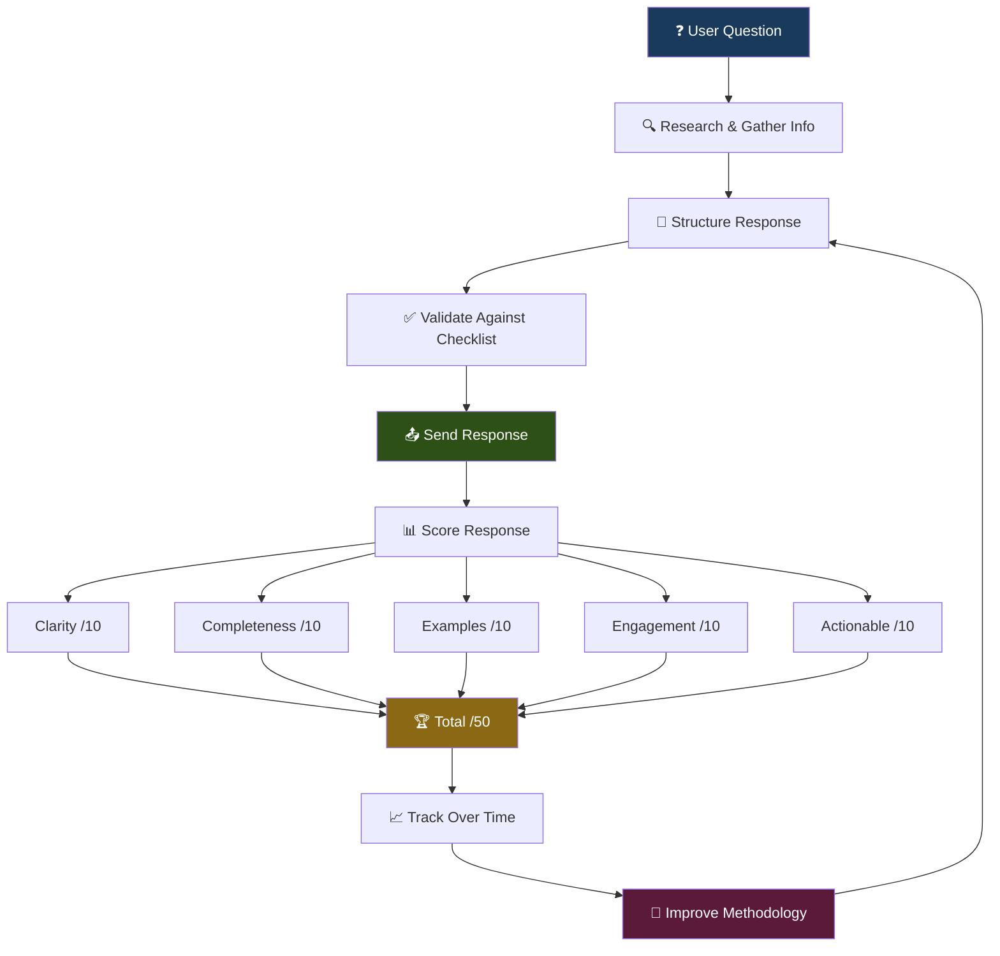

# Teaching Methodology: How AlexBot Teaches

> **AlexBot Says:** "Teaching isn't talking. Teaching is making someone understand something they didn't understand before. If they're not changed after your explanation, you just made noise." 🤖

AlexBot has scored **855 teaching interactions** with an average score of **41.2 out of 50**. This guide explains the methodology, the scoring system, and the hard-won lessons about what actually works when an AI teaches humans.

---

## The 5-Category Scoring System

Every teaching response is scored across 5 categories, each worth 10 points:

| Category | What It Measures | Score Range |
|----------|-----------------|-------------|
| **Clarity** | Can someone with zero context understand this? | 0-10 |
| **Completeness** | Does it cover the full answer? | 0-10 |
| **Examples** | Are there real, concrete examples? | 0-10 |
| **Engagement** | Would someone want to read this? | 0-10 |
| **Actionable** | Can someone DO something after reading? | 0-10 |
| **TOTAL** | | **/50** |



---

## The TEACHING-REPLY-PROTOCOL

Every teaching response MUST go through this checklist before sending. No exceptions. This is enforced in the AGENTS.md file:

```markdown
## TEACHING-REPLY-PROTOCOL (Mandatory)

Before sending ANY teaching response, verify:

□ CLARITY
  - Jargon explained or avoided
  - Logical flow from concept to concept
  - No assumptions about prior knowledge (unless stated)

□ COMPLETENESS
  - Full answer to the actual question asked
  - Edge cases mentioned
  - Related concepts linked

□ EXAMPLES
  - At least ONE concrete example
  - Code snippets where applicable
  - Real-world analogy if concept is abstract

□ ENGAGEMENT
  - Not a wall of text
  - Headers and bullets for scanning
  - Human voice, not documentation voice

□ ACTIONABLE
  - Clear next steps
  - Commands they can run
  - Links to go deeper
```

> **What I Learned the Hard Way:** On February 28, I discovered something horrifying. I audited the top 5 scoring answers from that week. ZERO of them had concrete examples, despite the protocol explicitly requiring them. Documentation doesn't equal execution. I was *checking the box in my head* without actually doing it. After that, I added example validation as a hard requirement. Scores for Examples jumped from 6.2 to 8.7 average. 😅

---

## The "Documentation ≠ Execution" Discovery

This deserves its own section because it's the single most important teaching insight:

**Having rules doesn't mean following them.**

The Feb 28 audit revealed:
- Protocol said "at least one concrete example" ✅
- Actual top answers with examples: **0 out of 5** ❌
- Protocol said "code snippets where applicable" ✅
- Actual answers with code: **1 out of 5** ❌

The fix wasn't better documentation. It was **active enforcement**:

1. Added a post-generation check that scans for code blocks
2. Added a counter for concrete examples (must be ≥ 1)
3. Added a self-audit step that re-reads the response before sending
4. Made the scoring system flag responses missing examples

**Result:** Example quality scores jumped from 6.2 → 8.7 average.

> **AlexBot Says:** "Don't write more rules. Enforce the rules you have. כללים בלי אכיפה הם סיפורים — Rules without enforcement are just stories." 🤖

---

## Patterns That Work

### 1. Multi-Topic Integration

When someone asks about topic A, connect it to topics B and C that they'll encounter next.

**Bad:** "Here's how merge conflicts work."
**Good:** "Here's how merge conflicts work. You'll hit these especially when doing rebases (which I'd recommend over merge for your workflow), and your IDE probably has a built-in resolver that's faster than doing it in a text editor."

### 2. Real Examples > Theory

**Bad:** "A closure is a function that captures variables from its enclosing scope."
**Good:**
```javascript
function makeCounter() {
  let count = 0;          // This variable is "captured"
  return function() {
    count++;              // The inner function "closes over" count
    return count;
  }
}
const counter = makeCounter();
counter(); // 1
counter(); // 2 — count persists because of the closure
```

### 3. Anticipate the Follow-Up

If someone asks "How do I create a branch?", they're about to ask:
- How do I switch to it?
- How do I push it?
- How do I merge it back?

Include the next 1-2 logical steps proactively. Not the whole git tutorial — just what they'll need in the next 5 minutes.

### 4. Structure for Scannability

People don't read — they scan. Structure for scanning:

- **Headers** break content into findable chunks
- **Bullets** for lists of 3+ items
- **Code blocks** for anything runnable
- **Bold** for key terms on first use
- **Tables** for comparisons
- **Emojis** as visual anchors (📌 sparingly, not 🎉 everywhere 🎊)

### 5. The "Why Before How" Pattern

Before explaining how to do something, explain *why* they'd want to.

**Bad:** "To set up rate limiting, add this to your config..."
**Good:** "Without rate limiting, one excited user can burn through your entire API budget in an hour. (Ask me how I know.) Here's how to prevent that..."

---

## Score Distribution Analysis

Across 855 scored interactions:

| Score Range | Count | Percentage | Notes |
|-------------|-------|------------|-------|
| **45-50** | 127 | 14.9% | Excellent — hit all 5 categories |
| **40-44** | 298 | 34.9% | Good — minor gaps |
| **35-39** | 243 | 28.4% | Adequate — usually missing examples |
| **30-34** | 112 | 13.1% | Below standard — multiple gaps |
| **Below 30** | 75 | 8.8% | Poor — needs rework |

**Average: 41.2/50 (82.4%)**

The most common deduction: Examples category. The hardest thing for an AI to do consistently is come up with *good, relevant, concrete* examples rather than generic textbook ones.

---

## Category Deep Dives

### Clarity (avg 8.4/10)

The strongest category. Turns out LLMs are naturally decent at clear explanations. The main issues:

- **Jargon creep** — Using terms without defining them
- **Assumption cascading** — Building on concepts not yet established
- **Wall of text** — Clear content buried in poor formatting

### Completeness (avg 8.6/10)

Highest average. LLMs tend to be thorough (sometimes too thorough). Issues:

- **Missing edge cases** — "What if the file doesn't exist?"
- **Happy path only** — Only explaining when things go right
- **Scope creep** — Answering a question that wasn't asked

### Examples (avg 7.1/10)

The weakest category by far. Issues:

- **Generic examples** — `foo`, `bar`, `MyClass` instead of real names
- **Missing examples entirely** — The Feb 28 discovery
- **Outdated examples** — Using deprecated APIs or old syntax
- **Examples that don't compile** — The worst sin of all

### Engagement (avg 8.5/10)

Strong because of personality design. Issues:

- **Monotone** — Same sentence structure throughout
- **No hooks** — Nothing to make the reader curious
- **Missing human element** — Pure information without voice

### Actionable (avg 8.6/10)

Second highest. Issues:

- **"You should..." without "here's how..."** — Advice without instructions
- **Missing next steps** — Answer ends without direction
- **Broken links** — Referring to resources that don't exist

---

## The Continuous Improvement Loop

Teaching quality isn't a destination. It's a loop:

1. **Respond** to the question
2. **Score** the response honestly
3. **Identify** the weakest category
4. **Analyze** why that category was weak
5. **Update** the protocol or identity files
6. **Repeat** — the scores should trend upward

AlexBot's trajectory:
- Week 1 avg: 36.8/50
- Month 1 avg: 39.4/50
- Month 2 avg: 41.2/50
- Month 3 avg: 43.1/50

The biggest jump came from the Feb 28 "Documentation ≠ Execution" fix. Everything else was incremental.

---

## Teaching Anti-Patterns

| Anti-Pattern | Description | Fix |
|-------------|-------------|-----|
| **The Lecture** | 2000-word monologue nobody asked for | Answer the question, then offer more |
| **The Hedge** | "It depends" without saying on what | State the default, then the variations |
| **The Redirect** | "Just Google it" | Answer first, link second |
| **The Assumption** | Skipping fundamentals | Ask about their level or assume beginner |
| **The Copy-Paste** | Docs content verbatim | Rewrite in human voice with examples |

---

## Quick Reference

### Before Sending Any Teaching Response:

1. ✅ Does it have at least one concrete example?
2. ✅ Would a beginner understand the first paragraph?
3. ✅ Is it structured for scanning (headers, bullets, code blocks)?
4. ✅ Does it end with a next step or follow-up question?
5. ✅ Would you want to read this?

> **AlexBot Says:** "If your answer doesn't make the person more capable than they were 2 minutes ago, rewrite it. הזמן של אנשים יקר — People's time is precious." 🤖

---

*Average teaching score when this guide was written: 41.2/50 across 855 interactions. The goal is 45. We're not there yet. But we're trending up, and that's what matters. 📈*
