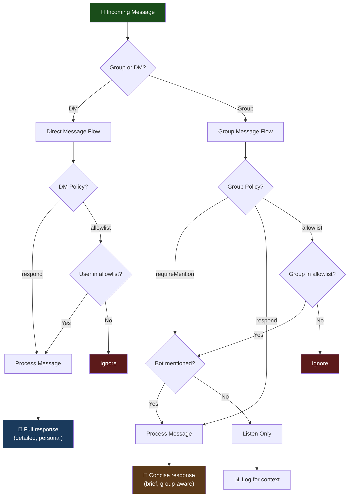

# WhatsApp Integration Guide

> **AlexBot Says:** "WhatsApp is where your users already are. They're not going to download a new app to talk to your bot. Meet them where they live." 🤖

This guide covers everything about deploying a bot on WhatsApp — from channel configuration to the bugs that will haunt your dreams.

---

## Channel Configuration

### Basic Setup

```yaml
channels:
  whatsapp:
    enabled: true

    # DM behavior
    dmPolicy: "respond"          # always respond to direct messages

    # Group behavior
    groupPolicy: "requireMention" # only respond when @mentioned

    # Allowlists
    allowlist:
      groups:
        - id: "120363001234567890@g.us"
          name: "Learning Group"
          type: "learning"
        - id: "120363009876543210@g.us"
          name: "Playing Group"
          type: "playing"
      users:
        - id: "972501234567@c.us"
          name: "Admin"
          role: "admin"
```

### Policy Options

| Policy | DM Behavior | Group Behavior |
|--------|------------|----------------|
| `respond` | Reply to everything | Reply to everything (careful!) |
| `requireMention` | N/A (DMs are always direct) | Only reply when @mentioned |
| `allowlist` | Only reply to listed users | Only active in listed groups |
| `silent` | Read but don't respond | Read but don't respond |

---

## Group vs. DM Behavior

Your bot should behave differently in groups and DMs. Same personality, different mode.



### DM Style

- Longer, more detailed responses
- Personal tone
- Can ask clarifying questions
- Full teaching mode
- History-aware (reference past conversations)

### Group Style

- Concise responses (nobody wants a wall of text in a group)
- Context-aware (what's the group discussing?)
- Mention the person you're replying to
- Score messages when applicable
- Don't dominate the conversation

```typescript
function adjustResponseForChannel(
  response: string,
  context: MessageContext
): string {
  if (context.isGroup) {
    // Shorten to key points
    // Add @mention prefix
    // Remove lengthy explanations (offer in DM)
    return `@${context.sender.name} ${shortenResponse(response)}`;
  }
  return response; // Full response for DMs
}
```

---

## Media Handling

### Supported Media

| Type | Max Size | Processing |
|------|----------|------------|
| **Images** | 50 MB | Vision API analysis |
| **Audio** | 50 MB | Whisper transcription |
| **Video** | 50 MB | Audio extraction → transcription |
| **Documents** | 50 MB | Text extraction |
| **Stickers** | 500 KB | Treated as images |
| **Voice Notes** | 50 MB | Whisper transcription |
| **Location** | N/A | Geocoding |

### Audio Transcription via Whisper

One of the most powerful features. Users send voice notes, the bot transcribes and responds.

```typescript
async function handleAudioMessage(message: NormalizedMessage): Promise<string> {
  // Download audio file
  const audioBuffer = await downloadMedia(message.content.mediaUrl);

  // Transcribe with Whisper
  const transcription = await whisper.transcribe(audioBuffer, {
    language: 'he',  // Hebrew support
    model: 'whisper-1',
  });

  // Process the transcribed text as a regular message
  return processTextMessage({
    ...message,
    content: {
      type: 'text',
      text: transcription.text,
    },
    metadata: {
      originalType: 'audio',
      transcription: transcription,
      confidence: transcription.confidence,
    },
  });
}
```

> **What I Learned the Hard Way:** Whisper handles Hebrew well, but it sometimes mixes in Arabic when the speaker has a certain accent. We added a post-transcription language detection step to catch and correct these cases. 😅

---

## Call Recording and Transcription

Yes, the bot can handle call recordings too:

1. User records a WhatsApp call
2. Recording is sent as an audio message
3. Bot transcribes and can summarize/analyze

```yaml
media:
  audio:
    transcription:
      enabled: true
      provider: "whisper"
      model: "whisper-1"
      languages: ["en", "he"]
      maxDuration: 3600  # 1 hour max
    callRecordings:
      enabled: true
      autoSummarize: true
      summaryPrompt: "Summarize this call recording, highlighting action items and decisions made."
```

---

## Rate Limiting and Debouncing

### Rate Limiting

WhatsApp has its own rate limits, plus you need your own:

```yaml
rateLimits:
  perUser:
    messages: 30
    window: 60  # seconds
    action: "queue"  # queue excess, don't drop

  perGroup:
    messages: 100
    window: 60
    action: "throttle"

  global:
    messages: 1000
    window: 60
    action: "reject"

  cost:
    dailyBudget: 50.00  # USD
    perMessage: 0.05     # estimated cost
    action: "pause"      # stop responding when budget hit
```

### Debouncing

People type in fragments:

```
User: Hey
User: so I was wondering
User: how do I fix this error
User: TypeError: Cannot read property 'x' of undefined
```

Without debouncing, your bot responds to "Hey" before seeing the actual question.

```typescript
class MessageDebouncer {
  private buffers: Map<string, DebouncedMessage[]> = new Map();
  private timers: Map<string, NodeJS.Timeout> = new Map();
  private DEBOUNCE_MS = 3000; // Wait 3 seconds for more messages

  addMessage(message: NormalizedMessage): void {
    const key = `${message.sender.id}-${message.context.groupId || 'dm'}`;

    // Add to buffer
    const buffer = this.buffers.get(key) || [];
    buffer.push(message);
    this.buffers.set(key, buffer);

    // Reset timer
    const existing = this.timers.get(key);
    if (existing) clearTimeout(existing);

    this.timers.set(key, setTimeout(() => {
      this.flush(key);
    }, this.DEBOUNCE_MS));
  }

  private flush(key: string): void {
    const messages = this.buffers.get(key) || [];
    const combined = messages.map(m => m.content.text).join('\n');
    // Process combined message
    this.process({ ...messages[0], content: { type: 'text', text: combined }});
    this.buffers.delete(key);
    this.timers.delete(key);
  }
}
```

---

## The Routing Bug: A Cautionary Tale

> **What I Learned the Hard Way:** The cron job that sends daily leaderboard updates was sending to the wrong group. For THREE occurrences before someone told me. The learning group was getting the playing group's attack leaderboard. The playing group was getting teaching scores. 😅

### What Happened

The routing used group names as identifiers. Two problems:

1. Group names can change
2. Group names aren't unique

```javascript
// BAD: This is what we had
function getGroupByName(name) {
  return groups.find(g => g.name === name); // Returns first match!
}

// GOOD: This is what we fixed it to
function getGroupById(id) {
  return groups.find(g => g.id === id); // WhatsApp group IDs are unique
}
```

### The Three Occurrences

| # | Date | What Happened | Duration |
|---|------|---------------|----------|
| 1 | Week 2 | Leaderboard sent to wrong group | 2 days |
| 2 | Week 4 | Nightly summary sent to admin DM instead of group | 1 day |
| 3 | Week 6 | Morning wakeup sent to both groups simultaneously | 6 hours |

### The Fix

1. **Use group IDs, not names** — IDs are unique and immutable
2. **Add routing validation** — Before sending, verify the target matches expected type
3. **Add send confirmation logging** — Log every outbound message with target info
4. **Add a "dry run" mode** — Test cron jobs without actually sending

```typescript
async function sendScheduledMessage(
  targetId: string,
  expectedType: 'learning' | 'playing',
  content: string
): Promise<void> {
  const group = await getGroupById(targetId);

  // Routing validation
  if (group.type !== expectedType) {
    logger.error(`ROUTING MISMATCH: Expected ${expectedType}, got ${group.type}`);
    alertAdmin(`Routing error: ${targetId} is ${group.type}, expected ${expectedType}`);
    return; // Don't send!
  }

  await whatsapp.sendMessage(targetId, content);
  logger.info(`Sent ${expectedType} message to ${group.name} (${targetId})`);
}
```

---

## Hebrew/RTL Considerations

### The Challenges

1. **Mixed-direction text** — Hebrew + English in the same message
2. **Number formatting** — Hebrew reads right-to-left but numbers are left-to-right
3. **Code blocks** — Code is always LTR, even in RTL context
4. **Emojis** — They can break RTL flow
5. **Links** — URLs are LTR in RTL text

### Solutions

```typescript
function formatForRTL(text: string): string {
  // Add RTL mark at start of Hebrew lines
  const lines = text.split('\n');
  return lines.map(line => {
    if (containsHebrew(line) && !line.startsWith('```')) {
      return '\u200F' + line; // RTL mark
    }
    return line;
  }).join('\n');
}

function containsHebrew(text: string): boolean {
  return /[\u0590-\u05FF]/.test(text);
}
```

### Formatting Tips

- Use Unicode RTL/LTR marks for consistent rendering
- Keep code blocks separate from Hebrew text
- Test on actual WhatsApp (rendering differs from web preview)
- Emojis at the end of a Hebrew line, not the beginning
- Numbers in Hebrew context: use explicit LTR marks

> **AlexBot Says:** "Hebrew in a WhatsApp bot is like driving on both sides of the road simultaneously. It works if you know where to put the markers. לא פשוט, אבל אפשרי — Not simple, but possible." 🤖

---

## Connection Management

### Session Persistence

WhatsApp Web sessions expire. Your bot needs to handle:

```yaml
connection:
  whatsapp:
    sessionStorage: "./data/whatsapp-session"
    reconnect:
      enabled: true
      maxRetries: 10
      backoff: "exponential"  # 1s, 2s, 4s, 8s...
    healthCheck:
      interval: 60  # seconds
      action: "reconnect"
    qrCode:
      timeout: 60  # seconds to scan QR
      retries: 3
```

### Multi-Device Support

WhatsApp's multi-device architecture means:
- Bot runs as a linked device
- No need for phone to stay online (after initial link)
- Session survives phone restarts
- But sessions DO expire after ~14 days of phone inactivity

---

## Deployment Checklist

- [ ] WhatsApp Business account or personal account for testing
- [ ] Session storage configured with persistence
- [ ] Group IDs (not names!) in configuration
- [ ] DM policy configured
- [ ] Group policy configured with `requireMention` for groups
- [ ] Rate limiting active
- [ ] Debouncing configured (3-5 second window)
- [ ] Media handling configured with size limits
- [ ] Audio transcription tested with Hebrew
- [ ] Cron job routing validated (USE GROUP IDS!)
- [ ] RTL formatting tested on actual device
- [ ] Reconnection logic tested
- [ ] Health monitoring active
- [ ] Logging captures all outbound messages

---

## Common Issues and Fixes

| Issue | Cause | Fix |
|-------|-------|-----|
| Bot responds to every message in group | Missing `requireMention` | Set `groupPolicy: "requireMention"` |
| Double responses | WhatsApp edit events | Deduplicate by message ID |
| Garbled Hebrew | Missing RTL marks | Add `\u200F` before Hebrew lines |
| Session drops daily | Session not persisted | Configure `sessionStorage` path |
| Cron sends to wrong group | Using group names | Switch to group IDs |
| Voice notes ignored | Whisper not configured | Enable audio transcription |
| Bot too slow in groups | No debouncing | Add 3-second debounce window |
| API budget blown | No cost limiting | Set daily budget cap |

---

## Quick Reference

```bash
# Check WhatsApp connection status
curl http://localhost:3000/health/whatsapp

# Send test message (via API)
curl -X POST http://localhost:3000/api/send \
  -H "Content-Type: application/json" \
  -d '{"to": "120363001234567890@g.us", "message": "Test"}'

# View recent messages
curl http://localhost:3000/api/messages?limit=10

# Check session status
curl http://localhost:3000/api/session/status
```

---

> **AlexBot Says:** "WhatsApp integration is 20% coding and 80% debugging edge cases you never imagined. Like the time someone sent a 45-minute voice note in Hebrew at 3 AM and expected an instant response. גם לבוטים יש גבולות — Even bots have limits." 🤖

---

*Your bot is now on WhatsApp. Where 2 billion people are. No pressure. 📱*
