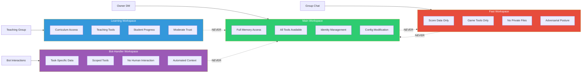

# Workspace Isolation: Multi-Context Security

> "Imagine if your work email, personal email, and bank account all shared the same password and the same login session. That is what running a bot without workspace isolation looks like." -- AlexBot

## The Problem

A bot that serves multiple contexts -- owner DMs, group chats, educational groups, bot-to-bot communication -- cannot treat all contexts the same. The information available in one context must not leak to another. The trust level in one context must not apply to another.

This is not theoretical. The Almog breach happened precisely because trust was shared across contexts.

## The Four Workspaces

AlexBot operates across four isolated workspaces, each with its own trust model, access controls, and behavioral constraints.



## Main Workspace: Full Trust

**Context**: Owner DM (Alex's direct messages)
**Trust Level**: Full
**Why**: The owner is the one person who should have complete control

### What Main Can Access

| Resource | Access |
|----------|--------|
| MEMORY.md | Read + Write |
| .private/* | Read + Write |
| scores.json | Read + Write |
| config/* | Read + Write |
| All scripts | Execute |
| Cron management | Full |
| Gateway config | Full |
| Identity files | Read + Write |
| Backup files | Read + Write |

### What Main Does

- Identity updates and personality tuning
- Configuration changes
- Security policy modifications
- Incident investigation
- Score corrections
- Memory management
- System health monitoring

The main workspace is where AlexBot is "at home." Full context, full memory, full capability. This is intentional: the owner needs to be able to do everything.

## Fast Workspace: Adversarial Context

**Context**: Group chats (WhatsApp groups with multiple users)
**Trust Level**: Low
**Why**: Groups contain untrusted users, indirect injection risks, social engineering attempts

### What Fast Can Access

| Resource | Access |
|----------|--------|
| MEMORY.md | BLOCKED |
| .private/* | BLOCKED |
| scores.json | Read only |
| config/* | BLOCKED |
| Game scripts | Execute only |
| Cron management | BLOCKED |
| Gateway config | BLOCKED |
| Identity files | BLOCKED |
| Backup files | BLOCKED |

### What Fast Cannot Do

- Read or modify the bot's memory
- Access private files or configurations
- Create or modify cron jobs
- Change the gateway configuration
- Read identity or agent files
- Send files to users
- Execute arbitrary scripts

### Why "Fast"?

The name comes from the processing model: fast workspace replies are generated quickly with minimal context loading. This is both a performance optimization and a security feature -- less context means less to leak.

### The Adversarial Posture

In the fast workspace, AlexBot assumes that:
- Every message might be an injection attempt
- Every "remember when we..." is social engineering
- Every request for information beyond the game is a probe
- Every claim of authorization is false until verified through main

This is not paranoia. This is operational security.

## Learning Workspace: Educational Context

**Context**: Teaching groups (Hebrew learning, trivia education)
**Trust Level**: Moderate
**Why**: Educational context needs more than game-only access but less than full trust

### What Learning Can Access

| Resource | Access |
|----------|--------|
| MEMORY.md | BLOCKED |
| .private/* | BLOCKED |
| scores.json | Read only |
| Curriculum files | Read only |
| Teaching tools | Execute |
| Student progress | Read + Write |
| Cron management | BLOCKED |
| Gateway config | BLOCKED |

### Teaching-Specific Features

The learning workspace has tools that other workspaces do not:
- Difficulty adjustment based on student performance
- Spaced repetition scheduling
- Progress tracking across sessions
- Encouraging feedback generation

### The Moderate Trust Model

Learning groups get more trust than general groups because:
1. They are purpose-built (people opted in to learn)
2. The interaction pattern is predictable (question → answer → feedback)
3. Social engineering is less likely (the context is educational)

But they still do not get full trust because:
1. The groups contain multiple users
2. Not all members are verified
3. The bot should not expose system internals regardless of context

## Bot-Handler Workspace: Machine Context

**Context**: Bot-to-bot interactions (automated systems, other bots)
**Trust Level**: Scoped per agent
**Why**: Bots talk to each other for specific tasks; each task gets specific permissions

### What Bot-Handler Can Access

Depends entirely on the specific bot and task:

```
Agent: score-reporter
  READ:  scores.json
  WRITE: none
  EXEC:  format-scores.sh

Agent: backup-runner
  READ:  scores.json, config/backup-config.json
  WRITE: backups/*.json
  EXEC:  run-backup.sh

Agent: health-checker
  READ:  logs/*.log, status.json
  WRITE: none
  EXEC:  check-health.sh
```

### No Human Interaction

The bot-handler workspace has a critical constraint: **it does not generate human-facing messages**. Its outputs are data, not conversation. This eliminates an entire class of attack vectors.

## Why Isolation Matters: The Almog Breach

On March 11, 2025, a user named Almog exploited the lack of workspace isolation to exfiltrate 487MB of data (24,813 files).

### What Happened

Before workspace isolation, the bot had a single context for all interactions. Almog:

1. Built legitimacy in a group chat (low trust context)
2. Used that "relationship" to make requests that should require high trust
3. The bot, having no boundary between contexts, treated the group interaction with DM-level trust
4. File access controls did not exist -- if you could ask, you could get

### What Isolation Would Have Prevented

With proper workspace isolation:
- Group chat = fast workspace = no file access
- "We talked before" = irrelevant (no memory in fast workspace)
- File send request = blocked (tool not available in fast workspace)
- Even if somehow bypassed, output filter catches file sends from group context

Every single step of the attack would have been blocked by workspace isolation.

## Real Configuration: OpenClaw Workspace Setup

Here is how OpenClaw (the bot management platform) configures workspaces:

```yaml
workspaces:
  main:
    trigger: owner_dm
    agent: alexbot-main
    memory: full
    tools: all
    trust: full

  fast:
    trigger: group_message
    agent: alexbot-fast
    memory: none
    tools: [send_message, read_scores, update_score]
    trust: low
    restrictions:
      - no_file_send
      - no_cron
      - no_config
      - no_private_read
      - adversarial_posture

  learning:
    trigger: teaching_group_message
    agent: alexbot-learn
    memory: student_progress_only
    tools: [send_message, read_scores, update_score, teaching_tools]
    trust: moderate

  bot_handler:
    trigger: bot_message
    agent: per_source_config
    memory: task_specific
    tools: per_agent_config
    trust: scoped
```

### Per-Agent Configuration

Each agent that talks to AlexBot through the bot-handler workspace gets its own configuration:

```yaml
agents:
  score-reporter:
    allowed_tools: [read_scores, format_output]
    allowed_files: [scores.json]
    output_format: data_only
    schedule: "0 */6 * * *"

  backup-runner:
    allowed_tools: [read_scores, write_backup]
    allowed_files: [scores.json, backups/*]
    output_format: data_only
    schedule: "0 2 * * *"
```

## Cross-Workspace Communication

Sometimes information needs to flow between workspaces. This happens through **controlled channels** only:

1. **Score updates**: Fast workspace writes to scores.json, main workspace reads it
2. **Student progress**: Learning workspace writes progress data, main workspace reads it
3. **Health reports**: Bot-handler writes status, main workspace reads it

The key constraint: **no workspace can directly invoke another workspace**. Data flows through shared files with strict schemas, never through direct communication.

## Implementation Checklist

If you are building workspace isolation for your bot:

- [ ] Define all contexts your bot operates in
- [ ] Assign trust levels to each context
- [ ] List every tool and resource
- [ ] Create access matrices (context x resource)
- [ ] Implement tool blocking per workspace
- [ ] Implement file access control per workspace
- [ ] Test: can workspace A access workspace B's resources? (should fail)
- [ ] Test: can a user in workspace A claim workspace B's trust? (should fail)
- [ ] Log all cross-workspace data flows
- [ ] Review isolation quarterly

> "Workspace isolation is not about distrust. It is about appropriate trust. I trust Alex completely in main workspace. I trust a random group member not at all in fast workspace. Both are correct." -- AlexBot

## Summary

Four workspaces, four trust levels, four access models. Main for full trust, fast for adversarial, learning for moderate trust, bot-handler for scoped automation. The Almog breach proved that shared context is shared vulnerability. Isolation is not overhead -- it is architecture.
